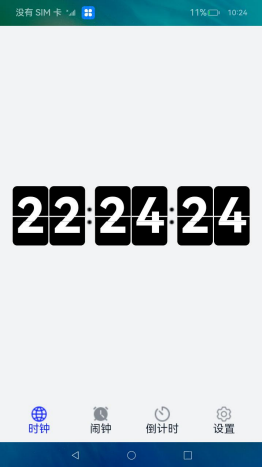
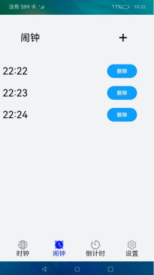
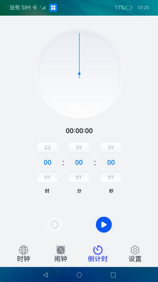
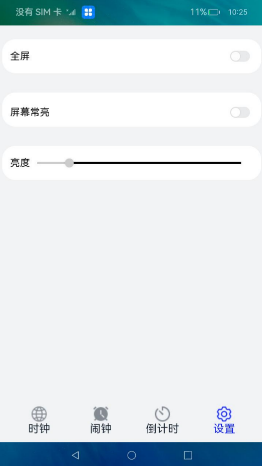

# 翻页时钟

### 介绍

本示例集中展示了时钟、闹钟相关的场景，使用@ohos.reminderAgenManager完成闹钟的相关功能，使用animateTo完成翻页时钟动画，使用@ohos.runningLock完成屏幕常亮功能
。

使用说明

1.主页面有四个底部标签栏，时钟页面展示了数字翻页时钟功能。

2.闹钟功能点击**+**号可以创建一个闹钟，等闹钟时间到了会进行提醒。

3.倒计时功能。

4.设置里边实现的功能有全屏、调节屏幕亮度和不熄屏。

### 效果预览

|首页|闹钟|倒计时|设置|
|----------------|----------------------|----------------------|----------------------|
| | | ||

### 相关概念

后台代理提醒：后台代理提醒主要提供后台提醒发布接口，开发者在应用开发时，可以调用这些接口去创建定时提醒，包括倒计时、日历、闹钟三种提醒类型。使用后台代理提醒能力后，应用可以被冻结或退出，计时和弹出提醒的功能将被后台系统服务代理。

### 相关权限

[ohos.permission.PUBLISH_AGENT_REMINDER](https://gitee.com/openharmony/docs/blob/master/zh-cn/application-dev/security/permission-list.md#ohospermissionpublish_agent_reminder)

[ohos.permission.RUNNING_LOCK](https://gitee.com/openharmony/docs/blob/master/zh-cn/application-dev/security/permission-list.md#ohospermissionrunning_lock)

[ohos.permission.NOTIFICATION_CONTROLLER](https://gitee.com/openharmony/docs/blob/master/zh-cn/application-dev/security/permission-list.md#ohospermissionnotification_controller)

### 依赖

不涉及。

### 约束与限制

1.本示例仅支持在标准系统上运行。

2.本示例需要使用DevEco Studio 3.1 Canary1 (Build Version: 3.1.0.100, built on November 3, 2022)才可编译运行。

3.本示例需要使用@ohos.brightness和@ohos.notificationManager系统权限的系统接口。使用Full SDK时需要手动从镜像站点获取，并在DevEco Studio中替换，具体操作可参考[替换指南](https://docs.openharmony.cn/pages/v3.2/zh-cn/application-dev/quick-start/full-sdk-switch-guide.md/)。
