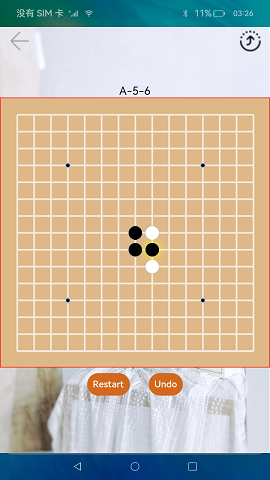

# Distributed Gobang

### Introduction

This sample shows Gobang, a popular game played with black and white stones on a go board, developed using the distributed data management function. The display effect is as follows:

### Concepts

Distributed data management: implements distributed collaboration between databases of different devices. The apps save data to distributed databases and perform operations such as adding, deleting, modifying, querying, and synchronizing data between distributed databases by calling the distributed data APIs.

### Required Permissions

ohos.permission.DISTRIBUTED_DATASYNC

### Usage

1. Start the app. After the permissions of the devices are checked, the devices on the same network are displayed. Touch the icon in the upper right corner and select the peer device to connect. If it is the first time to connect to the peer device, authentication is required. After the authentication is successful, the peer device is connected.

2. During the game, the user of the local device can restart the game or retract a false move. The user of the peer device cannot. Touching an empty intersection on the go board once presets the target place to move. You can touch it again to move your stone there or touch another empty intersection if you change your mind. If the peer device exits or goes offline unexpectedly, the local user can reconnect to the peer device. After the remote device is connected, the local user can touch any position on the go board. Data will be synchronized to the peer device for the game to continue.

### Constraints

- This sample can only be run on standard-system devices.

- This sample is based on the stage model, which is supported from API version 9.

-  This sample requires DevEco Studio 3.1 Canary1 (Build Version: 3.1.0.100) to compile and run. 
