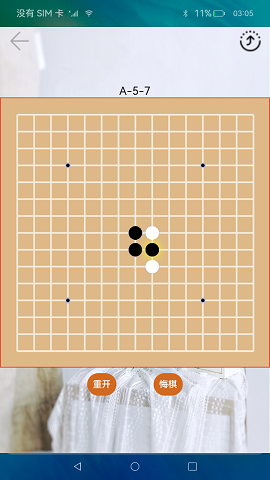

# 分布式五子棋

### 介绍

五子棋是一款比较流行的棋类游戏，此游戏使用分布式数据管理功能开发完成的。

本示例使用[Canvas组件](https://gitee.com/openharmony/docs/blob/master/zh-cn/application-dev/reference/arkui-ts/ts-components-canvas-canvas.md) 实现棋盘、棋子的绘制，使用[分布式数据管理](https://gitee.com/openharmony/docs/blob/master/zh-cn/application-dev/reference/apis/js-apis-distributed-data.md) 实现两台设备间数据的同步。

使用说明：

1.启动应用，同一个网络下两台设备都确认权限后，一台设备退出。点击右上角流转按钮，选择需要拉起的远程设备，点击后拉起远程设备，第一次拉起设备时，若未进行认证，输入认证码进行认证，认证成功后拉起远程设备。

2.游戏过程中，本地设备的用户可以重开，悔棋，远程设备无此功能。下子时，在棋盘某位置点击第一次时预下子，若确定下在该位置，继续点击该位置，若不确定，点击其他位置即可。若远程设备因特殊原因退出或者掉线，本地设备可重新拉起远程设备，拉起后，本地设备点击棋盘任意位置，数据会同步到远程设备，继续进行未完成的游戏。

### 效果预览

### 相关权限

允许不同设备间的数据交换：[ohos.permission.DISTRIBUTED_DATASYNC](https://gitee.com/openharmony/docs/blob/master/zh-cn/application-dev/security/permission-list.md)

### 依赖

不涉及。

### 约束与限制

1.本示例仅支持标准系统上运行，支持设备：RK3568。

2.本示例为Stage模型，仅支持API9版本SDK，版本号：3.2.10.6。

3.本示例需要使用DevEco Studio 3.1 Canary1 (Build Version: 3.1.0.100)及以上才可编译运行。

4.本示例需要使用@ohos.distributedHardware.deviceManager系统权限的系统接口。使用Full SDK时需要手动从镜像站点获取，并在DevEco Studio中替换，具体操作可参考[替换指南](https://docs.openharmony.cn/pages/v3.2/zh-cn/application-dev/quick-start/full-sdk-switch-guide.md/) 。

