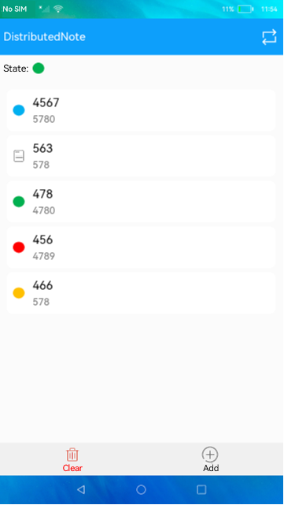

# Distributed Notepad

### Introduction

This sample shows how to implement a simple distributed Notepad using distributed data objects in eTS. The display effect is as follows:

### Concepts

Distributed data object: You can synchronize data between devices on a network by configuring distributed data objects with the same session ID for these devices. When a distributed object is modified, the peer device can listen for data changes and obtain new data.

### Required Permissions

ohos.permission.DISTRIBUTED_DATASYNC

### Usage

1. Start the app, touch the button in the upper right corner, and select the device to connect. After the connection is successful, the home screens of the two devices are displayed in green. Each time you connect to another device, the notes will be cleared.

2. To add a note, touch the **Add** button, edit the title and note content, mark color, and touch the **Submit** button.

3. To clear all notes, touch the **Clear** button.

4. To modify a note, touch the note, modify the note content, and touch **Submit**.

5. The operations performed in steps 2, 3, and 4 are synchronized to the connected device.

### Constraints

- This sample can only be run on standard-system devices.

- This sample is based on the stage model, which is supported from API version 9.

- This sample requires DevEco Studio 3.0 Beta4 (Build Version: 3.0.0.992, built on July 14, 2022) to compile and run. 
