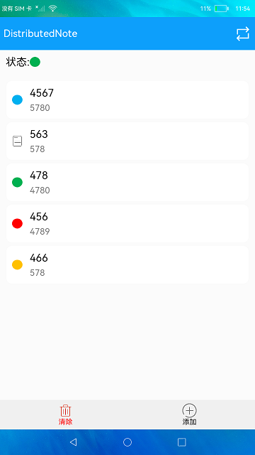

# 分布式备忘录

### 简介

本示例展示了在eTS中如何使用分布式数据对象实现一个简单的分布式备忘录。实现效果如下：

### 相关概念

分布式数据对象：组网内的设备，通过创建相同sessionId的分布式数据对象，修改分布式对象时，对端设备可以监听到数据变化并获取到新的数据，从而实现不同设备间的数据交换。

### 相关权限

允许不同设备间的数据交换：ohos.permission.DISTRIBUTED_DATASYNC

### 使用说明

1.启动应用,点击右上角按钮可以连接组网设备，选择设备后进行连接，连接成功后两个设备上首页状态均显示绿色，每次连接其他设备，界面会清空备忘录内容。

2.点击**添加**按钮进入添加界面，可以编辑标题、内容、标记颜色，点击**提交**按钮添加备忘录。

3.点击**清除**按钮清除所有备忘录内容。

4.点击已经添加的备忘录可以进入编辑界面更新备忘录内容，编辑完成后点击**提交**按钮更新备忘录。

5.两台设备连接成功后步骤2、3、4的操作会同步到另一台设备上。

### 约束与限制

1.本示例仅支持标准系统上运行。

2.本示例为Stage模型，从API version 9开始支持。

3.本示例需要使用DevEco Studio 3.1 Canary1 (Build Version: 3.1.0.100)及以上才可编译运行。

4.本示例需要使用@ohos.distributedHardware.deviceManager系统权限的系统接口。使用Full SDK时需要手动从镜像站点获取，并在DevEco Studio中替换，具体操作可参考[替换指南](https://docs.openharmony.cn/pages/v3.2/zh-cn/application-dev/quick-start/full-sdk-switch-guide.md/)。
