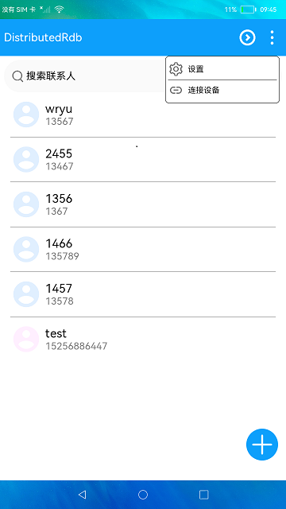

# 分布式关系型数据库

### 介绍

本示例展示了在eTS中分布式关系型数据库的使用，在增、删、改、查的基本操作外，还包括分布式数据库的数据同步同能。

使用说明:
1. 启动应用后点击“**+**”按钮可以添加联系人。
2. 点击联系人可以进入编辑界面编辑联系人信息。
3. 长按联系人进入多选状态，底部有“**全选**”、“**取消**”、“**删除**”、“**退出**”按钮，点击退出可以退出多选状态。
4. 点击右上角更多按钮，点击“**连接设备**”，选择要同步数据的设备，连接成功后可以开始将本端数据同步到对端。
5. 点击右上角更多按钮，点击“**设置**”可以进入设置界面设置数据同步方式，包括自动同步和手动同步。

### 效果预览

|首页|
|----------|
||

### 相关概念

关系型数据库：获得一个相关的RdbStore，操作关系型数据库，用户可以根据自己的需求配置RdbStore的参数，然后通过RdbStore调用相关接口可以执行相关的数据操作，包括增、删、改、查。
分布式关系型数据库：通过rdb的sync接口实现数据同步，通过 on('dataChange')方法实现监听数据变更从而读取对端设备上的数据。

### 相关权限

允许不同设备间的数据交换:[ohos.permission.DISTRIBUTED_DATASYNC](https://gitee.com/openharmony/docs/blob/master/zh-cn/application-dev/security/permission-list.md#ohospermissiondistributed_datasync)

### 约束与限制

1. 本示例的同步功能需要两台设备组网后测试;
2. 本示例仅支持标准系统上运行;
3. 本示例仅支持API9版本SDK，版本号：3.2.9.2;
4. 本示例需要使用DevEco Studio 3.1 Canary1 (Build Version: 3.1.0.100, built on November 3, 2022)才可编译运行;
5. 本示例需要使用@ohos.distributedHardware.deviceManager系统权限的系统接口。使用Full SDK时需要手动从镜像站点获取，并在DevEco Studio中替换，具体操作可参考[替换指南](https://docs.openharmony.cn/pages/v3.2/zh-cn/application-dev/quick-start/full-sdk-switch-guide.md/)。
