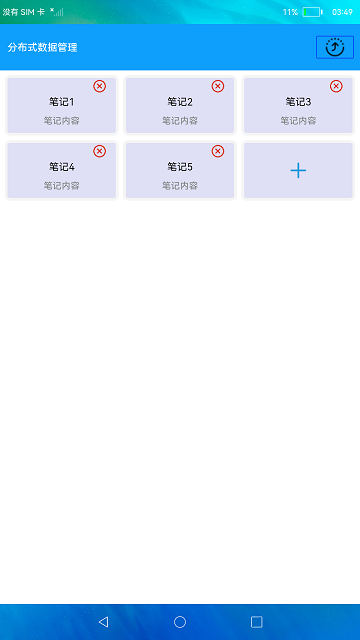

# 分布式数据管理

### 介绍

本示例展示了在eTS中分布式数据管理的使用，包括KVManager对象实例的创建和KVStore数据流转的使用。实现操作如下：

1.两台设备组网。

2.在一台界面中点击右上角的流转按钮，在弹窗中选择对端设备拉起对端设备上的应用。

3.拉起对端设备后，在界面中点击"+"按钮新增笔记卡片，点击每个卡片右上角的"X"按钮可以删除此卡片，可以看到对端设备和当前设备界面数据保持一致。

4.操作对端设备，当前设备界面也会保持和对端设备界面显示一致。

### 效果预览

### 相关权限

允许不同设备间的数据交换：[ohos.permission.DISTRIBUTED_DATASYNC](https://gitee.com/openharmony/docs/blob/master/zh-cn/application-dev/security/permission-list.md) 。

### 依赖

不涉及。

### 约束与限制

1.本示例仅支持标准系统上运行。

3.本示例仅支持API9版本FULL SDK，版本号：3.2.10.6,使用Full SDK时需要手动从镜像站点获取，并在DevEco Studio中替换，具体操作可参考[替换指南](https://docs.openharmony.cn/pages/v3.2/zh-cn/application-dev/quick-start/full-sdk-switch-guide.md/) 。

4.本示例需要使用DevEco Studio 3.1 Canary1 (Build Version: 3.1.0.100, built on November 3, 2022)才可编译运行。

3.本示例需要使用[@ohos.distributedHardware.deviceManager](https://gitee.com/openharmony/docs/blob/master/zh-cn/application-dev/reference/apis/js-apis-device-manager.md) 系统权限的系统接口。
