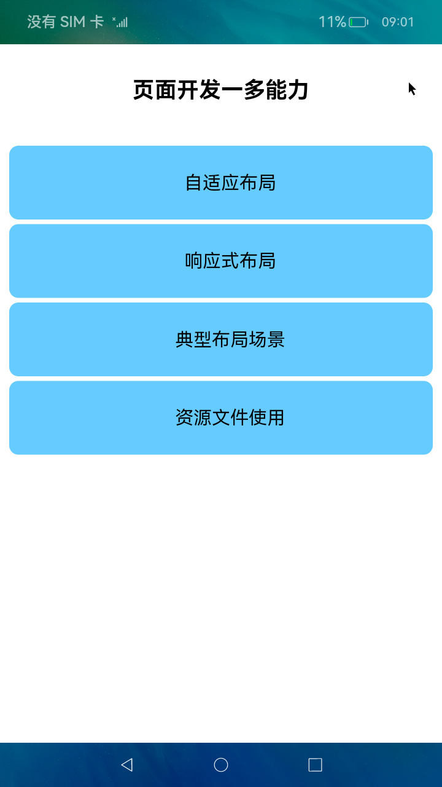
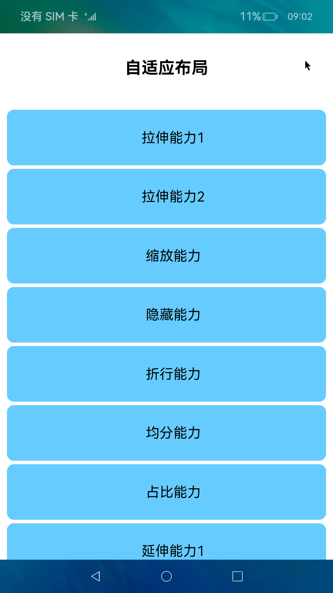
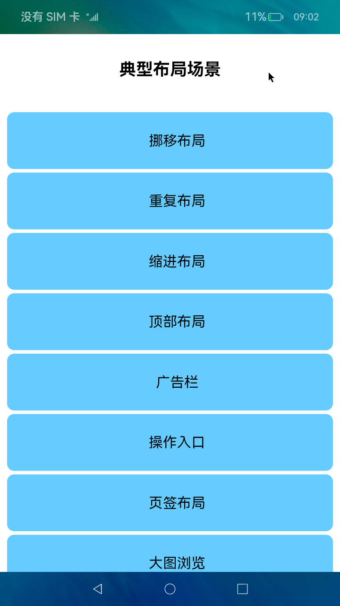

# 多设备自适应能力

### 介绍

本示例是[《一次开发，多端部署》](https://gitee.com/fanzhaonan/docs/tree/master/zh-cn/application-dev/key-features/multi-device-app-dev)的配套示例代码，展示了[页面开发的一多能力](https://gitee.com/fanzhaonan/docs/blob/master/zh-cn/application-dev/key-features/multi-device-app-dev/layout-intro.md)，包括自适应布局、响应式布局、典型布局场景以及资源文件使用。

| 名称         | 简介                                                         |
| ------------ | ------------------------------------------------------------ |
| 自适应布局   | 当外部容器大小发生变化时，元素可以**根据相对关系自动变化**以适应外部容器变化的布局能力。 |
| 响应式布局   | 当外部容器大小发生变化时，元素可以**根据断点或特定的媒体特征（如屏幕方向、窗口宽高等）自动变化**以适应外部容器变化的布局能力。 |
| 典型布局场景 | 应用开发中的典型场景，包括运行横幅、网格、侧边栏等。         |
| 资源文件使用 | 根据当前的设备特征（如设备类型、屏幕密度等）或应用场景（如语言、国家、地区等），从resources目录下不同的资源限定词目录中获取相应的资源值。 |

> 说明：
>
> * 自适应布局能力仅可以保证在外部容器大小在一定范围内变化时，容器内的元素布局合理。如果外部尺寸发生较大变化，需要借助响应式布局能力进一步适配（详见《一次开发，多端部署》中关于断点的介绍）。
> * 为简化代码、突出重点及方便读者理解，本示例中的自适应布局部分未做多设备适配。此部分建议在DevEco自带的MatePadPro预览器中运行及查看效果，以获得最佳的体验。
> * 响应式布局、典型布局场景、资源文件使用均做了多设备适配，推荐参考如下方式查看代码的运行效果：
>   * 将应用安装到不同类型的设备，查看运行效果。
>   * 将应用安装到开发板等设备中，开启设备的自由窗口能力，查看不同窗口尺寸下的运行效果。
>   * 通过创建不同屏幕尺寸多个预览器，或者通过拖拽的方式改变预览器的屏幕尺寸，查看不同情况下的运行效果。

### 使用说明：

1. 启动应用，首页展示了自适应布局、响应式布局、典型布局场景和资源限定词四个按钮。

2. 点击"自适应布局"进入新页面，分别展示拉伸能力、缩放能力、隐藏能力、折行能力、均分能力、占比能力和延伸能力共7种自适应布局能力。

3. 点击"响应式布局"进入新页面，分别展示断点、媒体查询和栅格布局3种响应式布局能力。

4. 点击"典型布局场景"进入新页面，展示了如何通过自适应布局能力和响应式布局能力，实现应用开发中的典型场景。

5. 点击"资源限定词"进入新页面，展示字符串和图片资源的使用。

### 效果预览：

|首页|自适应布局|响应式布局|典型场景|
|-----|-----|----|-----|
|||||


### 相关权限

不涉及。


### 约束与限制

1.本示例仅支持标准系统上运行。

2.本示例为Stage模型，从API version 9开始支持。

3.本示例需要使用DevEco Studio 3.0 Beta4 (Build Version: 3.0.0.992, built on July 14, 2022)才可编译运行。

4.本示例在开发板上运行时，可以修改开发板系统配置文件以使能应用窗口能力。

````
# 将开发板文件系统的权限配置为可读写
hdc shell mount -o rw,remount /
# 取出原始配置文件
hdc file recv system/etc/window/resources/window_manager_config.xml C:\
# 将文件中<decor enable="false"></decor>改为<decor enable="true"></decor>
# 用修改后的文件替换系统中的原始文件
hdc file send C:\window_manager_config.xml system/etc/window/resources/window_manager_config.xml
# 重启后生效
hdc shell reboot
````