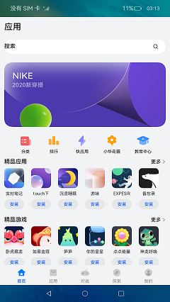

# 一多应用市场首页

### 介绍
本示例展示了应用市场首页，页面中包括Tab栏、运营横幅、精品应用、精品游戏等。

本示例使用[一次开发多端部署](https://gitee.com/openharmony/docs/tree/master/zh-cn/application-dev/key-features/multi-device-app-dev)中介绍的自适应布局能力和响应式布局能力进行多设备（或多窗口尺寸）适配，保证应用在不同设备或不同窗口尺寸下可以正常显示。

使用说明：

1. 启动应用，可以查看本应用在全屏状态下的显示效果。

2. 在应用顶部，下滑出现窗口操作按钮。（建议通过外接鼠标操作，接入鼠标只需要将鼠标移动至顶部即可出现窗口）

3. 点击悬浮图标，将应用悬浮在其它界面上显示。

4. 拖动应用悬浮窗口的边框，改变窗口尺寸，触发应用刷新，即可查看应用在不同窗口下的显示效果。

   改变窗口尺寸的过程中，窗口尺寸可能超出屏幕尺寸。此时在屏幕中只能看到应用部分区域的显示，但可以通过移动窗口位置，查看应用其它区域的显示。

### 效果预览

本示例在预览器中的效果：


本示例在开发板上运行的效果：

| 全屏显示                         | 窗口操作按钮                      | 悬浮窗口显示                      |
| ----------------------------- | -------------------------------------------- | -------------------------------------------- |
|  |  |  |


### 相关权限

不涉及。

### 依赖

不涉及

### 约束与限制
1. 本示例仅支持在标准系统上运行。

2. 本示例仅支持API9版本的SDK，版本号： 3.2.10.6。

3. 本示例需要使用DevEco Studio 3.1 Canary1 (Build Version: 3.1.0.100)及以上才可编译运行。

4. 本示例在开发板上运行时，需要修改开发板系统配置文件以使能应用窗口能力。

```shell
# 将开发板文件系统的权限配置为可读写
hdc shell mount -o rw,remount /
# 取出原始配置文件
hdc file recv system/etc/window/resources/window_manager_config.xml C:\
# 将文件中<decor enable="false"></decor>改为<decor enable="true"></decor>
# 用修改后的文件替换系统中的原始文件
hdc file send C:\window_manager_config.xml system/etc/window/resources/window_manager_config.xml
# 重启后生效
hdc shell reboot
```

