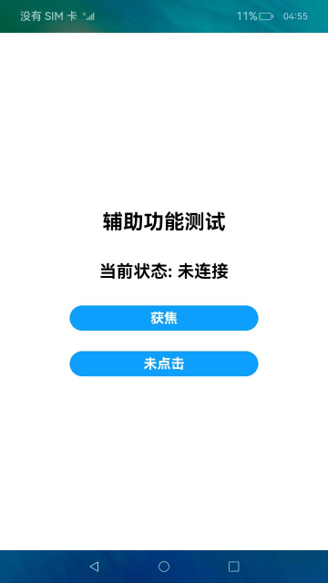

# AccessibilityExtensionAbility示例

## 介绍

本示例展示了AccessibilityExtensionAbility的简单应用，使用多个辅助功能接口实现了一些快捷的交互方式。

## 效果预览

|主页|交互结果|
|--------------------------------|--------------------------------|
|||

## 使用说明
1. 在启动无障碍扩展服务前，需退出当前应用保证界面节点正常生成；
2. 启动关闭无障碍扩展服务可参考[AccessibilityExtensionAbility开发指南](https://gitee.com/openharmony/docs/tree/master/zh-cn/application-dev/application-models/accessibilityextensionability.md), 服务连接状态将显示在屏幕上;
3. 启动无障碍扩展服务后，在设备屏幕上绘画手势`rightThenDown`获取当前界面全部节点，之后绘画手势`leftThenDown`打印所有节点的指定信息；
4. 在设备屏幕上绘画手势`left`对按钮`获焦`进行聚焦，之后可通过绘画手势`right`取消对按钮聚焦；
5. 在设备屏幕上绘画手势`down`，触发对按钮`未点击/已点击`的点击动作。

## 具体实现

* 获取界面元素、查询元素指定信息、通过text查找元素和获取元素执行指定动作的功能封装在AccessibilityManager，源码参考: [AccessibilityManager.ts](https://gitee.com/openharmony/applications_app_samples/blob/master/ability/AccessibilityExtAbility/entry/src/main/ets/AccessibilityExtAbility/AccessibilityManager.ts)
  * 使用 [getWindowRootElement()](https://gitee.com/openharmony/docs/blob/master/zh-cn/application-dev/reference/apis/js-apis-inner-application-accessibilityExtensionContext.md#accessibilityextensioncontextgetwindowrootelement) 获取界面根节点；
  * 获取元素属性值：使用AccessibilityUtils.getAttributeValue()；
  * 获取界面所有元素：基于获取的根元素，使用AccessibilityUtils.createElementArray()获取界面所有元素；
  * 打印界面元素指定信息：使用AccessibilityUtils.getElementWantedInfo()获取元素指定的信息；
  * 寻找指定元素：使用AccessibilityUtils.findElementByKey()。

## 工程目录
```
entry/src/main/ets/
|---AccessibilityExtAbility
|   |---AccessibilityExtAbility.ts         // 无障碍扩展服务
|   |---AccessibilityManager.ts            // 示例
|---Application
|---MainAbility
|---pages
|   |---index.ets                          // 主页
|---utils
|   |---AccessibilityUtils.ts              // 工具类
|   |---Logger.ts                          // 日志工具类
|   |---ResourceUtils.ts                   // 资源工具类
```
## 相关权限
不涉及。

## 依赖
不涉及。

## 约束与限制
1. 本示例仅支持标准系统上运行；
2. 本示例为Stage模型，从API 9开始支持；
3. 本示例基于DevEco Studio 3.0 Beta3 (Build Version: 3.0.0.900, build on March 31, 2022)开发，需使用该版本或更高版本才可编译运行；
4. 本示例使用了AccessibilityExtensionAbility相关系统接口，需要将默认的Public SDK替换为Full SDK，具体替换操作可参考[替换指南](https://docs.openharmony.cn/pages/v3.2/zh-cn/application-dev/quick-start/full-sdk-switch-guide.md/)；
