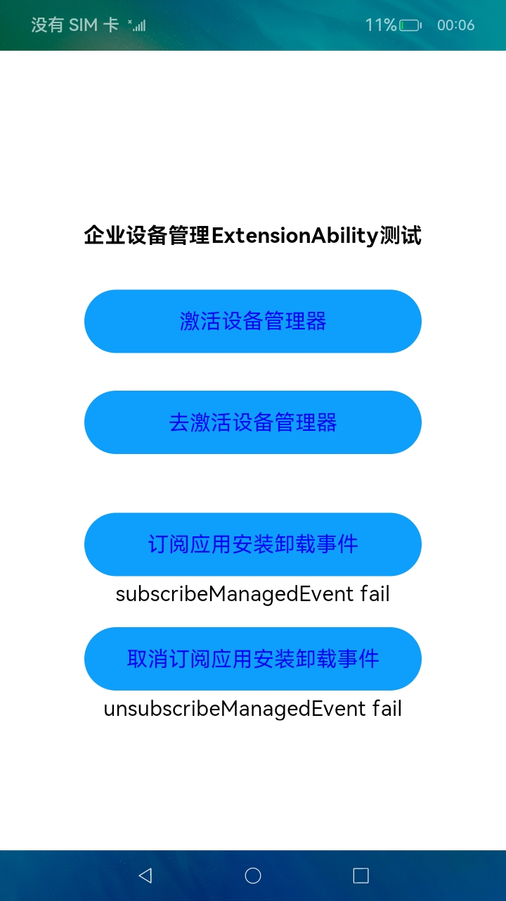
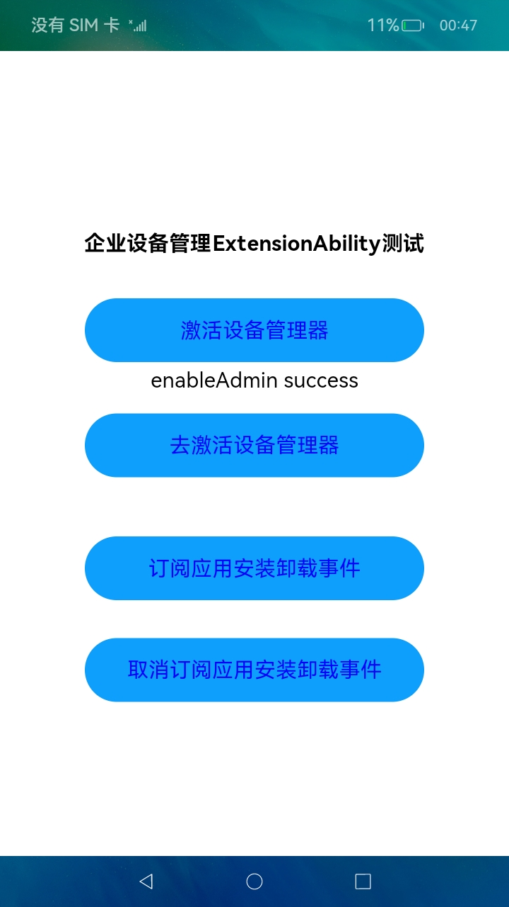

# EnterpriseAdminExtensionAbility的创建与使用

### 介绍

企业设备管理扩展能力，是MDM应用必备组件。当开发者为企业开发MDM（Mobilie Device Management）应用时，需继承EnterpriseAdminExtensionAbility，在EnterpriseAdminExtensionAbility实例中实现MDM业务逻辑，EnterpriseAdminExtensionAbility实现了系统管理状态变化通知功能，并定义了管理应用激活、去激活、应用安装、卸载事件等回调接口。

使用说明

1.启动应用后，点击激活设备管理器，会显示激活成功。由企业管理员或者员工部署MDM应用，激活设备管理器，系统通知MDM应用已激活DeviceAdmin权限。MDM应用可在onAdminEnable回调函数中进行初始化策略设置。

2.点击去激活设备管理器，会显示去激活成功。系统或者员工去激活设备管理器，应用可以通知企业管理员设备已脱管。

3.点击订阅应用安装卸载事件，会显示订阅成功。企业应用管理场景下，企业管理员订阅应用安装卸载事件，端侧应用安装和卸载事件通知MDM应用，MDM应用可以在回调函数中进行事件上报，通知企业管理员。

4.点击取消订阅应用安装卸载事件，会显示取消订阅成功。企业应用管理场景下，企业管理员取消订阅应用安装卸载事件。

### 效果预览

| 未激活                                                 | 订阅应用安装事件失败                                    | 已激活                                                 | 订阅应用安装卸载事件成功                                |
| ------------------------------------------------------ | ------------------------------------------------------- | ------------------------------------------------------ | ------------------------------------------------------- |
|  |  |  |  |

### 相关权限

[ohos.permission.MANAGE_ENTERPRISE_DEVICE_ADMIN](https://gitee.com/openharmony/docs/blob/master/zh-cn/application-dev/security/permission-list.md)

[ohos.permission.ENTERPRISE_SUBSCRIBE_MANAGED_EVENT](https://gitee.com/openharmony/docs/blob/master/zh-cn/application-dev/security/permission-list.md)

### 约束与限制

1. 本示例仅支持标准系统上运行，支持设备：RK3568。
2. 本示例仅支持API9版本SDK，版本号：3.2.9.2，本示例涉及使用系统接口：@ohos.enterprise.adminManager中的enableAdmin、disableAdmin接口，需要手动替换FullSDK才能编译通过，具体操作可参考[替换指南](https://docs.openharmony.cn/pages/v3.2/zh-cn/application-dev/quick-start/full-sdk-switch-guide.md/)；
3. 本示例需要使用DevEco Studio 3.1 Release (Build Version: 3.1.0.100)才可编译运行。
4. 本示例涉及系统接口，需要配置系统应用签名，可以参考[特殊权限配置方法](https://docs.openharmony.cn/pages/v3.2/zh-cn/application-dev/security/hapsigntool-overview.md/)，把配置文件中的“app-feature”字段信息改为“hos_system_app”。
5. 本示例涉及ohos.permission.MANAGE_ENTERPRISE_DEVICE_ADMIN为system_core级别(相关权限级别可通过[权限定义列表](https://gitee.com/openharmony/docs/blob/master/zh-cn/application-dev/security/permission-list.md)查看)，需要配置高权限签名，可参考[特殊权限配置方式](https://docs.openharmony.cn/pages/v3.2/zh-cn/application-dev/security/hapsigntool-overview.md/)。
