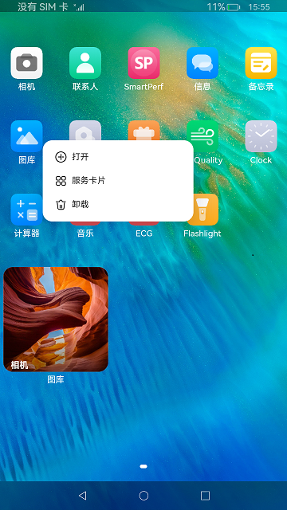
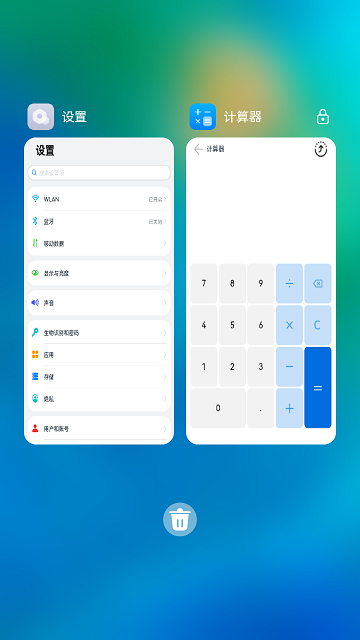

# 仿桌面应用

### 简介

本示例实现了一个简单桌面应用，实现了以下几点功能：

1.展示了系统安装的应用，实现点击启动、应用上滑弹出卡片、卡片添加到桌面、卡片移除功能。

2.实现桌面数据持久化存储，应用支持卸载、监听应用卸载和安装并显示。

3.实现最近任务管理功能，包括任务卡片加锁、解锁、清理和清理所有任务功能。

实现效果如下：

 

### 相关概念

1.**使用 launcherBundleManager模块接口（系统能力：SystemCapability.BundleManager.BundleFramework）**，获取所有应用信息和给定包名获取应用信息，实现桌面展示所有安装的应用。使用on接口监听应用的安装和卸载从而实现应用安装和卸载刷新桌面。

2.**使用bundle模块的getBundleInstaller接口获取到BundleInstaller（系统能力：SystemCapability.BundleManager.BundleFramework）**，调用uninstall接口实现应用卸载功能。

3.**使用formHost接口（系统能力：SystemCapability.Ability.Form）**，获取应用卡片信息，使用FormComponent组件展示卡片内容，从而实现添加卡片到桌面的功能。

4.使用关系型数据库rdb接口（系统能力：SystemCapability.DistributedDataManager.RelationalStore.Core），实现桌面数据持久化存储，存储应用的位置信息，卡片信息。

5.**使用missionManager模块接口（系统能力：SystemCapability.Ability.AbilityRuntime.Mission）**，获取最近任务信息，并实现加锁、解锁、清理后台任务的功能。

### 相关权限

| 权限名                                     | 权限说明                                         | 级别         |
| ------------------------------------------ | ------------------------------------------------ | ------------ |
| ohos.permission.GET_BUNDLE_INFO_PRIVILEGED | 允许应用查询其他应用的信息。                     | system_basic |
| ohos.permission.LISTEN_BUNDLE_CHANGE       | 允许应用监听其他应用安装、更新、卸载状态的变化。 | system_basic |
| ohos.permission.INSTALL_BUNDLE             | 允许应用安装、卸载其他应用。                     | system_core  |
| ohos.permission.MANAGE_MISSIONS            | 允许用户管理元能力任务栈。                       | system_core  |
| ohos.permission.REQUIRE_FORM               | 允许应用获取Ability Form。                       | system_basic |

### 使用说明

1.安装编译的hap包，使用hdc shell aa start -b ohos.samples.launcher -a MainAbility命令启动应用，应用启动后显示系统安装的应用。

2.点击应用主界面上的应用图标可以启动应用，长按弹出菜单，点击打开可以正常启动应用。

3.图库等支持卡片的应用，长按菜单中有服务卡片，点击进入卡片预览界面，在卡片预览界面点击**添加到桌面**，返回到桌面并且卡片成功添加到桌面。

4.上滑图库等支持卡片的应用，可以弹出默认上滑卡片，点击上滑卡片右上角的**+**图标，可以添加卡片到桌面。

5.应用在桌面界面，使用hdc install安装一个应用，桌面可以监听到应用安装，并显示新安装的应用到桌面上。

6.应用在桌面界面，使用hdc uninstall 卸载第5步安装的应用，桌面可以监听到卸载，并移除桌面上的应用。

7.在桌面空白处上滑，可以进入最近任务管理界面，下滑任务卡片可以加锁/解锁，上滑卡片可以清理该后台任务，点击垃圾桶可以清除所有后台任务（加锁的应用不会被清理掉）。

### 约束与限制

1.本示例仅支持标准系统上运行。

2.本示例为Stage模型，从API version 9开始支持。

3.本示例需要使用DevEco Studio 3.0 Beta4 (Build Version: 3.0.0.992, built on July 14, 2022)才可编译运行。

4.本示例需要使用系统权限的系统接口，需要使用Full SDK编译。使用Full SDK时需要手动从镜像站点获取，并在DevEco Studio中替换，具体操作可参考[替换指南](https://docs.openharmony.cn/pages/v3.2/zh-cn/application-dev/quick-start/full-sdk-switch-guide.md/)。

5.本示例使用了ServiceExtensionAbility，需要在签名证书UnsgnedReleasedProfileTemplate.json中配置"app-privilege-capabilities": ["AllowAppUsePrivilegeExtension"]，否则安装失败。具体操作指南可参考[应用特权配置指南](https://gitee.com/openharmony/docs/blob/eb73c9e9dcdd421131f33bb8ed6ddc030881d06f/zh-cn/device-dev/subsystems/subsys-app-privilege-config-guide.md)。

6.本示例所配置的权限均为system_basic或system_core级别(相关权限级别可通过[权限定义列表](https://gitee.com/openharmony/docs/blob/master/zh-cn/application-dev/security/permission-list.md)查看)，需要手动配置对应级别的权限签名(具体操作可查看[自动化签名方案](https://docs.openharmony.cn/pages/v3.2/zh-cn/application-dev/security/hapsigntool-overview.md/))。

7.本示例类型为系统应用，需要手动配置对应级别的应用类型("app-feature": "hos_system_app")。具体可参考profile配置文件[bundle-info对象内部结构](https://gitee.com/openharmony/docs/blob/eb73c9e9dcdd421131f33bb8ed6ddc030881d06f/zh-cn/application-dev/security/app-provision-structure.md#bundle-info%E5%AF%B9%E8%B1%A1%E5%86%85%E9%83%A8%E7%BB%93%E6%9E%84)
