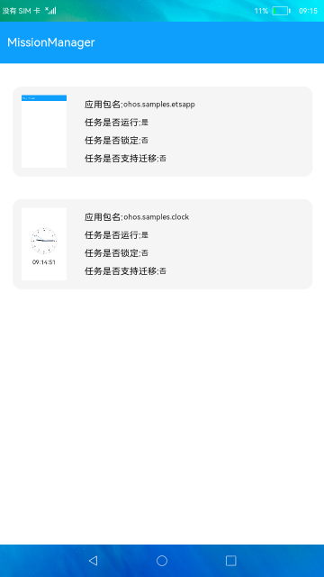

# 系统任务管理

### 简介

本示例通过调用系统任务管理的能力，对系统任务执行锁定、解锁、清理、切换到前台等操作。

### 相关概念

任务管理：对任务执行锁定、解锁、清理、切换到前台等操作。

### 相关权限

任务管理权限：ohos.permission.MANAGE_MISSIONS

### 使用说明

1.下拉“**获取系统任务信息**”，获取当前系统任务的包名、运行状态、锁定状态、任务是否支持迁移、任务快照等信息列表，且最多可获取10条任务。

2.左滑任务列表，点击“**锁定**”，即可锁定指定的任务。

3.若当前任务已锁定，可点击“**解锁**”，即可解锁指定的任务。

4.点击“**删除**”，即可删除指定的任务。

5.点击“**移动**”，即可将指定的任务移动到前台执行。

### 约束与限制

1.本示例仅支持在标准系统上运行。

2.本示例仅支持API9版本SDK，本示例涉及使用系统接口：@ohos.application.missionManager，需要手动替换Full SDK才能编译通过，具体操作可参考[替换指南](https://docs.openharmony.cn/pages/v3.2/zh-cn/application-dev/quick-start/full-sdk-switch-guide.md/)。

3.本示例需要使用DevEco Studio 3.0 Beta4 (Build Version: 3.0.0.992, built on July 14, 2022)才可编译运行。

4.本示例所配置的权限ohos.permission.MANAGE_MISSIONS为system_core级别(相关权限级别可通过[权限定义列表](https://gitee.com/openharmony/docs/blob/master/zh-cn/application-dev/security/permission-list.md)查看)，需要手动配置对应级别的权限签名(具体操作可查看[自动化签名方案](https://docs.openharmony.cn/pages/v3.2/zh-cn/application-dev/security/hapsigntool-overview.md/))。
