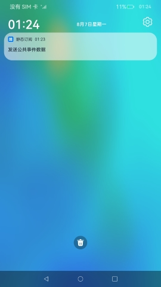

#  静态订阅

### 介绍

本示例主要展示了静态订阅的创建与使用。通过[CommonEventManager](https://gitee.com/openharmony/docs/blob/master/zh-cn/application-dev/reference/apis/js-apis-commonEventManager.md)发布自定义事件，该自定义事件为数据传输事件。通过[StaticSubscriberExtensionAbility](https://gitee.com/openharmony/docs/blob/master/zh-cn/application-dev/reference/apis/js-apis-application-staticSubscriberExtensionAbility.md)、[NotificationManager](https://gitee.com/openharmony/docs/blob/master/zh-cn/application-dev/reference/apis/js-apis-notificationManager.md)静态订阅已发布的自定义事件，订阅后即可自动收到该事件，收到该事件后，发送通知将自定义事件数据显示在通知栏。

使用说明：
1. 在entry/src/main/resources/base/profile/subscribe.json中添加需要订阅的目标事件。
2. 修改系统配置文件/etc/static_subscriber_config.json，将应用的包名添加至该json文件中。
3. 本示例编译后共有两个hap包，包括静态订阅hap包和自定义事件发布hap包，需要全部安装。静态订阅hap包需要签名成系统应用并安装才可实现对目标事件的静态订阅，安装后即默认订阅了目标事件；自定义事件发布hap包直接安装即可，发布事件后即可被静态订阅方收到。

### 效果预览
|通知栏|
|-----|
||

### 相关权限

[ohos.permission.NOTIFICATION_CONTROLLER](https://gitee.com/openharmony/docs/blob/master/zh-cn/application-dev/security/permission-list.md#ohospermissionnotification_controller)

### 依赖

不涉及

### 约束与限制

1. 本示例仅支持标准系统上运行，支持设备：RK3568。
2. 静态订阅仅支持系统应用，需要配置系统应用签名，可以参考[特殊权限配置方法](https://docs.openharmony.cn/pages/v3.2Beta/zh-cn/application-dev/security/hapsigntool-overview.md/)，把配置文件中的“apl”字段信息改为“system_basic”。
3. 本示例开发中需要手动替换Full SDK才能编译通过，具体操作可参考[替换指南](https://docs.openharmony.cn/pages/v3.2/zh-cn/application-dev/quick-start/full-sdk-switch-guide.md/)。
4. 实现静态订阅的应用需要经过性能功耗团队评审符合功耗要求，如果您希望在调试阶段尝试使用该功能，可修改系统配置文件/etc/static_subscriber_config.json,将待调试应用的包名添加至json文件中。
