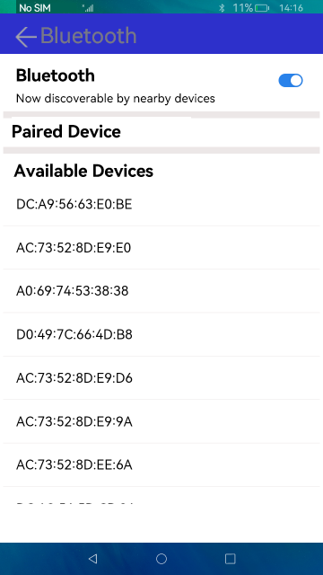

# Bluetooth

### Introduction

Bluetooth is a short-range wireless technology used to implement communication between fixed and mobile devices over low-cost short-distance wireless connections. This sample describes how to discover, pair, and unpair Bluetooth devices. The display effect is as follows:

### Concepts

Bluetooth: The Bluetooth module provides basic classic Bluetooth capabilities.

### Required Permissions

ohos.permission.USE_BLUETOOTH

ohos.permission.LOCATION

ohos.permission.DISCOVER_BLUETOOTH

ohos.permission.MANAGE_BLUETOOTH

ohos.permission.APPROXIMATELY_LOCATION

### Usage

1. Start the app. If Bluetooth is enabled, the system searches for nearby devices that can be paired. If Bluetooth is not enabled, enable it.

2. After nearby devices are detected, select the device to pair. A dialog box is displayed. Touch **Pair** to set up a connection with this device; touch **Cancel** otherwise.

3. To delete a paired device, touch the device in the paired device list. A dialog box is displayed, asking you whether to disconnect from this device. Touch **OK** to disconnect from this device; touch **Cancel** otherwise.

### Constraints

- This sample can only be run on standard-system devices.

- This sample is based on the stage model, which is supported from API version 9.

- This sample requires DevEco Studio 3.0 Beta4 (Build Version: 3.0.0.992, built on July 14, 2022) to compile and run. 

- The ohos.permission.MANAGE_BLUETOOTH permission used in this sample is of the system_basic level. You need to configure a signature for it. For details about the application permission level (APL), see [Permission List](https://gitee.com/openharmony/docs/blob/master/en/application-dev/security/permission-list.md).