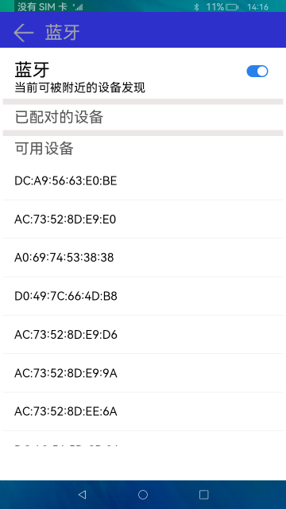

# 蓝牙

### 概要简介

蓝牙技术是一种无线数据和语音通信开放的全球规范，它是基于低成本的近距离无线连接，为固定和移动设备建立通信环境的一种特殊的近距离无线技术连接。本示例实现蓝牙设备发现，配对，取消配对功能。实现效果如下：

### 相关概念

蓝牙：蓝牙模块提供了基础的传统蓝牙能力。

### 相关权限

蓝牙使用权限：ohos.permission.USE_BLUETOOTH

位置发现权限：ohos.permission.LOCATION

设备发现权限：ohos.permission.DISCOVER_BLUETOOTH

蓝牙管理权限：ohos.permission.MANAGE_BLUETOOTH

允许应用获取设备模糊位置信息权限：ohos.permission.APPROXIMATELY_LOCATION

### 使用说明

1.启动应用，若蓝牙本来就打开的，系统会直接搜索周围可配对的设备，若蓝牙未打开，打开开关。

2.搜索到附近的设备后，选择需要配对的设备，点击该设备，会跳出匹配弹窗，若确定匹配，点击**匹配**按钮，否则点击**取消**按钮。

3.匹配后，若想删除匹配的设备，点击已配对的设备列表中的设备，会跳出断开连接弹窗，若确定删除该设备，点击**确定**，否则点击**取消**。

### 约束与限制

1.本示例仅支持标准系统上运行。

2.本示例仅支持API9版本SDK，本示例涉及使用系统接口：cancelPairedDevice()，需要手动替换Full SDK才能编译通过，具体操作可参考[替换指南](https://docs.openharmony.cn/pages/v3.2/zh-cn/application-dev/quick-start/full-sdk-switch-guide.md/)。

3.本示例需要使用DevEco Studio 3.0 Beta4 (Build Version: 3.0.0.992, built on July 14, 2022)才可编译运行。

4.本示例所配置的权限ohos.permission.MANAGE_BLUETOOTH为system_basic级别(相关权限级别可通过[权限定义列表](https://gitee.com/openharmony/docs/blob/master/zh-cn/application-dev/security/permission-list.md)查看)，需要手动配置对应级别的权限签名(具体操作可查看[自动化签名方案](https://docs.openharmony.cn/pages/v3.2/zh-cn/application-dev/security/hapsigntool-overview.md/))。
