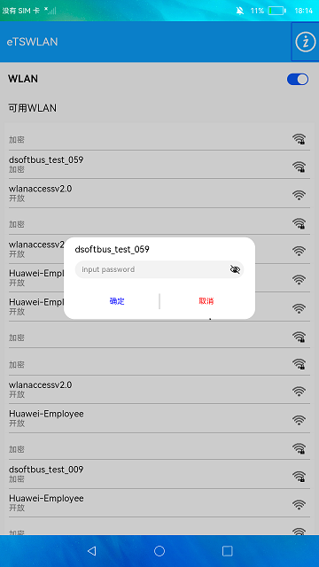
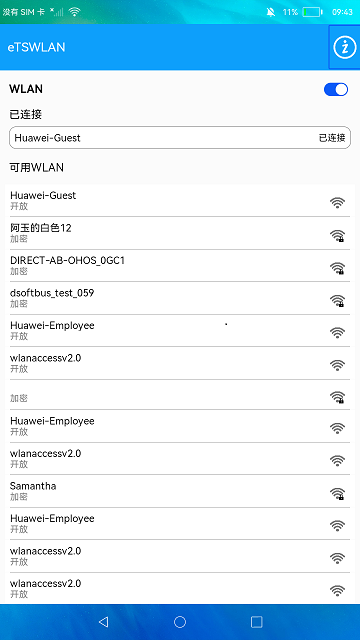
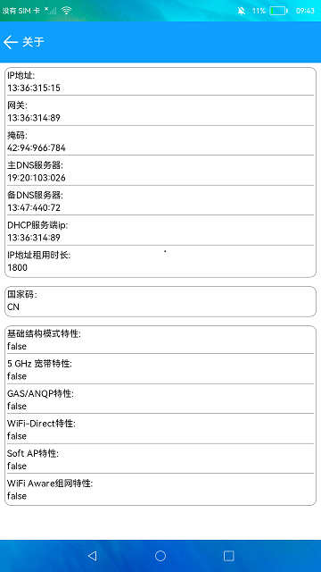

# WLAN

### 介绍

本示例通过@ohos.wifiManager相关API实现wlan激活、扫描和连接WIFI等功能。

使用说明

1. 启动应用后会判断WLAN是否激活，如果是激活状态，会扫描并展示可用WiFi列表，同时获取已连接WiFi信息并展示。

2. 点击界面的Switch开关可以禁用和激活WLAN，界面会监听WLAN状态扫描可用WiFi列表，也会监听WiFi连接状态展示已连接WiFi。

3. 点击可用WLAN列表中的WLAN信息，可以连接WiFi，如果是加密类型，会弹窗输入密码后连接。

4. 点击首页右上角的**关于**图标，进入关于界面，展示获取的IP信息、国家码和支持WLAN相关特性信息。

### 效果预览

|连接wifi                                     |主页                                     |wifi详情                                 |
|---------------------------------------------|---------------------------------------|-----------------------------------------|
||||

### 相关权限

[ohos.permission.GET_WIFI_INFO](https://gitee.com/openharmony/docs/blob/master/zh-cn/application-dev/security/permission-list.md#ohospermissionget_wifi_info)

[ohos.permission.GET_WIFI_INFO_INTERNAL](https://gitee.com/openharmony/docs/blob/master/zh-cn/application-dev/security/permission-list.md#ohospermissionget_wifi_info_internal)

[ohos.permission.SET_WIFI_INFO](https://gitee.com/openharmony/docs/blob/master/zh-cn/application-dev/security/permission-list.md#ohospermissionset_wifi_info)

[ohos.permission.GET_WIFI_CONFIG](https://gitee.com/openharmony/docs/blob/master/zh-cn/application-dev/security/permission-list.md#ohospermissionget_wifi_config)

[ohos.permission.SET_WIFI_CONFIG](https://gitee.com/openharmony/docs/blob/master/zh-cn/application-dev/security/permission-list.md#ohospermissionset_wifi_config)

[ohos.permission.MANAGE_WIFI_CONNECTION](https://gitee.com/openharmony/docs/blob/master/zh-cn/application-dev/security/permission-list.md#ohospermissionmanage_wifi_connection)

[ohos.permission.APPROXIMATELY_LOCATION](https://gitee.com/openharmony/docs/blob/master/zh-cn/application-dev/security/permission-list.md#ohospermissionapproximately_location)

### 依赖

不涉及。

### 约束与限制

1.本示例仅支持标准系统上运行。

2.本示例需要使用DevEco Studio 3.1 Canary1 (Build Version: 3.1.0.100, built on November 3, 2022)才可编译运行。

3.本示例需要使用@ohos.wifi系统权限的系统接口。使用Full SDK时需要手动从镜像站点获取，并在DevEco Studio中替换，具体操作可参考[替换指南](https://docs.openharmony.cn/pages/v3.2/zh-cn/application-dev/quick-start/full-sdk-switch-guide.md/) 。

4.本示例需要使用ohos.permission.GET_WIFI_INFO_INTERNAL、ohos.permission.MANAGE_WIFI_CONNECTION的权限为system_core级别(相关权限级别可通过[权限定义列表](https://gitee.com/openharmony/docs/blob/master/zh-cn/application-dev/security/permission-list.md) 查看)，需要手动配置对应级别的权限签名。
