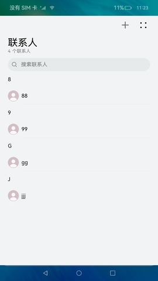
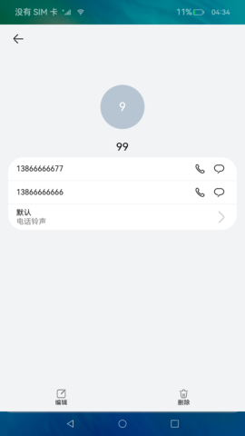
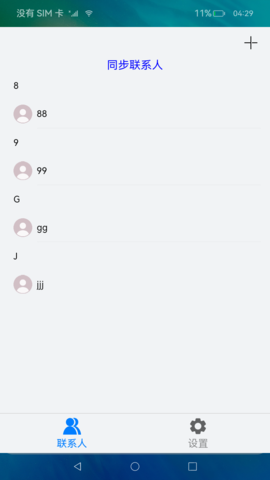
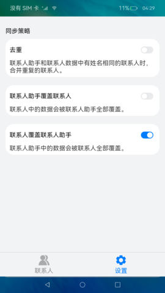

# 跨应用数据共享

### 介绍

 本示例实现了一个跨应用数据共享实例，分为联系人（数据提供方）和联系人助手（数据使用方）两部分：联系人支持联系人数据的增、删、改、查等功能；联系人助手支持同步联系人数据，当联系人与联系人助手数据不一致时，支持合并重复数据。 

实现：

1. 使用[DataShareExtensionAbility](https://gitee.com/openharmony/docs/blob/master/zh-cn/application-dev/reference/apis/js-apis-application-DataShareExtensionAbility.md) 实现数据共享。
2. 使用[关系型数据库](https://gitee.com/openharmony/docs/blob/master/zh-cn/application-dev/reference/apis/js-apis-data-rdb.md)实现数据的增、删、改、查接口。
3. 使用[DataShare](https://gitee.com/openharmony/docs/blob/master/zh-cn/application-dev/reference/apis/js-apis-data-dataShare.md)管理和访问数据库数据变化。

使用说明：

1. 联系人应用，首页中点击**+**按钮可以添加联系人，在首页展示联系人列表。
2. 联系人应用首页点击搜索框可以搜索联系人，点击联系人进入详情页，详情页提供编辑和删除功能入口。
3. 联系人助手应用，点击同步联系人可以同步联系人应用的数据到联系人助手，同步后可以点击联系人进入详情页，详情页提供编辑和删除功能。
4. 联系人助手首页点击**+**按钮，可以新增联系人。
5. 联系人助手设置页面可以设置同步策略，根据不同的同步策略，每次点击首页的同步联系人按钮会同步一次联系人数据，默认使用联系人覆盖联系人助手策略。

### 效果预览

### 相关权限

不涉及。

### 依赖

不涉及。

### 约束与限制

1. 本示例仅支持标准系统上运行，支持设备：RK3568。

2. 本示例为Stage模型，仅支持API9版本SDK，版本号：3.2.7.5。

3. 本示例需要使用DevEco Studio 3.0 Release (Build Version: 3.0.0.993, built on September 4, 2022)才可编译运行。

4. 本示例需要使用@ohos.data.dataShare，@ohos.data.dataSharePredicates，@ohos.data.ValuesBucket系统权限的系统接口。使用Full SDK时需要手动从镜像站点获取，并在DevEcoStudio中替换，具体操作可参考 [替换指南](https://docs.openharmony.cn/pages/v3.2/zh-cn/application-dev/quick-start/full-sdk-switch-guide.md/) 。

5. 本示例使用了DataShareExtensionAbility，安装需要手动配置签名，具体操作可查看[自动化签名方案](https://docs.openharmony.cn/pages/v3.2/zh-cn/application-dev/security/hapsigntool-overview.md/)。
