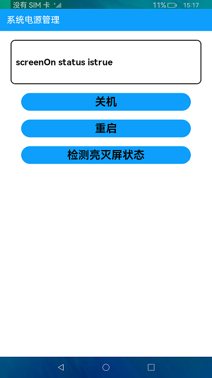

# 系统电源管理

### 简介

本示例通过[power](https://gitee.com/openharmony/docs/blob/master/zh-cn/application-dev/reference/apis/js-apis-power.md)接口实现了关机、重启以及检测亮灭屏状态的功能。

使用说明：

1.点击**关机**按钮，并在弹框中点击确定，系统将关机。点击取消，则关闭弹窗。

2.点击**重启**按钮，并在弹框中点击确定，系统将重启。点击取消，则关闭弹窗。

3.点击**检测亮灭屏状态**按钮，将会把检测的结果信息展示在显示窗口中。

### 效果预览

|主页|
|--------------------------------|
||

### 相关权限

电源管理权限：[ohos.permission.REBOOT](https://gitee.com/openharmony/docs/blob/master/zh-cn/application-dev/security/permission-list.md) 

### 依赖

不涉及。

### 约束与限制

1.本示例仅支持在标准系统上运行。

2.本示例仅支持API9版本SDK，版本号：3.2.7.6。

3.本示例需要使用DevEco Studio 3.1 Canary1 (Build Version: 3.1.0.100, built on November 3, 2022)才可编译运行。

4.本示例需要使用@ohos.power系统权限的系统接口。使用Full SDK时需要手动从镜像站点获取，并在DevEco Studio中替换，具体操作可参考[替换指南](https://docs.openharmony.cn/pages/v3.2/zh-cn/application-dev/quick-start/full-sdk-switch-guide.md/)。

5.本示例所配置的权限ohos.permission.REBOOT为system_basic级别(相关权限级别可通过[权限定义列表](https://gitee.com/openharmony/docs/blob/master/zh-cn/application-dev/security/permission-list.md)查看)，需要手动配置对应级别的权限签名(具体操作可查看[自动化签名方案](https://docs.openharmony.cn/pages/v3.2/zh-cn/application-dev/security/hapsigntool-overview.md/))。
