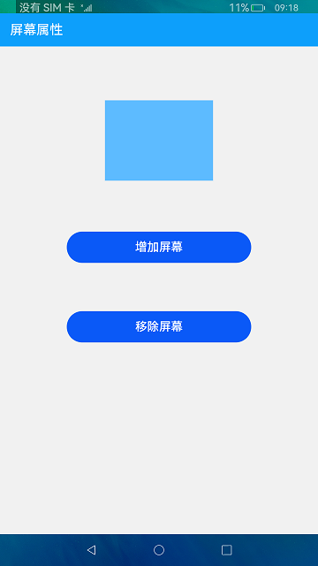
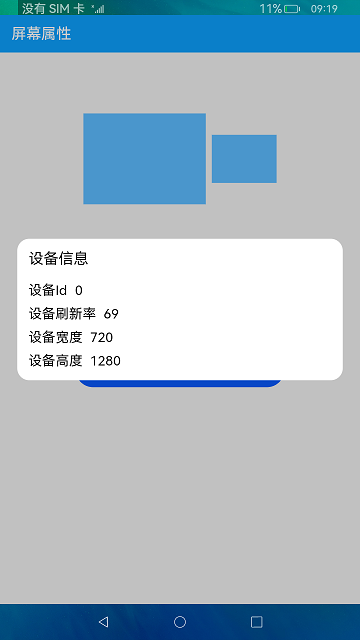

# 屏幕属性

### 简介

本示例监听屏幕数量变化，创建、销毁虚拟屏幕模拟屏幕增减，读取屏幕属性并显示。效果图如下：

### 相关概念

屏幕属性：屏幕属性接口提供获取默认display对象、获取所有display对象，开启监听、关闭监听功能。

Screen：screen接口提供创建虚拟屏幕、销毁虚拟屏幕、扩展屏幕、镜像屏幕等功能。

### 相关权限

不涉及。

### 使用说明

1.点击主页面中大矩形，弹窗显示默认屏幕宽、高、刷新率、ID信息，点击任意区域关闭弹窗，点击小矩形，弹窗显示所有屏幕信息。

2.点击**增加屏幕**按钮，监听到屏幕增加，增加小矩形代表新增屏幕（因界面空间有效，增加超过三个屏幕，只显示三个小矩形）。

3.点击**移除屏幕**按钮，监听到屏幕销毁，减少小矩形代表移除屏幕。

### 约束与限制

1.本示例仅支持在标准系统上运行。

2.本示例为Stage模型，仅支持API version 9版本SDK，版本号：3.2.10.6。

3.编译前下载最新日构建中ohos-sdk，解压并替换@ohos.screen.d.ts文件。

4.本示例需要使用DevEco Studio 3.1 Canary1 (Build Version: 3.1.0.100)及以上才可编译运行。

5.本示例需要使用@ohos.screen系统权限的系统接口。使用Full SDK时需要手动从镜像站点获取，并在DevEco Studio中替换，具体操作可参考[替换指南](https://docs.openharmony.cn/pages/v3.2/zh-cn/application-dev/quick-start/full-sdk-switch-guide.md/)。
