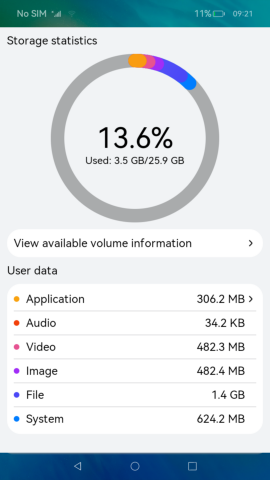
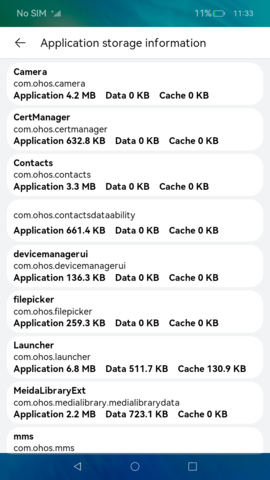
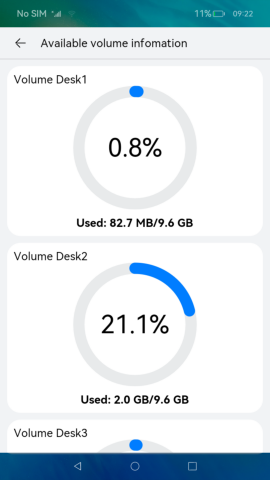

# Storage Space Statistics

### Introduction

This sample presents how to view the storage space usage, space of all installed applications, and available volumes of a device by using the application bundle management, application space statistics, and volume management modules.

This sample uses the [<**DataPanel** component>](https://gitee.com/openharmony/docs/blob/master/en/application-dev/reference/arkui-ts/ts-basic-components-datapanel.md) to display the space information about different applications; uses [**Bundle**](https://gitee.com/openharmony/docs/blob/master/en/application-dev/reference/apis/js-apis-Bundle.md) to obtain the application name and bundle information; uses [**App Space Statistics**](https://gitee.com/openharmony/docs/blob/master/en/application-dev/reference/apis/js-apis-storage-statistics.md) to obtain the storage space usage of the device; use [**Volume Management**](https://gitee.com/openharmony/docs/blob/master/en/application-dev/reference/apis/js-apis-volumemanager.md) to obtain information about available volumes of the device.
Instructions:

1. The main page displays the detailed information about the storage space usage of the current device.

2. Tap **Application** to view the space of all installed applications.

3. Tap **View Available Volumes** to view information about all available volumes of the device.

### Display Effect

### Required Permissions

- Permission to obtain storage space information and available volumes: [ohos.permission.STORAGE_MANAGER](https://gitee.com/openharmony/docs/blob/master/en/application-dev/security/permission-list.md)

- Permission to obtain information about installed applications: [ohos.permission.GET_BUNDLE_INFO_PRIVILEGED](https://gitee.com/openharmony/docs/blob/master/en/application-dev/security/permission-list.md)

### Dependency

N/A

### Constraints

1. This sample can only be run on standard-system devices that use the Rockchip RK3568 development board.

2. This sample is based on the stage model, which is supported from API version 9 (SDK version: 3.2.7.5). 

3. DevEco Studio 3.0 Release (Build Version: 3.0.0.993, built on September 4, 2022) must be used.

4. This sample uses the **@ohos.bundle.innerBundleManager**, **@ohos.volumeManager**, and **@ohos.storageStatistics** system APIs. To use the full SDK, obtain it from a mirror site and switch to it in DevEco Studio. For details, see [Guide to Switching to Full SDK](https://gitee.com/openharmony/docs/blob/master/en/application-dev/quick-start/full-sdk-switch-guide.md).

5. This example uses the **system_core** permissions (see [App Permission List](https://gitee.com/openharmony/docs/blob/master/en/application-dev/security/permission-list.md)). You need to [configure a high-level permission signature](https://docs.openharmony.cn/pages/v3.2Beta/zh-cn/application-dev/security/hapsigntool-overview.md).
