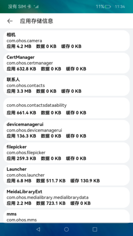
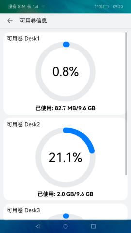

# 存储空间统计

### 介绍

本示例通过应用程序包管理、应用空间统计与卷管理模块，实现了查看当前设备存储空间信息、所有安装的应用的存储信息、所有可用卷的存储信息的功能。

本示例使用 [DataPanel组件](https://gitee.com/openharmony/docs/blob/master/zh-cn/application-dev/reference/arkui-ts/tsbasiccomponents-datapanel.md) 展示不同种类的应用存储信息，通过 [Bundle模块](https://gitee.com/openharmony/docs/blob/master/zh-cn/application-dev/reference/apis/js-apis-Bundle.md) 来获取不同应用的包名与应用名等信息， 使用 [应用空间统计](https://gitee.com/openharmony/docs/blob/master/zh-cn/application-dev/reference/apis/js-apis-storage-statistics.md) 来查询当前设备的存储使用情况，使用 [卷管理](https://gitee.com/openharmony/docs/blob/master/zh-cn/application-dev/reference/apis/js-apis-volumemanager.md) 来查询可用卷存储使用情况。
使用说明：

1. 主页面会展示当前设备存储使用的详细信息。

2. 点击“应用”，可以查看当前安装的所有应用的存储使用情况。

3. 当有可用的卷时，点击“查看可用卷信息”查看当前设备所有的可用卷的存储使用情况。

### 效果预览

### 相关权限

1. 允许获取存储信息与可用卷信息：[ohos.permission.STORAGE_MANAGER](https://gitee.com/openharmony/docs/blob/master/zh-cn/application-dev/security/permission-list.md)

2. 允许获取已安装应用的信息：[ohos.permission.GET_BUNDLE_INFO_PRIVILEGED](https://gitee.com/openharmony/docs/blob/master/zh-cn/application-dev/security/permission-list.md)

### 依赖

不涉及。

### 约束与限制

1. 本示例仅支持标准系统上运行，支持设备：RK3568。

2. 本示例为Stage模型，仅支持API9版本SDK，版本号：3.2.7.5。

3. 本示例需要使用DevEco Studio 3.0 Release (Build Version: 3.0.0.993, built on September 4, 2022)才可编译运行。

4. 本示例需要使用@ohos.bundle.innerBundleManager，@ohos.volumeManager，@ohos.storageStatistics系统权限的系统接口。使用Full SDK时需要手动从镜像站点获取，并在DevEcoStudio中替换，具体操作可参考 [替换指南](https://docs.openharmony.cn/pages/v3.2/zh-cn/application-dev/quick-start/full-sdk-switch-guide.md/) 。

5. 本示例使用了system_core级别的权限（相关权限级别请查看[权限定义列表](https://gitee.com/openharmony/docs/blob/master/zh-cn/application-dev/security/permission-list.md) ），需要手动配置高级别的权限签名(具体操作可查看[自动化签名方案](https://docs.openharmony.cn/pages/v3.2/zh-cn/application-dev/security/hapsigntool-overview.md/) ) 。
