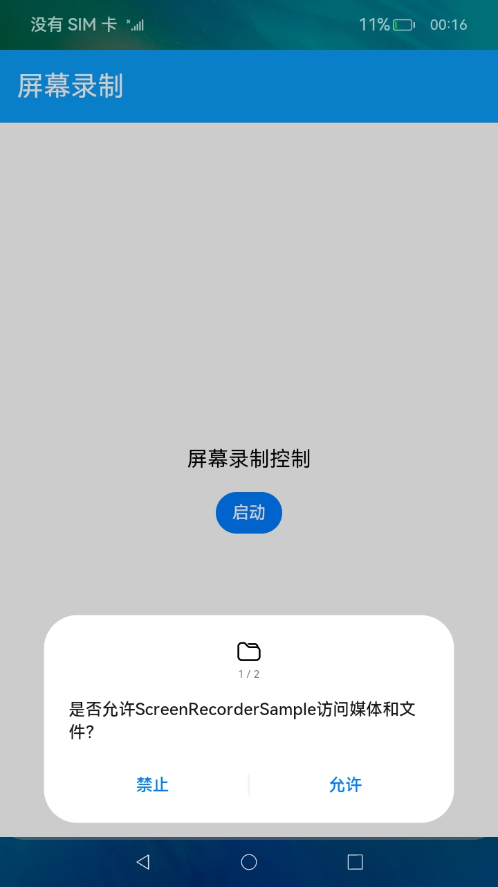
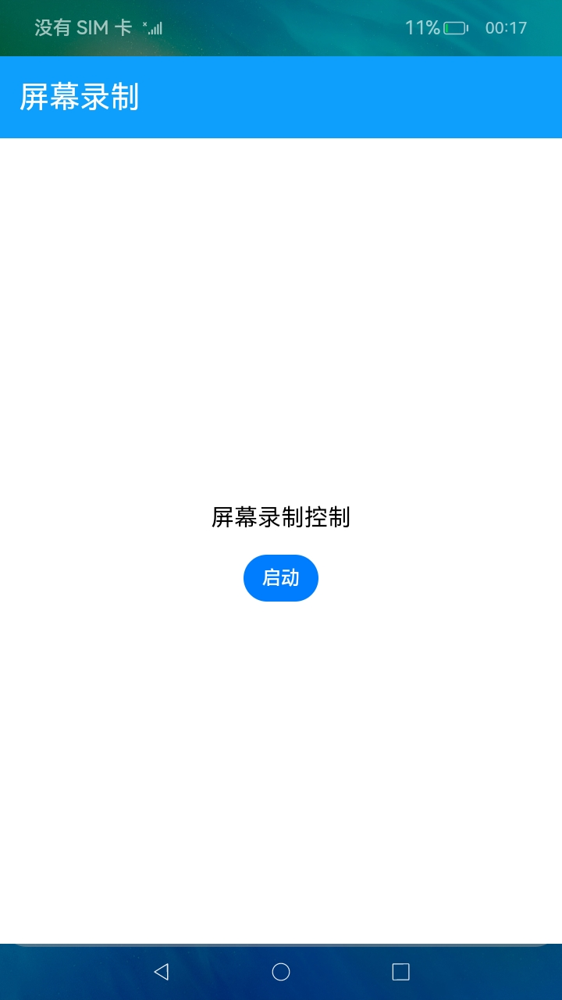
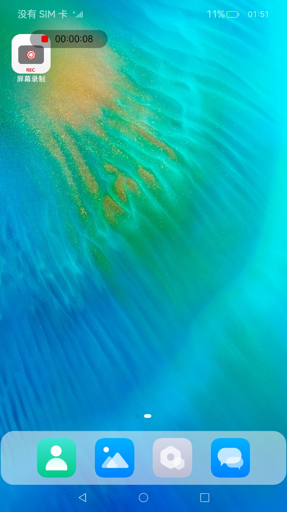

# 录屏示例

### 介绍

 该示例展示设备屏幕（含音频）录制功能。屏幕录制的主要工作是通过创建一个虚拟屏，捕获屏幕显示图形帧，完成视频编码并保存到文件中，帮助OEM设备厂家系统应用实现屏幕录制功能，也可以通过此应用抓取屏幕帧用于问题复现录制。

### 使用说明

1.启动应用，首次启动需要用户授予“**访问媒体和文件**”和“**麦克风**”的权限

2.点击**启动**按钮，启动屏幕录制。

3.启动录制后会弹出一个透明录制悬浮控件，并显示录制时间计时，此时可以操作屏幕，操作过程屏幕显示会被录制下来。

4.需要停止录屏时，点击悬浮半透明的红色按钮，屏幕录制停止。

5.打开图库应用，在图库中可以看到最新录屏的媒体文件，点击后可支持录屏回放。

### 效果预览

实现效果如下：

|获取媒体权限|获取录音权限|应用主界面|录制过程界面|
|--------------------------------|--------------------------------|--------------------------------|--------------------------------|
|||||

### 相关权限

**权限一：用户授权，访问媒体和文件**
ohos.permission.MEDIA_LOCATION
ohos.permission.WRITE_MEDIA
ohos.permission.READ_MEDIA

**权限二：用户授权，使用麦克风**
ohos.permission.MICROPHONE

**权限三：系统授权，需要配置为system_basic类型系统应用**
ohos.permission.SYSTEM_FLOAT_WINDOW

**权限四：系统授权，需要配置为system_core类型系统应用**

ohos.permission.CAPTURE_SCREEN

具体[参考指南](https://gitee.com/openharmony/docs/blob/master/zh-cn/application-dev/security/permission-list.md)。

### 约束与限制

1.本示例仅支持标准系统上安装运行。

2.本示例需要使用DevEco Studio 3.0 Beta4 (Build Version: 3.0.0.993, built on September 4, 2022)及以上版本才可编译运行。

3.本示例需要使用@ohos.screen系统权限的系统接口，使用Full SDK时需要手动从镜像站点获取，并在DevEco Studio中替换，具体操作可参考[替换指南](https://docs.openharmony.cn/pages/v3.2/zh-cn/application-dev/quick-start/full-sdk-switch-guide.md/)。

4.系统权限的自动化签名指南，可通过打开DevEco Studio中菜单，File -> Project Structure -> Project -> Signing Configs(TAB页最下方蓝色字体) -> “**View the operation guide**” 跳转链接，可支持系统权限的自动签名生成。

5.rk设备由于芯片限制，应用中videoFrameWidth，videoFrameHeight，videoFrameRate需同比缩小3/5, 才能实现rk上的播放效果。
