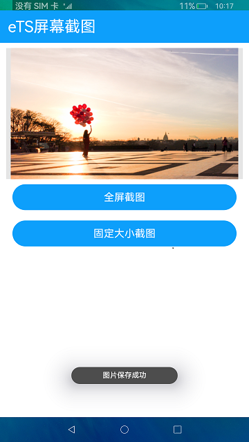

# 屏幕截图

### 简介

此Demo展示eTS项目中如何使用screenshot接口获取屏幕截图。实现效果如下：

### 相关概念

屏幕截图：提供获取当前屏幕截图的api，返回获取到的PixelMap信息。

### 相关权限

获取屏幕截图权限：ohos.permission.CAPTURE_SCREEN
读取公共媒体文件权限：ohos.permission.READ_MEDIA
读写公共媒体文件权限：ohos.permission.WRITE_MEDIA

### 使用说明

1. 点击**全屏截图**，获取全屏截图并保存到图库中。

2. 点击**固定大小截图**，获取固定大小截图并保存到图库中。

### 约束与限制

1.本示例仅支持标准系统上运行。

2.本示例仅支持API9版本SDK，本示例涉及使用系统接口：@ohos.screenshot，需要手动替换Full SDK才能编译通过，具体操作可参考[替换指南](https://docs.openharmony.cn/pages/v3.2/zh-cn/application-dev/quick-start/full-sdk-switch-guide.md/)。

3.本示例需要使用DevEco Studio 3.1 Canary1 (Build Version: 3.1.0.100)及以上才可编译运行

4.本示例所配置的权限ohos.permission.CAPTURE_SCREEN为system_core级别(相关权限级别可通过[权限定义列表](https://gitee.com/openharmony/docs/blob/master/zh-cn/application-dev/security/permission-list.md)查看)，需要手动配置对应级别的权限签名(具体操作可查看[自动化签名方案](https://docs.openharmony.cn/pages/v3.2/zh-cn/application-dev/security/hapsigntool-overview.md/))。

