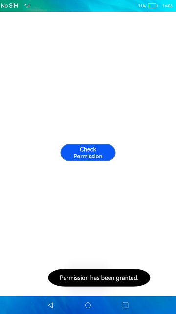
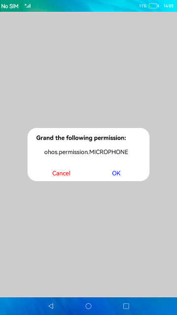

# Access Permission Control

### Introduction

This sample shows how `@ohos.abilityAccessCtrl` works to implement app permission control. The display effect is as follows:

 

### Concepts

Application access control: provides application permission management, including authentication, authorization, and authorization revocation.

### Required Permissions

- ohos.permission.GET_SENSITIVE_PERMISSIONS

- ohos.permission.REVOKE_SENSITIVE_PERMISSIONS

- ohos.permission.GRANT_SENSITIVE_PERMISSIONS

- ohos.permission.GET_BUNDLE_INFO_PRIVILEGED

- ohos.permission.GET_BUNDLE_INFO

- ohos.permission.MICROPHONE

### Usage

1. Open the app. A dialog box is displayed, asking you whether to grant the permission. Touch **Cancel**.

2. The permission check screen is displayed. Touch the **Check Permission** button. A message is displayed, indicating that the permission is not granted.

3. Close the app and open it again. A dialog box is displayed, asking you whether to grant the permission. Touch **OK**.

4. The permission check screen is displayed. Touch the **Check Permission** button. A message is displayed, indicating that the permission has been granted.

5. Close the app and open it again. No dialog box is displayed. Touch the **Check Permission** button. A message is displayed, indicating that the permission has been granted.

### Constraints

- This sample can only be run on standard-system devices.

- Before building a project, you need to run **Make Module 'entry'**.

- This sample requires DevEco Studio 3.0 Beta4 (Build Version: 3.0.0.992, built on July 14, 2022) to compile and run.

- The ohos.permission.GET_SENSITIVE_PERMISSIONS, ohos.permission.REVOKE_SENSITIVE_PERMISSIONS, and ohos.permission.GRANT_SENSITIVE_PERMISSIONS permissions used in this sample are of the system_core level. You need to configure signatures for these permissions. For details about the application permission level (APL), see [Permission List](https://gitee.com/openharmony/docs/blob/master/en/application-dev/security/permission-list.md).
