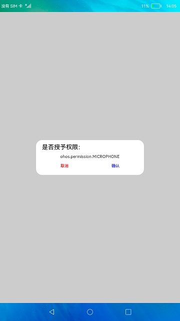

# 访问权限控制

### 介绍

本示例使用@ohos.abilityAccessCtrl，展示了应用申请权限场景。

使用说明

1.打开应用，页面出现弹窗，点击 **取消** 按钮。

2.页面跳转显示 **检测权限** 按钮，点击检测权限，出现提示信息“权限未授予”。

3.关闭应用再次打开，页面出现弹窗，点击 **确认** 按钮。

4.页面跳转显示 **检测权限** 按钮，点击**检测权限** 按钮，出现提示信息“权限已授予”。

5.关闭应用再次打开，页面不出现弹窗，点击 **检测权限** 按钮，点击检测权限，出现提示信息“权限已授予”。

### 效果预览

|主页|授权弹窗|
|------------|-------------------|
|| |

### 相关权限

[ohos.permission.GET_SENSITIVE_PERMISSIONS](https://gitee.com/openharmony/docs/blob/master/zh-cn/application-dev/security/permission-list.md#ohospermissionget_sensitive_permissions)

[ohos.permission.REVOKE_SENSITIVE_PERMISSIONS](https://gitee.com/openharmony/docs/blob/master/zh-cn/application-dev/security/permission-list.md#ohospermissionrevoke_sensitive_permissions)

[ohos.permission.GRANT_SENSITIVE_PERMISSIONS](https://gitee.com/openharmony/docs/blob/master/zh-cn/application-dev/security/permission-list.md#ohospermissiongrant_sensitive_permissions)

[ohos.permission.GET_BUNDLE_INFO_PRIVILEGED](https://gitee.com/openharmony/docs/blob/master/zh-cn/application-dev/security/permission-list.md#ohospermissionget_bundle_info_privileged)

[ohos.permission.GET_BUNDLE_INFO](https://gitee.com/openharmony/docs/blob/master/zh-cn/application-dev/security/permission-list.md#ohospermissionget_bundle_info)

[ohos.permission.MICROPHONE](https://gitee.com/openharmony/docs/blob/master/zh-cn/application-dev/security/permission-list.md#ohospermissionmicrophone)

### 依赖

不涉及。

### 约束与限制

1.本示例仅支持在标准系统上运行。

2.工程编译前需要先执行Make Module 'entry'。

3.本示例涉及使用系统接口：grantUserGrantedPermission()，需要手动替换Full SDK才能编译通过，具体操作可参考[替换指南](https://docs.openharmony.cn/pages/v3.2/zh-cn/application-dev/quick-start/full-sdk-switch-guide.md/)。

4.本示例需要使用DevEco Studio 3.1 Canary1 (Build Version: 3.1.0.100, built on November 3, 2022)才可编译运行。

5.本示例所配置的权限ohos.permission.GET_SENSITIVE_PERMISSIONS、ohos.permission.REVOKE_SENSITIVE_PERMISSIONS、ohos.permission.GRANT_SENSITIVE_PERMISSIONS为system_core级别(相关权限级别可通过[权限定义列表](https://gitee.com/openharmony/docs/blob/master/zh-cn/application-dev/security/permission-list.md)查看)，需要手动配置对应级别的权限签名(具体操作可查看[自动化签名方案](https://docs.openharmony.cn/pages/v3.2/zh-cn/application-dev/security/hapsigntool-overview.md/))。
