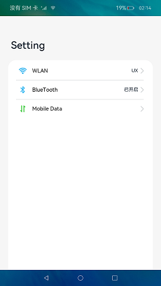
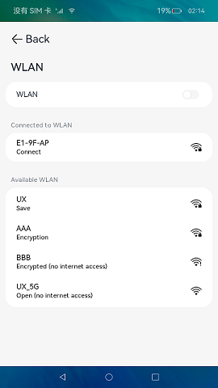
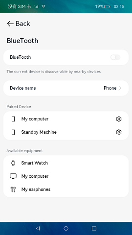
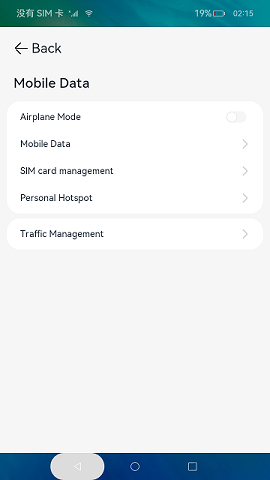

# Window Extension Ability

### Introduction

This sample simulates the **Setting** app, where you can touch the menu bar to go to the details page.

In this sample, the [Window Extension Ability](https://gitee.com/openharmony/docs/blob/master/en/application-dev/reference/apis/js-apis-application-WindowExtensionAbility.md) is used to set abilities, and [AbilityComponent](https://gitee.com/openharmony/docs/blob/master/en/application-dev/reference/arkui-ts/ts-container-ability-component.md) is used to load abilities.

### Usage

1. In portrait mode, touch the **Setting** menu bar on the left. The details page is displayed.

2. In landscape mode, touch the **Setting** menu bar on the left. The details page is displayed on the right.

### Preview

 
 

### Required Permissions

N/A

### Dependency

N/A

### Constraints

1. This sample can only be run on standard-system devices that use the Rockchip RK3568 chip.

2. This sample demonstrates the stage model, which supports only the SDK of API version 9 (SDK version: 3.2.6.3 Beta2).

3. DevEco Studio 3.0 Beta4 (Build version: 3.0.0.992, built on July 14, 2022) must be used.

4. **WindowExtensionAbility** and **AbilityComponent** are system APIs and require the use of the Full SDK. To use the Full SDK, you must manually obtain it from the mirror and switch to it in DevEco Studio. For details, see [Guide to Switching to Full SDK](https://gitee.com/openharmony/docs/blob/master/en/application-dev/quick-start/full-sdk-switch-guide.md).
