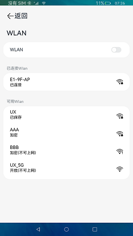

# 窗口扩展应用

### 介绍

本示例仿设置应用，实现点击设置菜单栏，跳转或加载详情页面。

本示例通过 [窗口扩展能力](https://gitee.com/openharmony/docs/blob/master/zh-cn/application-dev/reference/apis/js-apis-application-WindowExtensionAbility.md) 设置不同Ability，使用 [AbilityComponent](https://gitee.com/openharmony/docs/blob/master/zh-cn/application-dev/reference/arkui-ts/ts-container-ability-component.md) 组件加载各个Ability。

使用说明：

1.竖屏模式下点击左侧设置菜单栏，跳转详情页面。

2.横屏模式下点击左侧设置菜单栏，右侧显示详情页面。

### 效果预览

 
 

### 相关权限

不涉及。

### 依赖

不涉及。

### 约束与限制

1.本示例仅支持标准系统上运行，支持设备：支持RK3568。

2.本示例仅支持API version 9版本SDK，版本号：3.2.10.6。

3.本示例需要使用DevEco Studio 3.1 Canary1 (Build Version: 3.1.0.100)及以上才可编译运行。

4.本示例使用的WindowExtensionAbility、AbilityComponent均为系统接口，需要使用Full SDK手动从镜像站点获取，并在DevEco Studio中替换，具体操作可参考[替换指南](https://docs.openharmony.cn/pages/v3.2/zh-cn/application-dev/quick-start/full-sdk-switch-guide.md/)。
