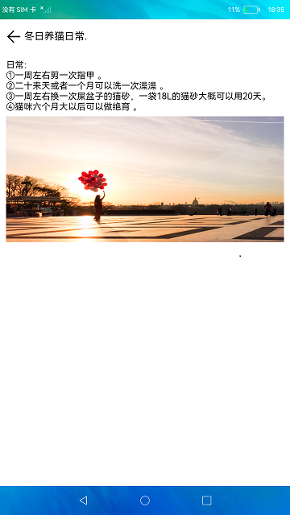

# 横竖屏切换

### 介绍

此Demo展示如何使用媒体查询，完成在不同设备上显示不同的界面效果。具体操作步骤如下：

1.在竖屏设备上，首页展示新闻列表，点击新闻进入详情界面。

2.在横屏设备上，首页左侧展示新闻列表，右侧显示新闻详情，点击新闻右侧显示所点击的新闻的详情。

### 效果预览

 

### 相关权限

不涉及。

### 依赖

不涉及。

### 约束与限制

1.本示例仅支持标准系统上运行。

2.本示例仅支持API9版本SDK，版本号：3.2.9.2。

3.本示例需要使用DevEco Studio 3.1 Canary1 (Build Version: 3.1.0.100, built on November 3, 2022)才可编译运行。
