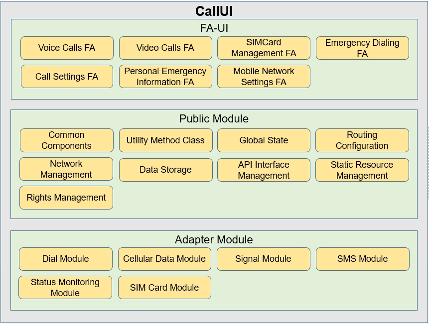

# applications_call

## 1 Introduction

​ Based on the capabilities of the system platform, design and develop call applications, providing voice calls, video calls, call settings, mobile network settings, SIM card management settings, emergency dialing, and functions for adding personal emergency information. Build models from different perspectives and design the architecture of the call application to ensure security, resilience, reliability, privacy, etc. while satisfying basic functions.

### 1.2 Introduction to Architecture Diagram:



The application adopts a multi-module design as a whole, which is used to handle the business logic and data management of the call application and the interface display. Each module follows the division principle of the above architecture.
The functions of each module are as follows:

* FA-UI: Interface display responsible for handling and user interaction
* Public Module: responsible for the processing of public methods, assisting in the display of the connected interface, the interaction of business logic and data management
* Adapter Module: responsible for business logic and data management

The important classes and their functions in each layer of the application are shown in the following table

| Module | Function | Class Name | Function |
| ---- | ---- | ---- | ---- |
| FA-UI | Interface Display | Voice Calls FA | Mainly provides user interface related to voice calls |
| FA-UI | Interface Display | video Calls FA | Mainly provide video call related user interface |
| FA-UI | Interface display | SIMCard Management FA | SIM card related user interaction management interface |
| FA-UI | Interface Display | Emergency Dialing FA | Emergency Dialing User Interface |
| FA-UI | Interface display | Call Settings FA | User interaction interface related to call settings |
| FA-UI | Interface Display | Personal Emergency Information FA | Personal Emergency Number User Interface |
| FA-UI | Interface Display | Mobile NetWork Settings FA | Mobile NetWork Settings User Interface |
| Public Module | Common Components and Methods | Common Components | Processing Classes for Public Components |
| Adapter Module | Business Processing Interface | Dial Module | Handling Dial-related Functions |
| Adapter Module | Business Processing Interface | Status Monitoring Module | Monitor Business Status Module |

## 2. Directories
```
/applications_call
├── callui                         
│   └── src
│       └── main
│           ├── ets               
│               ├── default
│                   ├── assets 
│                   ├── common       
│                       ├── components
│                       ├── configs    
│                       ├── constant     
│                       ├── utils    
│                   ├── model    
│                   ├── pages  
|                   ├── app.ets       
│               ├── ServiceAbility
│                   ├── callManagerService.ets
│                   ├── service.ts         
│                   ├── telephonyApi.ets  
│           ├── resources                 
|               ├── base             
|               ├── zh_CN               
│           ├── config.json        
├── doc                             
|   ├── image                  
|   ├── Instructions.md            
├── mobiledatasettings                  
│   └── src
│       └── main
│           ├── ets          
│               ├── default
│                   ├── pages
│           ├── resources
|               ├── base
|               ├── zh_CN
│           ├── config.json
├── figures
│   └── callui_en.png
├── signature
│   └── com.ohos.callui.p7b
├── LICENSE
├── build.gradle
```

## 3. Instructions for use

* See instructions for use ([Instructions for use](doc/Instructions.md))

## 4. Related positions

* system applications

[**applications_call**](https://gitee.com/openharmony/applications_call)
