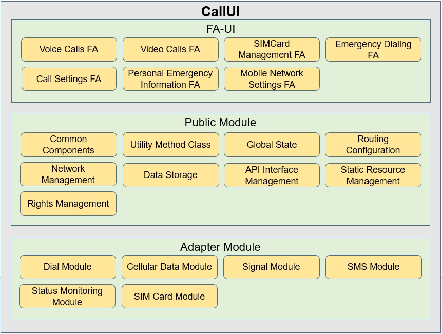

# applications_call

## 1. 简介

### 1.1 内容介绍：

​       基于系统平台能力，设计和开发通话应用，提供语音通话、视频通话、通话设置、移动网络设置、SIM卡管理设置、紧急拨号以及添加个人紧急信息的功能。从不同视角构建模型，设计通话应用的架构，确保在满足基本功能的同时，确保安全、韧性、可靠、隐私等。


### 1.2 架构图介绍：


应用整体采用了多模块设计的方式，用于处理通话应用的业务逻辑与数据管理以及界面显示，每个模块都遵循上述架构的划分原则。
各模块的作用分别如下：
* FA-UI：负责处理和用户交互的界面显示
* Public Module：负责公共方法的处理，辅助连通界面显示，业务逻辑和数据管理的交互
* Adapter Module：负责业务逻辑和数据管理

应用各层中重要类及其功能如下表所示

| 模块 | 功能 | 类名 | 作用 |
| ---- | ---- | ---- | ---- |
| FA-UI | 界面显示 | Voice Calls FA | 主要提供语音通话相关用户交互界面 |
| FA-UI | 界面显示 | video Calls FA | 主要提供视频通话相关用户交互界面 |
| FA-UI | 界面显示 | SIMCard Management FA | SIM卡相关用户交互管理界面 |
| FA-UI | 界面显示 | Emergency Dialing FA | 紧急拨号用户交互界面 |
| FA-UI | 界面显示 | Call Settings FA | 通话设置相关用户交互的界面 |
| FA-UI | 界面显示 | Personal Emergency Information FA | 个人设置紧急号码用户交互界面 |
| FA-UI | 界面显示 | Mobile NetWork Settings FA | 移动网络设置用户交互界面 |
| Public Module | 公共组件和方法 | Common Components | 公共组件的处理类 |
| Adapter Module | 业务处理接口 | Dial Module | 处理拨号相关的功能 |
| Adapter Module | 业务处理接口| Status Monitoring Module | 监听业务状态模块 |


## 2. 目录

```
/applications_call
├── callui                                       # 通话应用主Ability，提供拉起应用入口
│   └── src
│       └── main
│           ├── ets                              # ets代码目录
│               ├── default
│                   ├── assets                   # 图片资源
│                   ├── common                   # 公共组件或方法配置目录
│                       ├── components           # 公共组件
│                       ├── configs          	 # 应用配置对象目录
│                       ├── constant             # 应用常量对象目录
│                       ├── utils                # 公共方法
│                   ├── model                    # Model层代码目录
│                   ├── pages                    # 通话页面目录
|                   ├── app.ets                  # 全局ets逻辑和应用生命周期管理文件
│               ├── ServiceAbility               # 服务ability
│                   ├── callManagerService.ets   # ServiceAbility方法
│                   ├── service.ts               # ServiceAbility方法
│                   ├── telephonyApi.ets         # ServiceAbility方法
│           ├── resources                        # 资源配置文件存放目录
|               ├── base                         # 默认图片资源，字体大小，颜色资源存放目录
|               ├── zh_CN                        # 中文语言场景资源内容存放目录
│           ├── config.json                      # 全局配置文件
├── doc                                          # 使用说明目录
|   ├── image                                    # 使用说明图片资源
|   ├── Instructions.md                          # 使用说明
├── mobiledatasettings                           # 移动数据设置
│   └── src
│       └── main
│           ├── ets                              # ets代码目录
│               ├── default
│                   ├── pages                    # 移动数据页面目录
│           ├── resources                        # 资源配置文件存放目录
|               ├── base                         # 默认图片资源，字体大小，颜色资源存放目录
|               ├── zh_CN                        # 中文语言场景资源内容存放目录
│           ├── config.json                      # 全局配置文件
├── figures                                      # 架构图目录
│   └── callui_en.png                            # 架构设计图
├── signature                                    # 签名证书文件目录
│   └── com.ohos.callui.p7b                      # 签名文件
├── LICENSE                                      # 许可证
├── build.gradle                                 # 全局编译配置文件
```


## 3. 使用说明

* 参见使用说明（[使用说明](doc/Instructions.md)）


## 4. 相关仓

* 系统应用

[**applications_call**](https://gitee.com/openharmony/applications_call)


