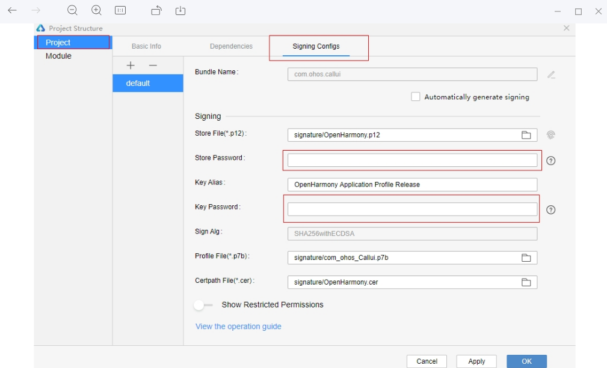
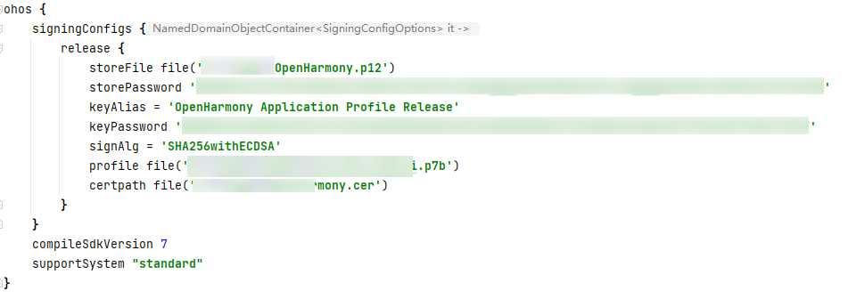
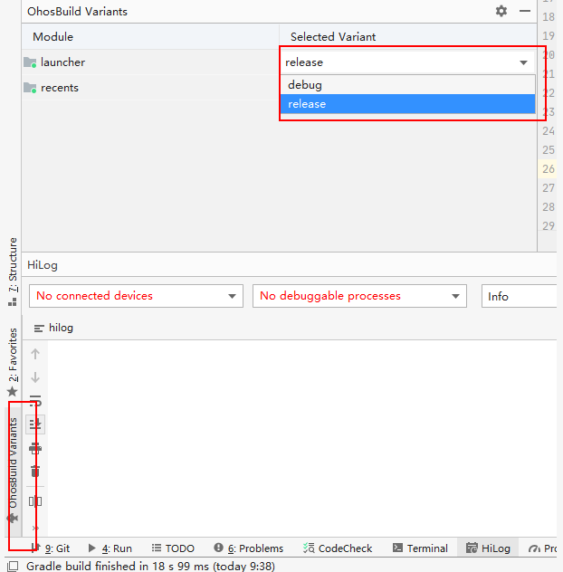
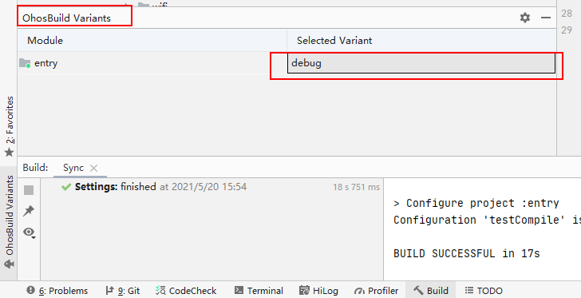
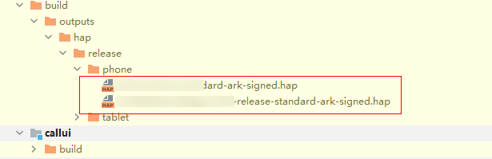
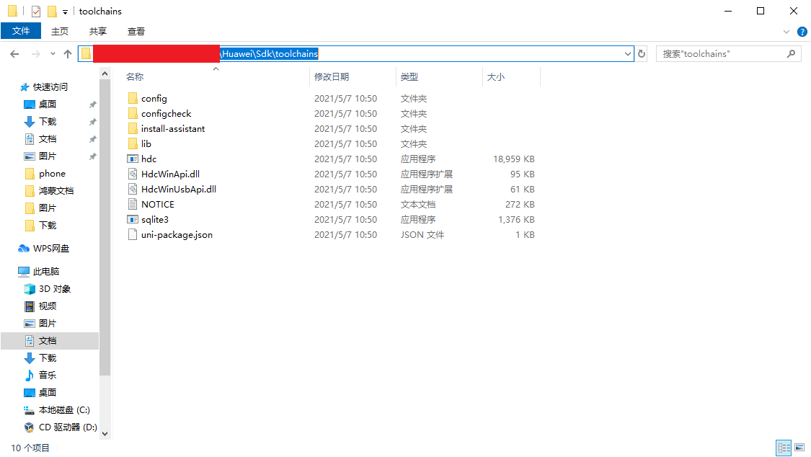

# CallUI 使用说明

## 1. 代码使用
### 1.1 代码下载
#### 1.1.1 配置码云ssh  
（1）打开本地 git bash 窗口

（2）进入到 .ssh 目录：cd ~/.ssh 

（3）找到 id_rsa.pub 文件：ls

（4）查看公钥：cat id_rsa.pub

（5）在码云（个人设置-安全设置-ssh公钥）中配置公钥  


#### 1.1.2下载代码

（1）搜索并打开gitee，点击导航栏里面的开源软件，搜索openharmony，点击进入openharmony，搜索applications_call，下载地址[applications_call](https://gitee.com/openharmony/applications_call)

（2）选择克隆/下载 - ssh方式 -复制下载地址

（3）本机git bash 中执行：

 ```
 git clone '复制的下载地址'
 ```


### 1.2 环境搭建

* 打开DevEco Studio链接下载安装，安装步骤及安装说明详见下载见官网
      

## 2. 基础开发说明
### 2.1 系统接口调用
### 2.2 异步回调的使用
- 在需要回调操作的ets文件中创建回调函数
```JavaScript
subscribeCallback(err, data)
{
    // do something
}
```
- 调用应用内部封装的接口，并传入回调函数
```JavaScript
Notification.subscribe(mSubscriber, this.subscribeCallback.bind(this));
```
- 在AsyncCallback返回数据时可以获取到错误信息或目标数据
```JavaScript
subscribeCallback(err, data) 
{
    Log.showInfo(TAG, 'subscribeCallback finished ====================' + JSON.stringify(data));
}
```


### 2.3 如何引用资源文件

#### 2.3.1 访问系统资源

```
this.title = this.$s('sys.type.name');
```


#### 2.3.2 访问应用资源

* 将应用资源放在工程的resources/base/element文件夹下的对应 .json 文件中，可通过$r()的方式引用资源
* 例如：引用字符串资源

```` JavaScript
this.title = this.$r('app.string.hello_world');
````


## 3. 典型接口的使用

```
import dataStorage from '@ohos.data.storage';
   onCreate() {
        LOG.info(TAG + 'AceApplication onCreate');
        this.initDataStorage();
    },
    async initDataStorage() {
        let context = featureAbility.getContext();
        let path = await context.getFilesDir();
        this.globalData.storage = dataStorage.getStorageSync(path + this.globalData.path);
    },
```


## 4. 签名打包

### 4.1 签名
（1）打开项目工程，选择 File → Project Structure


（2）选择 Project → Signing Configs，添加StorePassword：123456abc，KeyPassword：123456abc，
    依次填入下图中，完成后点击Apply，再点击OK




（3）配置完成后，对应的build.gradle文件中会出现如下内容




### 4.2 打包

* DevEco Studio 支持 debug 与 release 两种打包类型。可以在 OhosBuild Variants 窗口中进行切换

 


#### 4.2.1 debug打包

（1）代码准备完成后，在 OhosBuild Variants 窗口的 Selected Variant 中选择 debug 




（2）选择Build → Build Haps(s)/APP(s) → Build Hap(s)


（3）编译完成后，hap包会生成在工程目录下的 `\build\outputs\hap\debug\phone\`路径下（如果没有配置签名，则只会生成未签名的hap包）


#### 4.2.2 release打包

（1）代码准备完成后，在 OhosBuild Variants 窗口的 Selected Variant 中选择 release   


（2）选择Build → Build Haps(s)/APP(s) → Build Hap(s)


（3）编译完成后，hap包会生成在工程目录下的 `\build\outputs\hap\release\phone\`路径下（配置好签名后，生成的hap包会显示signed）




## 5. 安装、运行、调试

### 5.1 应用安装
（1）配置 hdc：进入SDK目录中的toolchains文件夹下，获取文件路径：



> 注意，此处的hdc.exe如果版本较老，可能不能正常使用，需要获取新的hdc.exe文件  
> hdc命令介绍与下载详见：[hdc仓库地址](https://gitee.com/openharmony/developtools_hdc_standard)


（2）并将此路径配置到环境变量中，重启电脑使环境变量生效


（3）连接开发板，打开cmd命令窗口，执行hdc list targets，弹出窗口如下：


（4）等待一段时间后，窗口出现如下打印，可回到输入 hdc list targets 的命令窗口继续操作


（5）再次输入hdc list targets，出现如下结果，说明hdc连接成功


（6）获取读写权限：

```
hdc target mount 
```


（7）将签名好的 hap 包放入设备的 `/system/app` 目录下，并修改hap包的权限

```
hdc file send 本地路径 /system/app/hap包名称
例如：hdc file send CallUI.hap /system/app/CallUI.hap
```
> 注意，如果设备不存在 `/system/app` 目录，则需要手动创建该目录并修改权限。
> ```
> hdc shell
> cd system
> mkdir app
> chmod 777 app
> ```
> `/system/app` 目录放置系统应用，例如：CallUI等。
> 
> 但hap包需要在该目录下手动设置权限
> ```
> chmod 666 hap包名
> ```
> 此目录应用不用手动安装，系统自动拉起。


### 5.2 应用运行

* applications_call属于系统应用，在将签名的 hap 包放入 `/system/app` 目录后，重启系统，应用会自动拉起

```
hdc shell reboot
```
> 注意，如果设备之前安装过系统应用，则需要执行如下两条命令清除设备中存储的应用信息才能够在设备重启的时候将我们装入设备的新 hap 包正常拉起。
>
> ```
> hdc shell "mount -o remount,rw /" 
> hdc shell rm -rf  /system/app/hap包
> hdc file send  hap当前路径   /system/app/hap包
> hdc shell "rm /data/* -rf"
> hdc shell "sync"
> hdc shell "/system/bin/udevadm trigger"
> hdc shell "reboot"
> ```
>


### 5.3 应用调试

#### 5.3.1 log打印
- 在程序中添加 log
```JS
console.info("callui log info");
```


#### 5.3.2 log获取及过滤

- log获取

将log输出至文件  
```
hdc shell hilog > 输出文件名称
```

例：在真实环境查看log，将全log输出到当前目录的hilog.log文件中
```
hdc shell hilog > hilog.log
```


- log过滤

在命令行窗口中过滤log
```
hilog │ grep 过滤信息
```

例：过滤包含信息 Label 的 hilog
```
hilog │ grep Label
```


## 6. 贡献代码

### 6.1 Fork 代码仓库
（1）在码云上打开 applications_call代码仓库（[仓库地址](https://gitee.com/openharmony/applications_call)）

（2）点击仓库右上角的 Forked 按钮，在弹出的画面中，选择将仓库 fork 到个人仓，点击确认

（3）Fork 成功之后，会在自己的账号下看见 fork 的代码仓库


### 6.2 提交代码

（1）访问我们自己在码云账号上 fork 的代码仓库，点击“克隆/下载”按钮，选择 SSH，点击“复制”按钮

（2）在本地新建 CallUI文件夹，在 CallUI文件夹中执行如下命令
```
git clone 步骤1中复制的地址
```

（3）修改代码

（4）提交代码到 fork 仓库。  
> 修改后的代码,使用git status 查看修改代码，执行 `git add` 命令，然后执行 `git commit` 命令与 `git push` 命令，将代码 push 到我们自己的 fork 仓中。关于代码提交的这部分内容涉及 git 的使用，可以参照 [git官网](https://git-scm.com/) 的内容，在此不再赘述。


### 6.3 发起 Pull Request (PR)

* 在将代码提交到 fork 仓之后，我们可以通过发起 Pull Request（PR）的方式来为 OpenHarmony 的相关项目贡献代码。

（1）打开 fork 仓库。选择 `Pull Requests` → `新建 Pull Request`

（2）在 `新建 Pull Request` 页面填入标题与说明，点击 `创建` 按钮

（3）创建 Pull Request 完成。 PR 创建完成后，会有专门的代码审查人员对代码进行评审，评审通过之后会合入相应的代码库