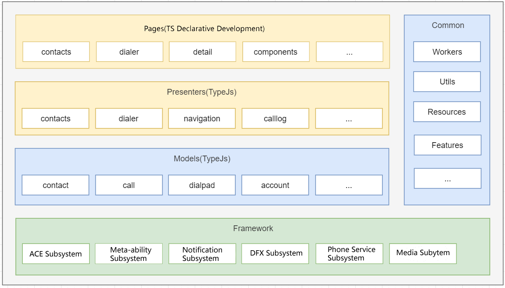

# Contacts

## Introduction

The Contacts application is a preset system application in OpenHarmony. The main functions include dial pad, call log view, call log batch deletion, contact list, details view, and contact creation.

### Architecture diagram

The application architecture mainly combines MVP and domain-driven design ideas.

## File Tree

~~~
/Contacts/
├── doc                                
├── entry                 
│   └── src
│       └── main
│           └── ets                  
│               └── MainAbility          
│                   ├── account        
│                   ├── call           
│                   ├── component      
│                   ├── contact          
│                       ├── contact     
│                       ├── entity        
│                       └── repo      
│                   ├── dialpad         
│                   ├── feature         
│                   |── model            
│                   |── pages           
│                   |── presenter      
│                   |── util         
│                   └── workers         
│               └── app.ets             
│           ├── resources      
│           └── config.json           
├── signs                               
├── LICENSE
~~~

## Related Repos

[**applications_mms**](https://gitee.com/openharmony/applications_mms)

[**applications_contactsdata**](https://gitee.com/openharmony/applications_contactsdata)

[**applications_call**](https://gitee.com/openharmony/applications_call)
