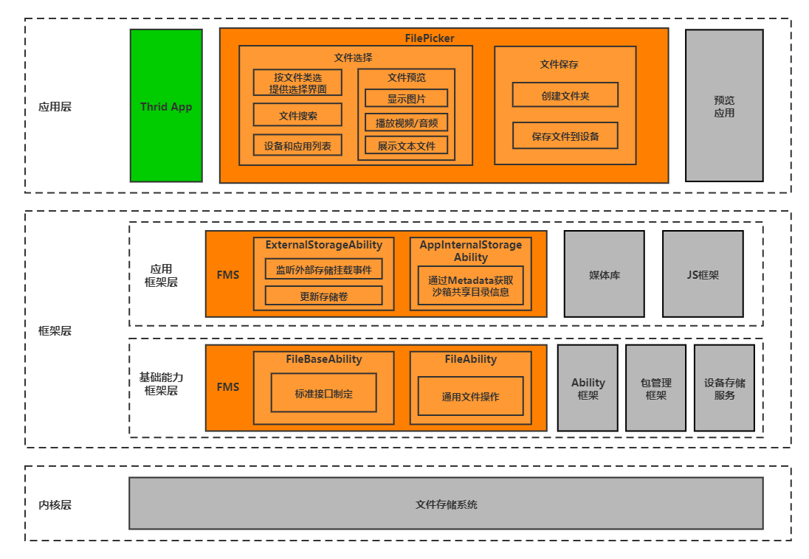

# FilePicker

## 简介

FilePicker应用是OpenHarmony中预置的系统应用，为用户提供文件选择及保存功能

### 架构图



## 目录

```
/applications/standard/filepicker
├── figures                     # 架构图目录
├── product                     # 产品层模块目录
│   └── pad                     # pad模式模块目录
|       └── src
|           ├── main
|               ├── ets
│                   ├── MainAbility              # MainAbility代码目录
|                       ├── module               # 公共文件目录
|                       ├── pages                # 业务特性的View层目录
|                       ├── workers              # worker对于的js文件目录
│                   └── AbilityStage.ts
|               ├── resources   # 资源目录
|               └── config.json # 项目配置信息
│   └── phone                   # phone模式模块目录
|       └── src
|           ├── main
|               ├── ets
│                   ├── MainAbility              # MainAbility代码目录
|                       ├── module               # 公共文件目录
|                       ├── pages                # 业务特性的View层目录
|                       ├── workers              # worker对于的js文件目录
│                   └── AbilityStage.ts
|               ├── resources   # 资源目录
|               └── config.json # 项目配置信息
├── signature                   # 证书文件目录
├── LICENSE                     # 许可文件
```

## 签名
1. 针对product下的每一个模块，配置build.gradle中的signingConfig。
2. 将signature目录下的sign_files.rar解压后放在build.gradle目录中配置的相应路径即可完成默认签名配置。
3. 把signature目录下的sig_hap.rar解压到任意目录。

## 编译运行
1. 签名配置完成后通过IDE Build -> Make All Modules即可编译出每个模块对应的hap包。
2. 将编译生成的签名后的hap包 如phone模块的phone-entry-debug-standard-ark-signed.hap放到sig_hap.rar解压的目录。
3. 修改sign-filepicker-phone.bat中的-inputFile、-outputFile并运行sign-filepicker-phone.bat即可生成可安装的hap包。

## 使用方法

通过startAbilityForResult拉起FilePicker并获取FilePicker返回的数据，示例代码如下

```js
// 拉起FilePicker选择文件
globalThis.context.startAbilityForResult(
    {
        bundleName: "com.ohos.filepicker",
        abilityName: "com.ohos.filepicker.MainAbility",
        parameters: {
            'startMode': 'choose', //choose or save    
        }
    },
    { windowMode: 102 }
)

// 拉起FilePicker保存文件
globalThis.context.startAbilityForResult(
    {
        bundleName: "com.ohos.filepicker",
        abilityName: "com.ohos.filepicker.MainAbility",
        parameters: {
            'startMode': 'save', //choose or save
            'saveFile': 'test.jpg',
        }
    },
    { windowMode: 102 }
)

// file picker返回给startAbilityForResult的数据
var abilityResult = {
    resultCode: resultCode,
    want: {
        parameters: {
            'startMode': startMode,
            'result': result
        }
    }
}
globalThis.context.terminateSelfWithResult(abilityResult)
```

## 相关仓

系统应用

**applications_filepicker**
