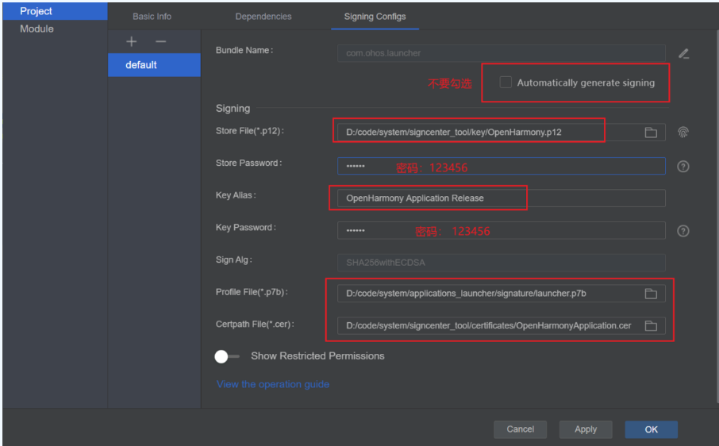

# FilePicker Release 版本签名

1. 下载秘钥库：https://gitee.com/openharmony/signcenter_tool

2. 修改 `certificates/OpenHarmonyApplication.pem` -> `certificates/OpenHarmonyApplication.cer`

3. 在ide上配置本地签名：
* `p12`: `signcenter_tool/key/OpenHarmony.p12`
* `Store Password`: `123456`
* `Key Alias`: `OpenHarmony Application Release`
* `Key Password`: `123456`
* `p7b`: `signature/filepicker.p7b`
* `cer`: `signcenter_tool/certificates/OpenHarmonyApplication.cer`

