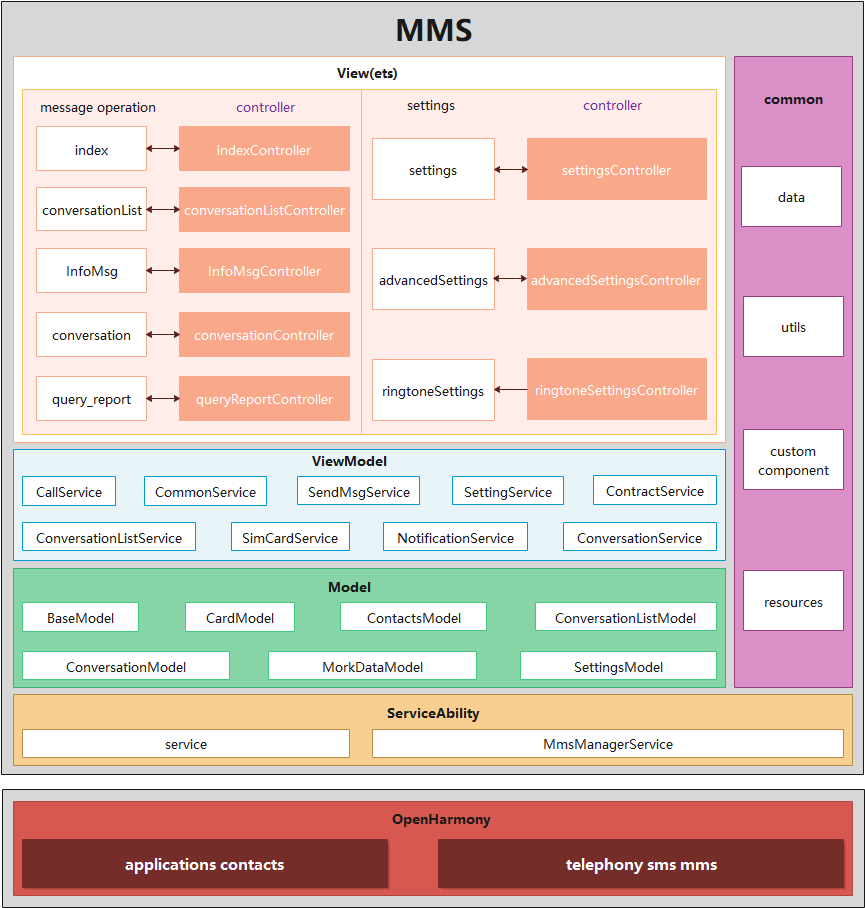

# 信息应用

## 简介

### 内容介绍
Mms应用是OpenHarmony中预置的系统应用，主要的功能包含信息查看、发送短信、接收短信、短信送达报告、删除短信等功能。

### 架构图

## 目录

~~~
/Mms/
├── doc                                        # 资料
├── entry
│   └── src
│       └── main
│           └── ets                            # ets代码目录
│               └── default                    # 业务代码目录
│                   ├── data                   # 自定义数据类型
│                   ├── model                  # 对接数据库
│                   ├── pages                  # 所有页面
│                       ├── conversation       # 会话详情页面
│                       ├── conversationlist   # 信息列表页面
│                       ├── index              # 初始页面
│                       ├── infomsg           # 通知信息列表页面
│                       ├── queryreport       # 报告详情页面
│                       └── settings           # 设置页面
│                   ├── service                # 业务逻辑
│                   ├── utils                  # 工具类
│                   ├── views                  # 自定义组件
│                   └── app.ets                # 应用生命周期
│               └── StaticSubscriber           # 静态事件监听
│           ├── resources                      # 资源配置文件存放目录
│           └── config.json                    # 全局配置文件
├── signs                                      # 签名
└── LICENSE
~~~

## 相关仓

[**applications_contacts**](https://gitee.com/openharmony/applications_contacts)

[**telephony_sms_mms**](https://gitee.com/openharmony/telephony_sms_mms)