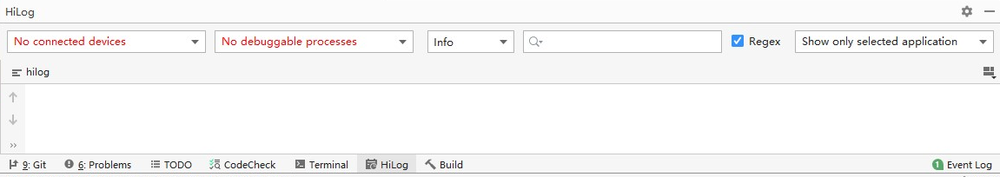

# 备忘录部件

## 1. 项目介绍

备忘录应用是OpenHarmony中预置的应用，为用户提供文本编辑以及保存功能。

## 2. 目录结构
```
/applications/standard/note
├─common
│  ├─component
│  │  └─src
│  │      └─main
│  │          ├─ets
│  │          │  └─default                        # 界面基本组件
│  │          └─resources                         # 资源配置文件存放目录
│  └─utils
│      └─src
│          └─main
│              ├─ets
│              │  └─default
│              │      ├─baseUtil                  # 数据处理
│              │      ├─constants                 # 常量定义
│              │      └─model
│              │          ├─databaseModel         # 数据格式定义
│              │          └─searchModel           # 搜索数据格式定义
│              └─resources                        # 资源配置文件存放目录
├─figures                                         # readme的截图
└─product
    ├─phone
    │  └─src
    │      └─main
    │          ├─ets
    │          │  └─MainAbility
    │          │      ├─pages                     # 手机主页面设置
    │          │      └─res                       # 预置图片
    │          └─resources                        # 资源文件
    └─tablet
        └─src
            └─main
                ├─ets
                │  └─MainAbility
                │      ├─pages                    # 平板主页面设置
                │      └─res                      # 预置图片
                └─resources                       # 资源文件
```

### 整体架构


## 3. 签名打包

### 签名

#### 签名文件的获取

1.生成签名文件可参考https://gitee.com/openharmony/docs/blob/master/zh-cn/application-dev/security/hapsigntool-overview.md

#### 签名文件的配置

打开项目工程，选择 File → Project Structure


选择 Modules → Signing Configs，将对应的签名文件配置如下，完成后点击Apply，再点击OK。
密码为生成签名文件时的密码，如果使用默认的签名文件，则使用默认密码123456。


配置完成后，对应的build.gradle文件中会出现如下内容


### 打包
1. 选择Build → Build Haps(s)/APP(s) → Build Hap(s)

   

2. 编译完成后，hap包会生成在工程目录下的 `\build\outputs\hap\release\`路径下（如果没有配置签名，则只会生成未签名的hap包）

   


## 4. 安装、调试

### 应用安装

将设备通过调试线链接电脑，IDE上显示已链接设备，点击开始按钮即可安装并拉起应用：


### 应用调试

#### log打印

- 在程序中添加 log

```JS
console.info("note log info");
```

可以在DevEco Studio中查看log


#### log获取及过滤

- log获取

将hdc_std的环境变量配置好，将log输出至文件 


```
hdc_std shell hilog > 输出文件名称
```

例：
在真实环境查看log，将全log输出到当前目录的hilog.log文件中

```
hdc_std shell hilog > hilog.log
```

- log过滤

在命令行窗口中过滤log

```
hilog | grep 过滤信息
```

例：过滤包含信息 Label 的 hilog

```
hilog | grep Label
```

## 相关仓

系统应用

**[applications_notes](https://gitee.com/openharmony/applications_notes)**

