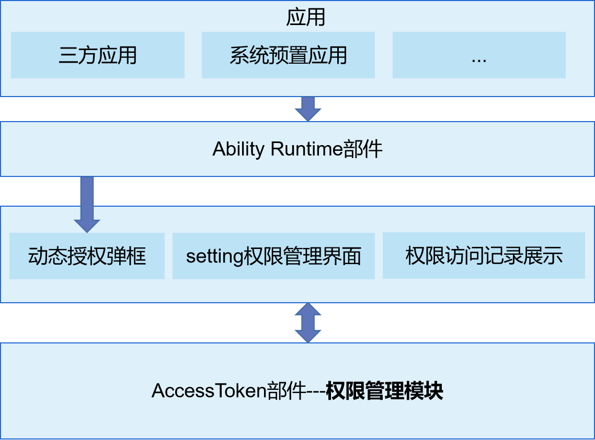

# 访问控制<a name="ZH-CN_TOPIC_0000001101239136"></a>

 - [简介<a name="section11660541593"></a>](#简介)
 - [目录<a name="section161941989596"></a>](#目录)
 - [相关仓<a name="section1371113476307"></a>](#相关仓)

## 简介<a name="section11660541593"></a>

权限管理应用是OpenHarmony中预置的系统系统应用，为用户提供运行时权限弹框、权限管理设置和权限使用记录展示等功能。

权限管理应用的架构图如下所示：

## 目录<a name="section161941989596"></a>

```
/applications/standard/permission_manager
├── entry                              # entry模块目录
├── permissionmanager                  # 权限管理模块目录
│   ├── src/main/ets                   # ets模块
│   │       ├── Application            # abilitystage目录
│   │       ├── MainAbility            # 权限管理ability
│   │       ├── ServiceExtAbility      # serviceExtension配置目录
│   │       ├── common                 # 公共工具目录
│   │       └── pages                  # 页面目录
│   ├──  resources                     # 全局资源文件目录
│   └──  module.json5                  # 全局配置文件
├── signature                          # 证书文件目录
└── LICENSE                            # 许可文件
```

## 使用说明<a name="section123459000"></a>

参见使用说明 [使用说明](https://gitee.com/openharmony/docs/blob/master/zh-cn/application-dev/security/accesstoken-guidelines.md)

## 相关仓<a name="section1371113476307"></a>

**[security\_access\_token](https://gitee.com/openharmony/security_access_token/blob/master/README_zh.md)**
