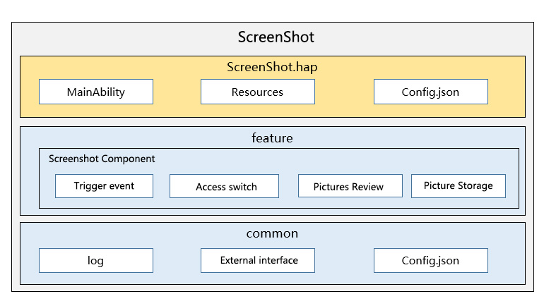

# ScreenShot

## Introduction

The ScreenShot application is a preset system application in OpenHarmony, which provides users with the function of capturing the current screen and saving the current picture.

### Architecture diagram



#### feature
    Screen capture management layer, providing screen capture window display control and picture save control.
#### common
   A general tool class that provides log printing and external interface management functions.

## content

```
/applications/standard/screenshot
     ├── entry             # entry module directory
     ├── common            # Common tool class directory
     ├── build.gradle      # Global build configuration file
     ├── settings.gradle   # Compile the module configuration file
     ├── LICENSE           # License file
     ├── signature         # Certificate file directory
     ├── features          # subcomponent directory
     │ ├── screenshot      # screenshot component
     │ ├── screenShotModel # Save screenshots, etc.
     ├── product           # ScreenShot general function catalog
```

### Function description
#### features
    sub-component directory, provides screen capture window display control, and image save control.

#### product
    ScreenShot general function catalog, screenshot service entrance.

## sign
1. For each module under product/phone, configure signingConfigs in build.gradle

2. Put screenshot.p7b in the signature directory on the corresponding path configured in the build.gradle directory.

## Instructions

Create a small screen capture window to display pictures through create, the sample code is as follows

```js
// Create a small screen capture window to display pictures
window.create(context, windowName, WINDOW_TYPE).then((win) => {
  win.moveTo(0, WINDOW_Y).then(() => {
    win.resetSize(dis.width * ZOOM_RATIO, dis.height * ZOOM_RATIO).then(() => {
      win.loadContent(INDEX_PAGE).then(() => {
      })
    })
  })
}, (error) => {
  Log.showInfo(TAG, " window createFailed, error.code = " + error.code)
})


// Take a screenshot of the current screen, the return value can be directly displayed on the control
Screenshot.save().then(async (data) => {
  if (!!data) {
    show();
  }
}).catch((err) => {
  Log.showInfo(TAG, `save err`);
})
    
```

## Relevant warehouse

Relevant warehouse

**applications\_screenshot**