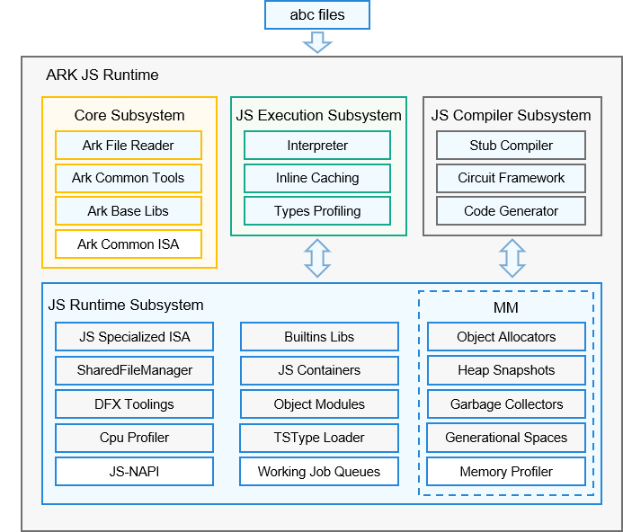

# 方舟编译器部件

## 简介
方舟编译器部件供了一个基于GN和Ninja的集成编译构建框架。构建流程由鸿蒙方舟编译分流，并在构建基础上增加跨平台方式。

方舟编译器部件架构图：



## 目录结构
```
/arkcompiler/
├── profiler            # 性能调优组件
├── ets_runtime         # 方舟eTS(兼容JS/TS)运行时时                               
├── runtime_core        # 方舟运行时公共库        
├── ets_frontend        # 方舟eTS(兼容JS/TS)前端编译器
├── toolchain           # 方舟运行时调试调优工具链
│   └── build           # 编译配置       
├── third_party         # 三方库       
│   └── protobuf
│   └── icu
│   └── zlib
│   └── bounds_checking_function
```

## 环境配置
获取源码及安装依赖工具，详细参考[点击这里](https://gitee.com/lordwithcc/arkcompiler_toolchain/blob/add_standalone_part/build/preconfig_ubuntu.md)

## 使用说明
abc文件：由方舟前端将js文件转换生成的字节码文件

ark_js_vm：运行abc文件的工具

### step1 生成编译产物ark_js_vm
```
python ark.py x64.release
```
### step2 将js文件转换为abc文件
```
./out/x64.release/arkcompiler/ets_frontend/es2abc test.js
```
### step3 执行生成的abc文件
```
LD_LIBRARY_PATH=out/x64.release:prebuilts/clang/ohos/linux-x86_64/llvm/lib ./out/x64.release/arkcompiler/ets_runtime/ark_js_vm test.abc
```
### 执行262测试套
```
python ark.py x64.release -test262
```

## 编译选项

交叉编译可根据目标选择不同平台，在x64平台构建android_arm目标平台
```
python ark.py android_arm.release
```
编译模式选择，在x64平台构建debug版本
```
python ark.py x64.debug
```
获取更多编译说明
```
python ark.py -help
```

## 相关仓
[arkcompiler\_runtime\_core](https://gitee.com/openharmony/arkcompiler_runtime_core)

[arkcompiler\_ets\_runtime](https://gitee.com/openharmony/arkcompiler_ets_runtime)

[arkcompiler\_ets\_frontend](https://gitee.com/openharmony/arkcompiler_ets_frontend)

**[arkcompiler\_toolchain](https://gitee.com/openharmony/arkcompiler_toolchain)**

[developtools\_profiler](https://gitee.com/openharmony/developtools_profiler)