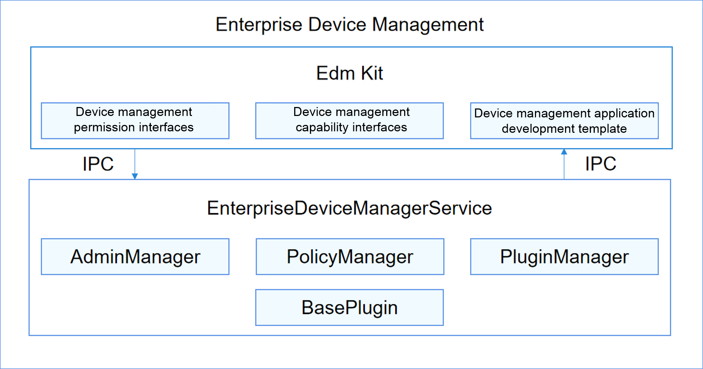

# Enterprise Device Management

## Introduction

The Enterprise Device Management component provides the management application development framework, management mode setting, and enterprise device management capabilities for developing Mobile Device Management (MDM) applications. You can leverage the system-level management APIs for your applications in the enterprise context.

## Architecture

**Figure 1** Architecture of the Enterprise Device Management component



In the architecture of the Enterprise Device Management component:

- Edm Kit provides an MDM application development framework for developers, device management permission interfaces for system applications, and device management capability interfaces for third-party applications.
- EnterpriseDeviceManagerService is a system service that manages MDM applications and device management and control policies in the enterprise context.
  - AdminManager maintains the application information of each device administrator.
  - PolicyManager manages and persists the governance policies set by the enterprise.
  - PluginManager loads and manages device management capability plug-ins.
  - BasePlugin provides basic device management capabilities for the operating system.
## Directory Structure

The code directory structure of the enterprise device manager is as follows:

````
/base/customization/enterprise_device_management
├── common                   # Common code
├── etc                      # Process configuration files
├── interfaces               # Edm Kit code
│   └── inner_api            # Subsystem interfaces
│   └── kits                 # Developer interfaces
├── profile                  # System service configuration files
└── services                 # Implementation code of the enterprise device management services
```
````
## Usage

The enterprise device manager provides a template for developing enterprise device management applications. This template makes it easier to enable device management applications, set security policies, and conduct system configuration and management.

## Repositories Involved

[admin_provisioning](https://gitee.com/openharmony/applications_admin_provisioning)
