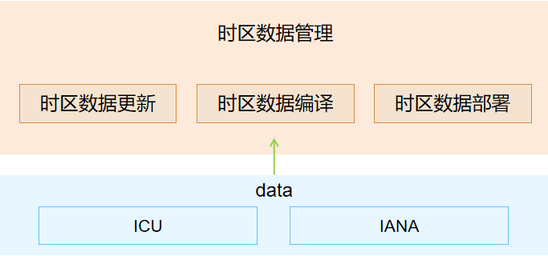

# 时区数据管理部件

## 简介

**时区数据管理部件**提供时区数据的更新、编译、部署等功能，支持其他子系统访问系统时区数据。时区数据管理部件支持如下设备：润和DAYU200	RK3568。



**时区数据管理部件架构图说明:**

- **时区数据更新**会从[IANA时区数据官网](https://data.iana.org/time-zones/releases/)搜索当前时区数据的最新版本。若官网存在新的时区数据版本，则时区数据更新工具会下载最新版本时区数据进行数据更新，否则不执行数据更新操作。更新的时区数据会被保存到./data/iana/目录下，示例如下：

```
cd tool/update_tool  // 切换到时区数据更新工具所在目录
python3 download_iana.py  // 执行数据更新脚本
```

- **时区数据编译**会对时区源数据进行编译，并在./data/prebuild/posix目录下生成时区二进制数据，在./data/prebuild/tool/linux目录下生成时区工具zic。示例如下：

```
cd tool/compile_tool  // 切换到时区数据编译工具所在目录
chmod 755 compile.sh
./compile.sh  // 执行数据更新脚本
```

- **时区数据部署**通过提供构建脚本，将时区数据部署到系统设备上。其中IANA时区数据部署到系统设备的/etc/zoneinfo目录下，icu时区数据部署到etc/icu_tzdata目录下。构建脚本为data/Build.gn。


## 目录

时区数据管理组件目录结构如下所示：

```
/base/global/
├── timezone           # 时区数据管理组件代码仓
│   ├── data          # 时区编译数据目录
│   ├── tool          # 时区数据管理工具
│   │   ├── compile_tool              # 时区数据编译工具
│   │   └── update_tool          # 时区数据更新工具
```

## 相关仓

[全球化子系统](https://gitee.com/openharmony/docs/blob/master/zh-cn/readme/%E5%85%A8%E7%90%83%E5%8C%96%E5%AD%90%E7%B3%BB%E7%BB%9F.md)

[global\_i18n](https://gitee.com/openharmony/global_i18n/blob/master/README_zh.md)

[global\_resource\_management](https://gitee.com/openharmony/global_resource_management/blob/master/README_zh.md)

