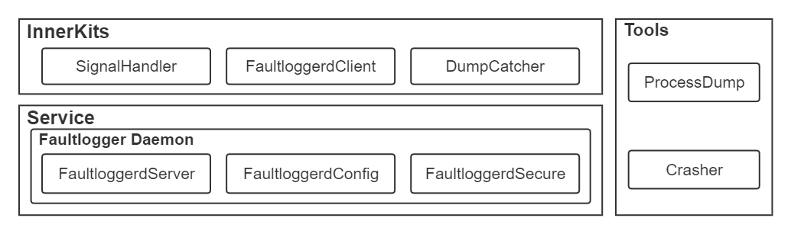
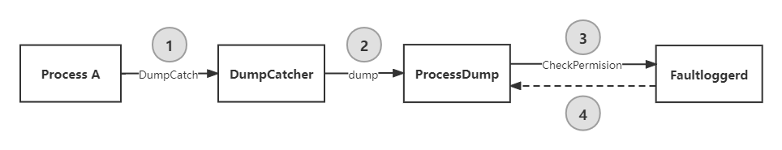
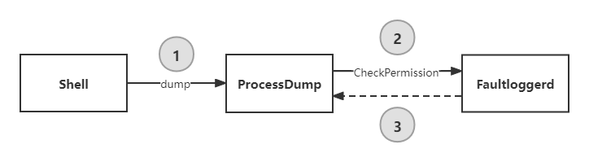
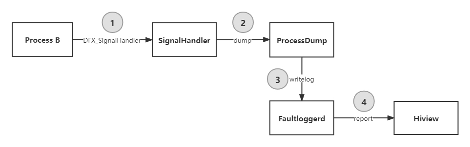

# FaultLoggerd

-   Introduction
-   Architecture
-   Directory Structure
-   How to Use
    -   DumpCatcher
    -   ProcessDump
-   Service Process
    -   DumpCatcher SDK Service Process
    -   ProcessDump Service Process
    -   Process Crash Service Process
-   Repositories Involved

## Introduction

Faultloggerd is a component that generates and manages temporary C/C++ runtime crash logs in OpenHarmony. You can find crash logs in the preset directory to locate faults.

## Architecture



* SignalHandler: signal handler, which receives system exception signals and triggers the capture of process exception information.
* DumpCatcher: stack information capture tool, which provides the function of capturing stack information of the specified process and thread.
* FaultloggerdClient: temporary crash log management client, which receives requests for file descriptors and stack exporting.
* ProcessDump: binary tool for capturing process information, which provides the function of capturing stack information of the specified process and thread in command line mode.
* Crasher: crash constructor, which constructs and simulates crashes.
* FaultloggerdServer: core service processing module, which receives and processes requests from FaultloggerdClient.
* FaultloggerdSecure: permission verification module, which provides permission management and verification for runtime crash log generation and capture.
* FaultloggerdConfig: temporary crash log management module.

The following table describes the exception signals that can be processed.

| Signal Value| Signal     | Description           | Cause                                                    |
| ------ | --------- | --------------- | ------------------------------------------------------------ |
| 4      | SIGILL    | Invalid instruction       | The executable file incurs an error or attempts to execute a data segment. This signal may also be generated in the case of stack overflow.|
| 5      | SIGTRAP   | Breakpoint or trap  | A breakpoint instruction or any other trap instruction is executed.                              |
| 6      | SIGABRT   | Abort signal| The abort function is called.                                   |
| 7      | SIGBUS    | Illegal memory access   | Invalid address, including memory address alignment error, is identified. For example, accessing an integer of four digits at an address not divisible by four. The difference between SIGBUS and SIGSEGV is that SIGSEGV is triggered by unauthorized access to valid storage addresses (for example, access to storage space that is read only or does not belong to the process).|
| 8      | SIGFPE    | Floating-point exception       | A fatal arithmetic error, for example, floating-point arithmetic error, division overflow, or division by 0, has occurred.|
| 11     | SIGSEGV   | Invalid memory access   | The process attempts to access memory that is not allocated to itself, or write data to a memory address that does not have the write permission.|
| 16     | SIGSTKFLT | Stack overflow         | The stack overflows.                                                  |
| 31     | SIGSYS    | System call exception   | An invalid system call is initiated.                                            |

## Directory Structure

```txt
faultloggerd/
├── OAT.xml
├── common                                 # Common definitions
├── faultloggerd.gni
├── interfaces                             # APIs
│   └── innerkits
│       ├── dump_catcher                   # Stack information capture tool
│       ├── faultloggerd_client            # Temporary crash log management client
│       └── signal_handler                 # Signal handler
├── ohos.build
├── services                               # FaultLoggerd services
│   ├── BUILD.gn
│   ├── config                             # Startup configuration
│   ├── fault_logger_config.cpp            # Log file management
│   ├── fault_logger_config.h              # Log file management
│   ├── fault_logger_daemon.cpp            # Faultloggerd service implementation
│   ├── fault_logger_daemon.h              # Faultloggerd service implementation
│   ├── fault_logger_secure.cpp            # Permission management and verification
│   ├── fault_logger_secure.h              # Permission management and verification
│   ├── main.cpp
│   └── test
├── test                                   # Test resources
│   ├── BUILD.gn
│   ├── fuzztest                           # Fuzz test
│   ├── performancetest                    # Performance test
│   └── systemtest                         # System function test
└── tools                                  # Tools
    ├── crasher_c                          # Crash constructor (C)
    ├── crasher_cpp                        # Crash constructor (C++)
    └── process_dump                       # Process information capture tool
```

## How to Use

### DumpCatcher

DumpCatcher allows an application to capture call stack information. It provides the API for printing stack information of the specified process and thread.

Interface class: `DfxDumpCatcher`

Interface method: `bool DumpCatch(const int pid, const int tid, std::string& msg);`

Parameters:

* Return value:
  * `true`: Dumping of stack information is successful. Related information is stored in the `msg` string object.
  * `false`: Dumping of stack information has failed.
* Input parameters:
  * `pid`: ID of the process for dumping stack information. If all threads in the process need to be back traced, set `tid` to **0**.
  * `tid`: ID of the thread for dumping stack information.
* Output parameters:
  * `msg`: dumping result.

> Note: Only the administrator (**system** or **root**) is allowed to capture all process information. Common users can only capture information on their own processes. To capture call stack information of a process that does not belong to the current user group, ensure that you have permissions to read **/proc/pid/maps** and implement **ptrace** on the target process.

Sample Code

* dump_catcher_demo.h

```c++
#ifndef DUMP_CATCHER_DEMO_H
#define DUMP_CATCHER_DEMO_H

#include <inttypes.h>

#define NOINLINE __attribute__((noinline))

#define GEN_TEST_FUNCTION(FuncNumA, FuncNumB)          \
    __attribute__((noinline)) int TestFunc##FuncNumA() \
    {                                                  \
        return TestFunc##FuncNumB();                   \
    }

// Test functions for callstack depth test
int TestFunc0(void);
int TestFunc1(void);
int TestFunc2(void);
int TestFunc3(void);
int TestFunc4(void);
int TestFunc5(void);
int TestFunc6(void);
int TestFunc7(void);
int TestFunc8(void);
int TestFunc9(void);
int TestFunc10(void);

#endif // DUMP_CATCHER_DEMO_H
```

  * dump_catcher_demo.cpp

```c++
#include "dump_catcher_dump.h"

#include <iostream>
#include <string>
#include <unistd.h>
#include "dfx_dump_catcher.h"
using namespace std;

NOINLINE int TestFunc10(void)
{
    OHOS::HiviewDFX::DfxDumpCatcher dumplog;
    string msg = "";
    bool ret = dumplog.DumpCatch(getpid(), gettid(), msg);
    if (ret) {
        cout << msg << endl;
    }
    return 0;
}

// auto gen function
GEN_TEST_FUNCTION(0, 1)
GEN_TEST_FUNCTION(1, 2)
GEN_TEST_FUNCTION(2, 3)
GEN_TEST_FUNCTION(3, 4)
GEN_TEST_FUNCTION(4, 5)
GEN_TEST_FUNCTION(5, 6)
GEN_TEST_FUNCTION(6, 7)
GEN_TEST_FUNCTION(7, 8)
GEN_TEST_FUNCTION(8, 9)
GEN_TEST_FUNCTION(9, 10)

int main(int argc, char *argv[])
{
    TestFunc0();
    return 0;
}
```

* Sample **BUILD.gn** file:

```gn
import("//base/hiviewdfx/faultloggerd/faultloggerd.gni")
import("//build/ohos.gni")

config("dumpcatcherdemo_config") {
  visibility = [ ":*" ]

  include_dirs = [
    ".",
    "//utils/native/base/include",
    "//base/hiviewdfx/faultloggerd/interfaces/innerkits/dump_catcher/include/",
  ]
}

ohos_executable("dumpcatcherdemo") {
  sources = [ "dump_catcher_demo.cpp" ]

  configs = [ ":dumpcatcherdemo_config" ]

  deps = [ 
    "//base/hiviewdfx/faultloggerd/interfaces/innerkits/dump_catcher:lib_dfx_dump_catcher",
    "//utils/native/base:utils",
  ]

  external_deps = [ "hilog_native:libhilog" ]

  install_enable = true
  part_name = "faultloggerd"
  subsystem_name = "hiviewdfx"
}
```

* Execution result:

```txt
# ./dumpcatcherdemo
#00 pc 0000000000000981(00000000004a8981) /data/test/dumpcatcherdemo
#01 pc 0000000000000a6d(00000000004a8a6d) /data/test/dumpcatcherdemo
#02 pc 0000000000000a63(00000000004a8a63) /data/test/dumpcatcherdemo
#03 pc 0000000000000a59(00000000004a8a59) /data/test/dumpcatcherdemo
#04 pc 0000000000000a4f(00000000004a8a4f) /data/test/dumpcatcherdemo
#05 pc 0000000000000a45(00000000004a8a45) /data/test/dumpcatcherdemo
#06 pc 0000000000000a3b(00000000004a8a3b) /data/test/dumpcatcherdemo
#07 pc 0000000000000a31(00000000004a8a31) /data/test/dumpcatcherdemo
#08 pc 0000000000000a27(00000000004a8a27) /data/test/dumpcatcherdemo
#09 pc 0000000000000a1d(00000000004a8a1d) /data/test/dumpcatcherdemo
#10 pc 0000000000000a13(00000000004a8a13) /data/test/dumpcatcherdemo
#11 pc 0000000000000a77(00000000004a8a77) /data/test/dumpcatcherdemo
#12 pc 00000000000c2b08(00000000b6fafb08) /system/lib/ld-musl-arm.so.1(__libc_start_main+116)
#13 pc 0000000000000938(00000000004a8938) /data/test/dumpcatcherdemo
#14 pc 00000000000008c4(00000000004a88c4) /data/test/dumpcatcherdemo
```

### ProcessDump

ProcessDump is a command line tool provided for users to capture call stack information. This tool uses the `-p` and `-t` parameters to specify the target process and thread. After command execution is complete, it displays the thread stack information of the specified process in the command line window.

Tool name: `processdump`

Location: `/system/bin`

Parameters:

* `-p [pid]`: prints all thread stack information of the specified process.
* `-p [pid] -t [tid]`: prints information about the specified thread of a process.

Return result: Stack information parsed.

> Note: Only the administrator (**system** or **root**) is allowed to use this API.

Example: querying call stack information of the Hiview main thread

```txt
# ps -A | grep hiview
  114 ?        00:00:00 hiview
# processdump -p 114 -t 114
Tid:114, Name:hiview
#00 pc 0000000000089824(00000000b6f44824) /system/lib/ld-musl-arm.so.1(ioctl+68)
#01 pc 000000000002a709(00000000b6c56709) /system/lib/libipc_core.z.so(_ZN4OHOS15BinderConnector11WriteBinderEmPv+16)
#02 pc 000000000002ba75(00000000b6c57a75) /system/lib/libipc_core.z.so(_ZN4OHOS13BinderInvoker18TransactWithDriverEb+224)
#03 pc 000000000002bb37(00000000b6c57b37) /system/lib/libipc_core.z.so(_ZN4OHOS13BinderInvoker13StartWorkLoopEv+22)
#04 pc 000000000002c211(00000000b6c58211) /system/lib/libipc_core.z.so(_ZN4OHOS13BinderInvoker10JoinThreadEb+36)
#05 pc 0000000000038d07(00000000004bcd07) /system/bin/hiview(_ZNSt3__h6vectorINS_9sub_matchINS_11__wrap_iterIPKcEEEENS_9allocatorIS6_EEE8__appendEj+596)
#06 pc 0000000000028655(00000000004ac655) /system/bin/hiview
#07 pc 00000000000c2b08(00000000b6f7db08) /system/lib/ld-musl-arm.so.1(__libc_start_main+116)
#08 pc 00000000000285f4(00000000004ac5f4) /system/bin/hiview
#09 pc 0000000000028580(00000000004ac580) /system/bin/hiview
```

## Service Process

### DumpCatcher SDK Service Process



1. Process A invokes the `DumpCatch()` API provided by `DumpCatcher` to request for dumping stack information of the specified process and thread.
2. After receiving the dumping request from process A, `DumpCatcher` runs `ProcessDump` to obtain the stack information.
3. `ProcessDump` requests permission verification from `Faultloggerd`.
4. If the permission verification is successful, `Faultloggerd` returns a file descriptor to `ProcessDump`. `ProcessDump` then sends the dumping result to `DumpCatcher`.

### ProcessDump Service Process



1. `Shell` runs the `processdump -p [pid] -t [tid]` command to request for dumping stack information of the specified process and thread.
2. `ProcessDump` requests permission verification from `Faultloggerd`.
3. If the permission verification is successful, `Faultloggerd` returns a file descriptor to `ProcessDump`. `ProcessDump` then writes the dumping result to the standard output.

### Faultloggerd Service Process



1. Process B calls the `DFX_SignalHandler` function to detect crash exception signals from `SignalHandler`.
2. When detecting a crash exception signal, `SignalHandler` forks a child process and runs `ProcessDump` to dump the stack information of the crashed process and thread.
3. After reading the stack information, `ProcessDump` writes logs to the temporary storage directory in `Faultloggerd`.
4. `Faultloggerd` calls `AddFaultLog()` to report the fault to `Hiview` for subsequent processing.


## Repositories Involved

[DFX Subsystem](https://gitee.com/openharmony/docs/blob/master/en/readme/dfx.md)

[hiviewdfx\_hiview](https://gitee.com/openharmony/hiviewdfx_hiview/blob/master/README.md)

[hiviewdfx\_hilog](https://gitee.com/openharmony/hiviewdfx_hilog/blob/master/README.md)

[hiviewdfx\_hiappevent](https://gitee.com/openharmony/hiviewdfx_hiappevent/blob/master/README.md)

[hiviewdfx\_hisysevent](https://gitee.com/openharmony/hiviewdfx_hisysevent/blob/master/README.md)

**hiviewdfx\_faultloggerd**

[hiviewdfx\_hilog\_lite](https://gitee.com/openharmony/hiviewdfx_hilog_lite/blob/master/README.md)

[hiviewdfx\_hievent\_lite](https://gitee.com/openharmony/hiviewdfx_hievent_lite/blob/master/README.md)

[hiviewdfx\_hiview\_lite](https://gitee.com/openharmony/hiviewdfx_hiview_lite/blob/master/README.md)
