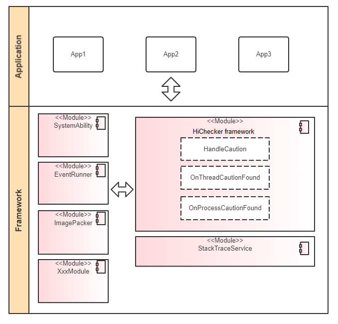

# HiChecker

-   [Introduction](#section11660541593)
-   [Architecture](#section161941989596)
-   [Directory Structure](#section14197309111)
-   [Usage](#section1371113476307)
-   [Repositories Involved](#section1371113476310)

## Introduction<a name="section11660541593"></a>

HiChecker is provided for you to check issues that may be easily ignored during development of OpenHarmony applications (including system-built and third-party applications). Such issues include calling of time-consuming functions by key application threads, event distribution and execution timeout in application processes, and ability resource leakage in application processes. The issues are recorded in logs or lead to process crashes explicitly so that you can find and rectify them.

## Architecture<a name="section161941989596"></a>

 

| Dependent Component                                                   | Dependency Description                                                    |
| ----------------------------------------------------------- | ------------------------------------------------------------ |
| Multimedia subsystem: ImagePacker           | Invokes the HiChecker API in time-consuming functions to display a notification with the preset prompt message.|
| Ability subsystem: FeatureAbility| Provides registration for resource leakage detection and notification of the detection results.                  |

Supported features:

- Time-consuming function call detection
- Ability leakage detection
- Addition and removal of check rules
- Addition and removal of caution rules for logs (default) and app crashes
- When related detection conditions are met, unwinding of Native stacks to the key trigger point is supported. JS stack unwinding is not supported currently.

## Directory Structure<a name="section14197309111"></a>

```
/base/hiviewdfx/hichecker
├── frameworks          # Framework code
│   └── native          # HiChecker Native implementation code
├── interfaces          # APIs
│   └── native          # C++ APIs
│       └── innerkits   # APIs provided for internal subsystems
|   └── js              # JS APIs
│       └── kits        # APIs provided for applications
├── test                # Test cases
│   └── unittest            
```


## Usage<a name="section1371113476307"></a>
### Available APIs

The following table lists the APIs provided by HiChecker.

| Class       | API                                               | Description                      |
| --------- | :-------------------------------------------------- | -------------------------- |
| HiChecker | BigInt RULE_CAUTION_PRINT_LOG = 1<<63;              | Defines a caution rule, which is programmed to print a log when an alarm is generated.      |
|           | BigInt RULE_CAUTION_TRIGGER_CRASH = 1<<62;          | Defines a caution rule, which is programmed to force an application to exit when an alarm is generated.      |
|           | BigInt RULE_THREAD_CHECK_SLOW_PROCESS = 1;          | Defines a check rule, which is programmed to check whether any time-consuming function is called.|
|           | BigInt RULE_CHECK_ABILITY_CONNECTION_LEAK = 1<<33;  | Defines a check rule, which is programmed to check ability leakage. |
|           | addRule(BigInt rule) : void                         | Adds one or more rules.      |
|           | removeRule(BigInt rule) : void                      | Removes one or more rules.      |
|           | getRule() : BigInt                                  | Obtains all rules.            |
|           | contains(BigInt rule) : boolean                     | Checks whether a rule exists.    |
|           | NotifySlowProcess(std::string) : void               | Sends a notification of a time-consuming function call.            |
|           | NotifySlowEvent(std::string) : void                 | Sends a notification of a time-consuming function call event.            |
|           | NotifyAbilityConnectionLeak(Caution caution) : void | Sends a notification of ability leakage.         |
| Caution   | GetTriggerRule() : BigInt                           | Obtains the rule that triggers the current alarm.|
|           | GetCustomMessage() : String                         | Obtains the alarm message.          |
|           | GetStackTrace() : String                           | Obtains stack information.              |

## Repositories Involved<a name="section1371113476310"></a>

[DFX Subsystem](https://gitee.com/openharmony/docs/blob/master/en/readme/dfx.md)

[hiviewdfx_hilog](https://gitee.com/openharmony/hiviewdfx_hilog/blob/master/README.md)

[hiviewdfx_faultloggerd](https://gitee.com/openharmony/hiviewdfx_faultloggerd/blob/master/README.md)
