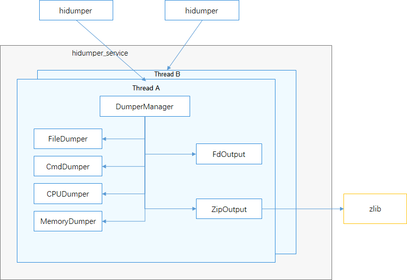

# HiDumper<a name="EN-US_TOPIC_0000001116225437"></a>

  - [Introduction](#section11660541593)
  - [Directory Structure](#section161941989596)
  - [Usage](#section1312121216216)
    - [How to Use](#section129654513264)
  - [Repositories Involved](#section1371113476307)

## Introduction<a name="section11660541593"></a>

HiDumper is a unified system information collection tool provided by OpenHarmony for development and test personnel to analyze and locate faults.

HiDumper consists of the following modules:

-   hidumper: Serves as the executable program of HiDumper, which receives user input and communicates with the server.
-   DumpManager: Serves as the manager of HiDumper, which provides functions such as information classification, command request distribution, and information collection.
-   Dumpers: Exports various information, including file information, command information, CPU usage, and memory usage.
-   Output: Outputs various contents. This module consists of two parts: FdOutput for standard output or file output and ZipOutput for compressed output.

**Figure 1** HiDumper architecture



## Directory Structure<a name="section161941989596"></a>

```
/base/hiviewdfx/hidumper
├── client                # Client code
│   ├── native            # Native code
├── frameworks            # Framework code
│   ├── native            # Core function code
|   |   |── include        # Header files
|   |   |── src           # Source files
|   |       |── common    # Common function code
|   |       |── executor  # Process executor code
|   |       |── factory   # Factory code
|   |       |── manager   # Core manager code
|   |       |── util      # Utility code
|── sa_profile            # HiDumper SA profile
|── services              # HiDumper service code
|   |── native            # C++ service code
|   |── zidl              # Communication function
|   |   |── include       # Header files of the communication function
|   |   |── src           # Source code of the communication function
├── test                  # Test cases
│   ├── unittest          # Unit test code
│   ├── moduletest        # Module-level test code
```

## Usage<a name="section1312121216216"></a>

During OpenHarmony application development, you can use HiDumper to query system information, service information, and process stack information, and then use the information to analyze and locate faults.


### How to Use<a name="section129654513264"></a>

HiDumper helps you export basic system information to locate and analyze faults. When passing complex parameters to sub-services and abilities, enclose parameters in double quotation marks.

The procedure is as follows:

1.  Access the device CLI, and run the **hidumper -h** command to obtain the help information, which includes basic information and function syntax.

    ```
    hidumper -h
    ```

2.  Run the **hidumper -lc** command to obtain the system information cluster list.

    ```
    hidumper -lc
    ```

3.  Run the **hidumper -c** command to obtain all information that is classified by **base** and **system**.

    ```
    hidumper -c
    ```

4.  Run the **hidumper -c [base | system]** to obtain the system cluster information that is classified by **base** or **system**.

    ```
    hidumper -c base
    hidumper -c system
    ```

5.  Run the **hidumper -ls** command to obtain the system ability list.

    ```
    hidumper -ls
    ```

6.  Run the **hidumper -s** command to obtain all system ability information.

    ```
    hidumper -s
    ```

7.  Run the **hidumper -s 3301 -a "-h"** command to obtain the help information about the ability whose ID is **3301**.

    ```
    hidumper -s 3301  -a "-h"
    ```

8.  Run the **hidumper -s 3008** command to obtain all information about the ability whose ID is **3008**.

    ```
    hidumper -s 3008
    ```

9.  Run the **hidumper -e** command to obtain the crash information generated by the Faultlog module.

    ```
    hidumper -e
    ```

10. Run the **hidumper --net** command to obtain network information.

    ```
    hidumper --net
    ```

11. Run the **hidumper --storage** command to obtain storage information.

    ```
    hidumper --storage
    ```
12. Run the **hidumper -p** command to obtain process information, including the list and information of processes and threads.

    ```
    hidumper -p
    ```

13. Run the **hidumper -p 1024** command to obtain information about the process whose PID is **1024**.

    ```
    hidumper -p 1024
    ```

14. Run the **hidumper --cpuusage [pid]** command to obtain the CPU usage information of the process whose PID has been specified.

    ```
    hidumper --cpuusage
    hidumper --cpuusage 1024
    ```

15. Run the **hidumper --cpufreq** command to obtain the actual operating frequency of each CPU core.

    ```
    hidumper --cpufreq
    ```

16. Run the **hidumper --mem [pid]** command to obtain all memory usage information of the process whose PID has been specified.

    ```
    hidumper --mem
    hidumper --mem 1024
    ```

17. Run the **hidumper --zip** command to compress data to the **/data/log/hidumper** directory.

    ```
    hidumper --zip
    ```

## Repositories Involved<a name="section1371113476307"></a>

DFX subsystem:

hmf/hiviewdfx

DFX modules:

hmf/hiviwdfx/hilog

hmf/hiviwdfx/hitrace

hmf/hiviwdfx/hicollie

**hmf/hiviwdfx/hidumper**

hmf/hiviwdfx/hiappevent

hmf/hiviwdfx/hisysevent

hmf/hiviwdfx/debug
