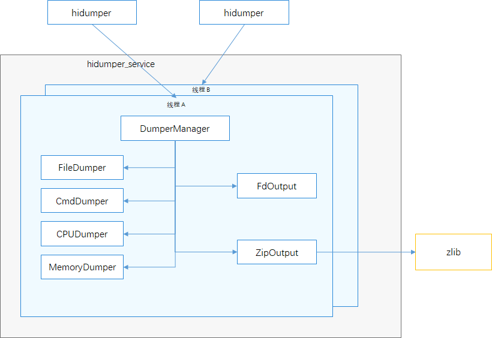

# HiDumper组件<a name="ZH-CN_TOPIC_0000001116225437"></a>


- [HiDumper组件<a name="ZH-CN_TOPIC_0000001116225437"></a>](#hidumper组件)
  - [简介<a name="section11660541593"></a>](#简介)
  - [目录<a name="section161941989596"></a>](#目录)
  - [说明<a name="section1312121216216"></a>](#说明)
    - [接口说明<a name="section1551164914237"></a>](#接口说明)
    - [使用说明<a name="section129654513264"></a>](#使用说明)
  - [相关仓<a name="section1371113476307"></a>](#相关仓)
																					 

## 简介<a name="section11660541593"></a>

HiDumper是OpenHarmony中为开发、测试人员，IDE工具提供统一的系统信息获取工具，帮助使用者分析，定位问题。

HiDumper主要包括以下几个主要模块：

-   hidumper，hidumper工具的可执行程序，接收用户输入，与服务端通讯。
-   DumpManager，系统信息导出工具管理者，提供信息分类，命令请求分发和信息获取方法的管理。
-   Dumpers，各类信息的导出器。主要包括文件导出、命令导出、CPU使用导出、内存使用导出等。
-   Output，内容输出，主要包括向标准输出或文件输出的FdOutput，压缩输出的ZipOutput。

**图1**  HiDumper架构图



## 目录<a name="section161941989596"></a>

```
/base/hiviewdfx/hidumper
├── client                # 客户端代码
│   ├── native            # 客户端native代码
├── frameworks            # 框架代码
│   ├── native            # 导出功能核心代码
|   |   |── include        # 头文件目录
|   |   |── src           # 源文件目录
|   |       |── common    # 通用功能代码
|   |       |── executor  # 导出过程执行器代码
|   |       |── factory   # 跟进导出项生成导出执行器
|   |       |── manager   # 导出管理核心代码
|   |       |── util      # 工具类源代码
|── sa_profile            # Hidumper sa 属性文件
|── services              # Hidumper服务源码
|   |── native            # 服务C++源码
|   |── zidl              # 通讯功能源码目录
|   |   |── include       # 通讯功能头文件
|   |   |── src           # 通讯功能源代码
├── test                  # 测试用例目录
│   ├── unittest          # 单元测试代码
│   ├── moduletest        # 模块级别测试代码
```

## 说明<a name="section1312121216216"></a>

开发者在OpenHarmony应用开发过程中需要查询系统信息，服务信息，进程栈等信息时可以通过HiDumper获取到对应信息，然后利用这些信息分析定位问题。


### 使用说明<a name="section129654513264"></a>

hidumper可以为开发者导出系统当前基本信息，通过这些基本信息可以定位分析问题。给子服务和元能力传递复杂参数时，参数需要在双引号中。

具体步骤如下：

1.  进入设备命令行，输入hidumper -h获取基本信息介绍，功能语法介绍。

    ```
    hidumper -h
    ```

2.  输入hidumper -lc获取系统信息分类列表。

    ```
    hidumper -lc
    ```

3.  输入hidumper -c 获取系统base、system等所有分类信息。

    ```
    hidumper -c
    ```

4.  输入  **hidumper -c [base system]**  按  **base** 或 **system** 分类获取系统簇信息。

    ```
    hidumper -c base
    hidumper -c system
    ```

5.  输入  **hidumper -ls**  命令获取系统中元能力列表。

    ```
    hidumper -ls
    ```

6.  输入  **hidumper -s**  命令获取系统全部元能力信息。

    ```
    hidumper -s
    ```

7.  运行  **hidumper -s 3301 -a "-h"**  命令获取id为3301的元能力的帮助。

    ```
    hidumper -s 3301  -a "-h"
    ```

8.  运行  **hidumper -s 3008**  命令获取id为3008的元能力的全部信息。

    ```
    hidumper -s 3008
    ```

9.  运行  **hidumper -e**  命令获取Faultlog模块生成的崩溃历史信息。

    ```
    hidumper -e
    ```

10. 运行  **hidumper --net**  命令获取网络信息。

    ```
    hidumper --net
    ```

11. 运行  **hidumper --storage**  命令获取存储相关信息。

    ```
    hidumper --storage
    ```
12. 运行  **hidumper -p**  命令获取进程信息，包括进程、线程的列表和信息。

    ```
    hidumper -p
    ```

13. 运行  **hidumper -p 1024**  命令获取pid为1024的进程信息。

    ```
    hidumper -p 1024
    ```

14. 运行  **hidumper --cpuusage [pid]**  命令获取CPU的使用信息；如果指定了进程的pid，则只获取该进程的CPU使用信息。

    ```
    hidumper --cpuusage
    hidumper --cpuusage 1024
    ```

15. 运行  **hidumper --cpufreq**  命令获取每一个CPU核实际运行的频率。

    ```
    hidumper --cpufreq
    ```

16. 运行  **hidumper --mem [pid]**  命令获取全部的内存使用信息；如果指定进程的pid，只获取该进程的内存使用情况。

    ```
    hidumper --mem
    hidumper --mem 1024
    ```

17. 运行  **hidumper --zip**  命令压缩信息数据到/data/log/hidumper目录下。

    ```
    hidumper --zip
    ```

## 相关仓<a name="section1371113476307"></a>

DFX子系统:

hmf/hiviewdfx

DFX组件:

hmf/hiviwdfx/hilog

hmf/hiviwdfx/hitrace

hmf/hiviwdfx/hicollie

**hmf/hiviwdfx/hidumper**

hmf/hiviwdfx/hiappevent

hmf/hiviwdfx/hisysevent

hmf/hiviwdfx/debug
