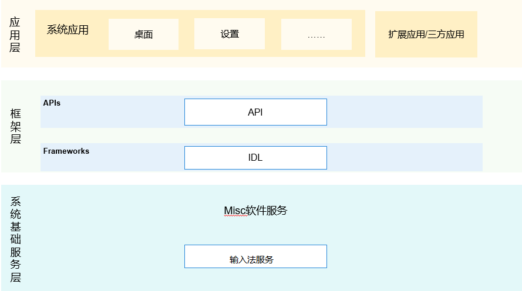

# inputmethod_imf

#### 介绍
输入法框架，主要作用是拉通应用和输入法，保证应用可以通过输入法进行文本输入

**图 1**  子系统架构图<a name="fig143011012341"></a>  


#### 仓路径
/base/inputmethod/imf

## 目录

```
/base/inputmethod/imf
├── figures                              # 构架图
├── frameworks/inputmethod_ability       # 对输入法客户端提供的接口
├── frameworks/inputmethod_controller    # 对客户端提供的接口
├── interfaces/kits/js                   # 组件对外提供的接口代码
│   └── napi                             # 输入法框架napi接口
├── profile                              # 组件包含的系统服务的配置文件和进程的配置文件
├── services                             # 输入法框架服务
├── test                                 # 接口的Fuzz测试和js单元测试
└── unitest                              # 接口的单元测试
```

## 框架代码介绍
输入法框架目前有四大模块，具体如下：

1.  应用客户端

路径：/base/inputmethod/imf/frameworks/inputmethod_controller

作用：实现应用和输入法框架服务交付，包括应用与输入法服务的绑定、应用对输入法的显示和隐藏请求等等

2.  输入法客户端

路径：/base/inputmethod/imf/frameworks/inputmethod_ability

作用：实现输入法框架服务与输入法交付的中间桥梁，包括监听输入法当前的状态等等

3.  输入法服务

路径：/base/inputmethod/imf/services

作用：作为输入法框架的核心，输入法的主要处理逻辑都是在这里完成

4.  输入法Js接口

路径：/base/inputmethod/imf/interfaces/kits/js

作用：暂时对外暴露的js接口，主要是留给输入法进行调用使用的


## 本框架编译调试方法

1.   编译命令

./build.sh --product-name (填写具体的产品名，如：Hi3516DV300) --build-target imf

2.  推送so文件

将工程目录下out\ohos-arm-release\inputmethod\imf 下的libinputmethod_client.z.so libinputmethod_ability.z.so 
libinputmethod_service.z.so libinputmethod_para.z.so推送到system/lib，将libinputmethodengine.z.so libinputmethod.z.so 推送到system/lib/module下，并确保六个so至少为可读状态。

3.  重启设备

## 参与贡献

1.  Fork 本仓库
2.  提交代码
3.  新建 Pull Request
4.  commit完成即可

