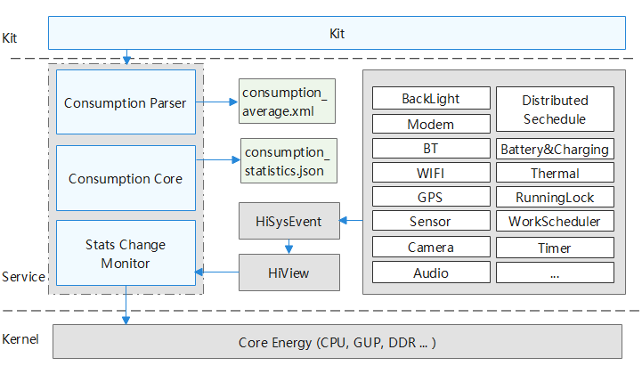

# Battery Statistics<a name="EN-US_TOPIC_0000001115047353"></a>

-   [Introduction](#section11660541593)
-   [Directory Structure](#section19472752217)
-   [Repositories Involved](#section63151229062)

## Introduction<a name="section11660541593"></a>

The battery statistics module provides the following functions:

1.  Software power consumption statistics: collects statistics on power consumption of each application or software. The power consumption is measured by Uid. Software power consumption includes but is not limited to the following items: CPU power consumption, running lock power consumption, mobile wireless power consumption, Wi-Fi power consumption, GNSS power consumption, sensor power consumption, camera power consumption, flashlight power consumption, etc.
2.   Hardware power consumption statistics: collects statistics on power consumption of the hardware. Power consumption beyond software power consumption belongs to hardware power consumption. It includes but is not limited to the following items: user power consumption, call power consumption, screen power consumption, Wi-Fi power consumption, and Bluetooth power consumption.

**Figure 1**  Architecture of the battery statistics module<a name="fig106301571239"></a>


## Directory Structure<a name="section19472752217"></a>

```
/base/powermgr/battery_statistics
├── etc                         # Etc profile
├── figures                     # Architecture figures
├── frameworks                  # FrameWork Layer
│   ├── js                      # NAPI code
│   └── native                  # Native code
├── interfaces                  # APIs
│   ├── innerkits               # Internal APIs
│   └── kits                    # External APIs
├── sa_profile                  # SA profile
├── services                    # Services
│   ├── native                  # Native services
│   ├── profile                 # Average Power Consumption Profile
│   └── zidl                    # Zidl APIs
├── test                        # Test code
│   ├── batterystats_fuzzer     # Fuzz test
│   └── systemtest              # System test
└── utils                       # Utilities and common code
```


## Repositories Involved<a name="section63151229062"></a>

[Power Management Subsystem](https://gitee.com/openharmony/docs/blob/master/en/readme/power-management.md)

[powermgr_power_manager](https://gitee.com/openharmony/powermgr_power_manager)

[powermgr_display_manager](https://gitee.com/openharmony/powermgr_display_manager)

[powermgr_battery_manager](https://gitee.com/openharmony/powermgr_battery_manager)

[powermgr_thermal_manager](https://gitee.com/openharmony/powermgr_thermal_manager)

**powermgr_battery_statistics**

[powermgr_battery_lite](https://gitee.com/openharmony/powermgr_battery_lite)

[powermgr_powermgr_lite](https://gitee.com/openharmony/powermgr_powermgr_lite)
