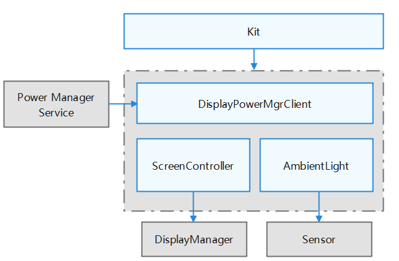

# display\_manager<a name="EN-US_TOPIC_0000001152026155"></a>

-   [Introduction](#section11660541593)
-   [Directory Structure](#section19472752217)
-   [Repositories Involved](#section63151229062)

## Introduction<a name="section11660541593"></a>

The Display power manager module of this repository provides the following capabilities:

1.  Turning on/off the display
2.  Adjusting the brightness of the display screen

**Figure  1**  Display power management subsystem architecture<a name="fig106301571239"></a> 


## Directory Structure<a name="section19472752217"></a>

```
base/powermgr/display_manager
├── figures                  	# Architecture figures
├── frameworks                  # FrameWork Layer
│   ├── napi                  	# NAPI code
│   └── native                  # Native code
├── interfaces                  # APIs
│   ├── innerkits               # Internal APIs
│   └── kits                    # External APIs
├── sa_profile                  # SA profile
├── service                    	# Services
│   ├── native                  # Native services
│   └── zidl                    # zidl APIs
├── test                        # Test code
└── utils                       # Utilities and common code
```

## Repositories Involved<a name="section63151229062"></a>

[Power management subsystem](https://gitee.com/openharmony/docs/blob/master/en/readme/power-management.md)

[powermgr_power_manager](https://gitee.com/openharmony/powermgr_power_manager)

**powermgr_display_manager**

[powermgr_battery_manager](https://gitee.com/openharmony/powermgr_battery_manager)

[powermgr_thermal_manager](https://gitee.com/openharmony/powermgr_thermal_manager)

[powermgr_battery_statistics](https://gitee.com/openharmony/powermgr_battery_statistics)

[powermgr_battery_lite](https://gitee.com/openharmony/powermgr_battery_lite)

[powermgr_powermgr_lite](https://gitee.com/openharmony/powermgr_powermgr_lite)
