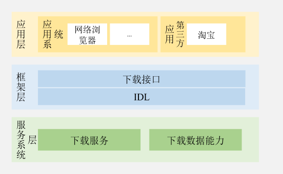
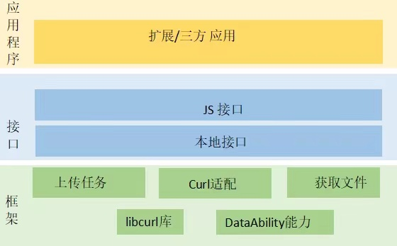

# Request服务

##  简介

### 内容介绍

Request服务向三方应用提供系统下载/上传服务能力，以支撑应用开发者方便、高效地使用以及管理下载/上传业务的功能，包含新建、移除、暂停、恢复以及查询下载/上传任务。

### 架构图介绍

**图 1** 下载子系统架构图  


系统应用：依赖的系统应用如浏览器等。

三方应用：依赖的第三方应用如淘宝等。

下载 API：提供下载功能的接口。

IDL：提供NAPI之间的相互通信。

下载服务：负责下载的具体过程，客户端发起一个下载请求，下载内部创建下载任务，处理下载请求并完成下载任务。

下载数据能力：用来保存每一次下载的记录。

**图 2** 上传子系统架构图  


扩展/三方 应用：上传功能的客户端，是上传的发起方。

JS接口：对外提供上传功能JS接口。

本地接口：上传本地文件的接口。

上传任务：客户端每发起一个上传请求，上传内部都会创建一个上传任务，用于处理上传请求，转发服务器的上传应答。

Curl适配：对三方库libcurl的一个封装。

获取文件：根据客户端发起上传请求时传入的文件路径获取要上传的文件。

libcurl: 三方库。

DataAbility能力：DataAbility的使用方，用户获取DataAbility文件协议路径下的文件。

## 目录

```
/base/request/request
├── figures                                # 架构图
├── download/ability                       # 下载服务数据库管理模块
├── download/etc 	                       # 下载服务包含的进程配置文件
	 └──interfaces/kits/js/napi            # 本组件对外提供的下载服务接口代码
		 └──download_single                # 下载服务的napi接口
├── download/sa_profile                    # 下载服务包含的系统服务的配置文件
├── download/services                      # 下载系统服务实现
├── download/utils                         # 下载服务包含日志打印和公共事件定义的常量
├── upload/frameworks                      # 上传服务功能实现
├── upload/interfaces/kits                 # 本组件对外提供的上传服务接口代码
│   ├── js                                 # 本组件js接口定义
│   └── napi                               # 上传服务的napi接口
└── upload/unitest                         # 上传模块的单元测试
```

##  说明

###  接口说明

**表 1**  Request服务的主要接口

<table><thead align="left"><tr id="row143351854201012"><th class="cellrowborder" valign="top" width="50%" id="mcps1.2.3.1.1"><p id="p103351154121010"><a name="p103351154121010"></a><a name="p103351154121010"></a>接口名</p>
</th>
<th class="cellrowborder" valign="top" width="50%" id="mcps1.2.3.1.2"><p id="p1033585416105"><a name="p1033585416105"></a><a name="p1033585416105"></a>描述</p>
</th>
</tr>
</thead>
<tbody>
<tr id="row204321219392"><td class="cellrowborder" valign="top" width="50%" headers="mcps1.2.3.1.1 "><p id="p1893413268144"><a name="p1893413268144"></a><a name="p1893413268144"></a>download(config: DownloadConfig, callback: AsyncCallback&lt;DownloadTask&gt;): void</p>
</td>
<td class="cellrowborder" valign="top" width="50%" headers="mcps1.2.3.1.2 "><p id="p18761104812149"><a name="p18761104812149"></a><a name="p18761104812149"></a>异步接口，用于文件下载，使用callback形式回调返回DownloadTask实例，该实例代表一个下载任务，用户可以通过该实例操作该下载任务，比如添加progress、complete、fail监听，暂停、恢复、移除和查询下载任务。</p>
</td>
</tr>
<tr id="row13335054111017"><td class="cellrowborder" valign="top" width="50%" headers="mcps1.2.3.1.1 "><p id="p12832214151418"><a name="p12832214151418"></a><a name="p12832214151418"></a>download(config: DownloadConfig): Promise&lt;DownloadTask&gt;</p>
</td>
<td class="cellrowborder" valign="top" width="50%" headers="mcps1.2.3.1.2 "><p id="p3335145451011"><a name="p3335145451011"></a><a name="p3335145451011"></a>异步接口，用于文件下载，使用promise形式回调返回DownloadTask实例，该实例代表一个下载任务，用户可以通过该实例操作该下载任务，比如添加progress、complete、fail监听，暂停、恢复、移除和查询下载任务。</p>
</td>
</tr>
<tr id="row204321219393"><td class="cellrowborder" valign="top" width="50%" headers="mcps1.2.3.1.1 "><p id="p1893413268144"><a name="p1893413268144"></a><a name="p1893413268144"></a>upload(config: UploadConfig, callback: AsyncCallback&lt;UploadTask&gt;): void</p>
</td>
<td class="cellrowborder" valign="top" width="50%" headers="mcps1.2.3.1.2 "><p id="p18761104812149"><a name="p18761104812149"></a><a name="p18761104812149"></a>异步接口，用于上传一组文件，使用callback形式回调返回UploadTask实例，该实例代表一个上传任务，用户可以通过该实例操作该上传任务，比如添加progress、headerReceive、fail监听，移除上传任务。</p>
</td>
</tr>
<tr id="row13335054111018"><td class="cellrowborder" valign="top" width="50%" headers="mcps1.2.3.1.1 "><p id="p12832214151418"><a name="p12832214151418"></a><a name="p12832214151418"></a>upload(config: UploadConfig): Promise&lt;UploadTask&gt;</p>
</td>
<td class="cellrowborder" valign="top" width="50%" headers="mcps1.2.3.1.2 "><p id="p3335145451011"><a name="p3335145451011"></a><a name="p3335145451011"></a>异步接口，用于上传一组文件，使用promise形式回调返回UploadTask实例，该实例代表一个上传任务，用户可以通过该实例操作该上传任务，比如添加progress、headerReceive、fail监听，移除上传任务。</p>
</td>
</tr>
<tr id="row204321219394"><td class="cellrowborder" valign="top" width="50%" headers="mcps1.2.3.1.1 "><p id="p1893413268144"><a name="p1893413268144"></a><a name="p1893413268144"></a>download(context: BaseContext,config: DownloadConfig, callback: AsyncCallback&lt;DownloadTask&gt;): void</p>
</td>
<td class="cellrowborder" valign="top" width="50%" headers="mcps1.2.3.1.2 "><p id="p18761104812149"><a name="p18761104812149"></a><a name="p18761104812149"></a>异步接口，用于文件下载，使用callback形式回调返回DownloadTask实例，该实例代表一个下载任务，用户可以通过该实例操作该下载任务，比如添加progress、complete、fail监听，暂停、恢复、移除和查询下载任务。</p>
</td>
</tr>
<tr id="row13335054111019"><td class="cellrowborder" valign="top" width="50%" headers="mcps1.2.3.1.1 "><p id="p12832214151418"><a name="p12832214151418"></a><a name="p12832214151418"></a>download(context: BaseContext,config: DownloadConfig): Promise&lt;DownloadTask&gt;</p>
</td>
<td class="cellrowborder" valign="top" width="50%" headers="mcps1.2.3.1.2 "><p id="p3335145451011"><a name="p3335145451011"></a><a name="p3335145451011"></a>异步接口，用于文件下载，使用promise形式回调返回DownloadTask实例，该实例代表一个下载任务，用户可以通过该实例操作该下载任务，比如添加progress、complete、fail监听，暂停、恢复、移除和查询下载任务。</p>
</td>
</tr>
<tr id="row204321219395"><td class="cellrowborder" valign="top" width="50%" headers="mcps1.2.3.1.1 "><p id="p1893413268144"><a name="p1893413268144"></a><a name="p1893413268144"></a>upload(context: BaseContext,config: UploadConfig, callback: AsyncCallback&lt;UploadTask&gt;): void</p>
</td>
<td class="cellrowborder" valign="top" width="50%" headers="mcps1.2.3.1.2 "><p id="p18761104812149"><a name="p18761104812149"></a><a name="p18761104812149"></a>异步接口，用于上传一组文件，使用callback形式回调返回UploadTask实例，该实例代表一个上传任务，用户可以通过该实例操作该上传任务，比如添加progress、headerReceive、fail监听，移除上传任务。</p>
</td>
</tr>
<tr id="row13335054111020"><td class="cellrowborder" valign="top" width="50%" headers="mcps1.2.3.1.1 "><p id="p12832214151418"><a name="p12832214151418"></a><a name="p12832214151418"></a>upload(context: BaseContext,config: UploadConfig): Promise&lt;UploadTask&gt;</p>
</td>
<td class="cellrowborder" valign="top" width="50%" headers="mcps1.2.3.1.2 "><p id="p3335145451011"><a name="p3335145451011"></a><a name="p3335145451011"></a>异步接口，用于上传一组文件，使用promise形式回调返回UploadTask实例，该实例代表一个上传任务，用户可以通过该实例操作该上传任务，比如添加progress、headerReceive、fail监听，移除上传任务。</p>
</td>
</tr>
</tbody>
</table>

**表 2** DownloadTask的主要接口
<table><thead align="left"><tr id="row143351854201012"><th class="cellrowborder" valign="top" width="50%" id="mcps1.2.3.1.1"><p id="p103351154121010"><a name="p103351154121010"></a><a name="p103351154121010"></a>接口名</p>
</th>
<th class="cellrowborder" valign="top" width="50%" id="mcps1.2.3.1.2"><p id="p1033585416105"><a name="p1033585416105"></a><a name="p1033585416105"></a>描述</p>
</th>
</tr>
</thead>
<tbody><tr id="row204321219393"><td class="cellrowborder" valign="top" width="50%" headers="mcps1.2.3.1.1 "><p id="p1893413268144"><a name="p1893413268144"></a><a name="p1893413268144"></a>on(type: 'progress', callback:(receivedSize: number, totalSize: number) =&gt; void): void</p>
</td>
<td class="cellrowborder" valign="top" width="50%" headers="mcps1.2.3.1.2 "><p id="p18761104812149"><a name="p18761104812149"></a><a name="p18761104812149"></a>开启下载任务进度监听，使用callback形式返回下载进度结果。多次调用的场合最后一次调用时传入的callback有效。</p>
</td>
</tr>
<tr id="row13335054111018"><td class="cellrowborder" valign="top" width="50%" headers="mcps1.2.3.1.1 "><p id="p12832214151418"><a name="p12832214151418"></a><a name="p12832214151418"></a>on(type: 'complete' | 'pause' | 'remove', callback:() =&gt; void): void</p>
</td>
<td class="cellrowborder" valign="top" width="50%" headers="mcps1.2.3.1.2 "><p id="p3335145451011"><a name="p3335145451011"></a><a name="p3335145451011"></a>开启下载任务状态：complete、pause、remove监听，使用callback形式返回。多次调用的场合最后一次调用时传入的callback有效。</p>
</td>
</tr>
<tr id="row204321219393"><td class="cellrowborder" valign="top" width="50%" headers="mcps1.2.3.1.1 "><p id="p1893413268144"><a name="p1893413268144"></a><a name="p1893413268144"></a>on(type: 'fail', callback:(error: number) =&gt; void): void</p>
</td>
<td class="cellrowborder" valign="top" width="50%" headers="mcps1.2.3.1.2 "><p id="p18761104812149"><a name="p18761104812149"></a><a name="p18761104812149"></a>开启下载任务fail监听，使用callback形式返回错误码。多次调用的场合最后一次调用时传入的callback有效。</p>
</td>
</tr>
<tr id="row204321219393"><td class="cellrowborder" valign="top" width="50%" headers="mcps1.2.3.1.1 "><p id="p1893413268144"><a name="p1893413268144"></a><a name="p1893413268144"></a>off(type: 'progress', callback?:(receivedSize: number, totalSize: number) =&gt; void): void</p>
</td>
<td class="cellrowborder" valign="top" width="50%" headers="mcps1.2.3.1.2 "><p id="p18761104812149"><a name="p18761104812149"></a><a name="p18761104812149"></a>关闭下载任务进度监听，使用callback形式返回结果。</p>
</td>
</tr>
<tr id="row204321219393"><td class="cellrowborder" valign="top" width="50%" headers="mcps1.2.3.1.1 "><p id="p1893413268144"><a name="p1893413268144"></a><a name="p1893413268144"></a>off(type: 'complete' | 'pause' | 'remove', callback?:() =&gt; void): void</p>
</td>
<td class="cellrowborder" valign="top" width="50%" headers="mcps1.2.3.1.2 "><p id="p18761104812149"><a name="p18761104812149"></a><a name="p18761104812149"></a>关闭下载任务状态：complete、pause、remove监听，使用callback形式返回结果。</p>
</td>
</tr>
<tr id="row204321219393"><td class="cellrowborder" valign="top" width="50%" headers="mcps1.2.3.1.1 "><p id="p1893413268144"><a name="p1893413268144"></a><a name="p1893413268144"></a>off(type: 'fail', callback?:(error: number) =&gt; void): void</p>
</td>
<td class="cellrowborder" valign="top" width="50%" headers="mcps1.2.3.1.2 "><p id="p18761104812149"><a name="p18761104812149"></a><a name="p18761104812149"></a>关闭下载任务fail监听，使用callback形式返回结果。</p>
</td>
</tr>
<tr id="row204321219393"><td class="cellrowborder" valign="top" width="50%" headers="mcps1.2.3.1.1 "><p id="p1893413268144"><a name="p1893413268144"></a><a name="p1893413268144"></a>remove(): Promise&lt;boolean&gt;</p>
</td>
<td class="cellrowborder" valign="top" width="50%" headers="mcps1.2.3.1.2 "><p id="p18761104812149"><a name="p18761104812149"></a><a name="p18761104812149"></a>移除下载任务，异步方法，使用promise形式返回结果。</p>
</td>
</tr>
<tr id="row204321219393"><td class="cellrowborder" valign="top" width="50%" headers="mcps1.2.3.1.1 "><p id="p1893413268144"><a name="p1893413268144"></a><a name="p1893413268144"></a>remove(callback: AsyncCallback&lt;boolean&gt;): void</p>
</td>
<td class="cellrowborder" valign="top" width="50%" headers="mcps1.2.3.1.2 "><p id="p18761104812149"><a name="p18761104812149"></a><a name="p18761104812149"></a>移除下载任务，异步方法，使用callback形式返回结果。</p>
</td>
</tr>
<tr id="row204321219393"><td class="cellrowborder" valign="top" width="50%" headers="mcps1.2.3.1.1 "><p id="p1893413268144"><a name="p1893413268144"></a><a name="p1893413268144"></a>pause(): Promise&lt;boolean&gt;</p>
</td>
<td class="cellrowborder" valign="top" width="50%" headers="mcps1.2.3.1.2 "><p id="p18761104812149"><a name="p18761104812149"></a><a name="p18761104812149"></a>暂停下载任务，异步方法，使用promise形式返回结果。</p>
</td>
</tr>
<tr id="row204321219393"><td class="cellrowborder" valign="top" width="50%" headers="mcps1.2.3.1.1 "><p id="p1893413268144"><a name="p1893413268144"></a><a name="p1893413268144"></a>pause(callback: AsyncCallback&lt;boolean&gt;): void</p>
</td>
<td class="cellrowborder" valign="top" width="50%" headers="mcps1.2.3.1.2 "><p id="p18761104812149"><a name="p18761104812149"></a><a name="p18761104812149"></a>暂停下载任务，异步方法，使用callback形式返回结果。</p>
</td>
</tr>
<tr id="row204321219393"><td class="cellrowborder" valign="top" width="50%" headers="mcps1.2.3.1.1 "><p id="p1893413268144"><a name="p1893413268144"></a><a name="p1893413268144"></a>resume(): Promise&lt;boolean&gt;</p>
</td>
<td class="cellrowborder" valign="top" width="50%" headers="mcps1.2.3.1.2 "><p id="p18761104812149"><a name="p18761104812149"></a><a name="p18761104812149"></a>恢复下载任务，异步方法，使用promise形式返回结果。</p>
</td>
</tr>
<tr id="row204321219393"><td class="cellrowborder" valign="top" width="50%" headers="mcps1.2.3.1.1 "><p id="p1893413268144"><a name="p1893413268144"></a><a name="p1893413268144"></a>resume(callback: AsyncCallback&lt;boolean&gt;): void</p>
</td>
<td class="cellrowborder" valign="top" width="50%" headers="mcps1.2.3.1.2 "><p id="p18761104812149"><a name="p18761104812149"></a><a name="p18761104812149"></a>恢复下载任务，异步方法，使用callback形式返回结果。</p>
</td>
</tr><tr id="row204321219393"><td class="cellrowborder" valign="top" width="50%" headers="mcps1.2.3.1.1 "><p id="p1893413268144"><a name="p1893413268144"></a><a name="p1893413268144"></a>query(): Promise&lt;DownloadInfo&gt;</p>
</td>
<td class="cellrowborder" valign="top" width="50%" headers="mcps1.2.3.1.2 "><p id="p18761104812149"><a name="p18761104812149"></a><a name="p18761104812149"></a>查询下载任务，异步方法，使用promise形式返回DownloadInfo。</p>
</td>
</tr>
<tr id="row204321219393"><td class="cellrowborder" valign="top" width="50%" headers="mcps1.2.3.1.1 "><p id="p1893413268144"><a name="p1893413268144"></a><a name="p1893413268144"></a>query(callback: AsyncCallback&lt;DownloadInfo&gt;): void</p>
</td>
<td class="cellrowborder" valign="top" width="50%" headers="mcps1.2.3.1.2 "><p id="p18761104812149"><a name="p18761104812149"></a><a name="p18761104812149"></a>查询下载任务，异步方法，使用callback形式返回DownloadInfo。</p>
</td>
</tr><tr id="row204321219393"><td class="cellrowborder" valign="top" width="50%" headers="mcps1.2.3.1.1 "><p id="p1893413268144"><a name="p1893413268144"></a><a name="p1893413268144"></a>queryMimeType(): Promise&lt;string&gt;</p>
</td>
<td class="cellrowborder" valign="top" width="50%" headers="mcps1.2.3.1.2 "><p id="p18761104812149"><a name="p18761104812149"></a><a name="p18761104812149"></a>查询下载任务的MIME type，异步方法，使用promise形式返回MIME type。</p>
</td>
</tr>
<tr id="row204321219393"><td class="cellrowborder" valign="top" width="50%" headers="mcps1.2.3.1.1 "><p id="p1893413268144"><a name="p1893413268144"></a><a name="p1893413268144"></a>queryMimeType(callback: AsyncCallback&lt;string&gt;): void</p>
</td>
<td class="cellrowborder" valign="top" width="50%" headers="mcps1.2.3.1.2 "><p id="p18761104812149"><a name="p18761104812149"></a><a name="p18761104812149"></a>查询下载任务的MIME type，异步方法，使用callback形式返回MIME type。</p>
</td>
</tr>
</tbody>
</table>

**表 3**  参数 DownloadConfig的描述
<table><thead align="left"><tr id="row143351854201012"><th class="cellrowborder" valign="top" width="20%" id="mcps1.2.3.1.1"><p id="p103351154121010"><a name="p103351154121010"></a><a name="p103351154121010"></a>名称</p>
</th>
<th class="cellrowborder" valign="top" width="10%" id="mcps1.2.3.1.2"><p id="p1033585416105"><a name="p1033585416105"></a><a name="p1033585416105"></a>类型</p>
</th>
<th class="cellrowborder" valign="top" width="70%" id="mcps1.2.3.1.3"><p id="p1033585416105"><a name="p1033585416105"></a><a name="p1033585416105"></a>说明</p>
</th>
</tr>
</thead>
<tbody><tr id="row204321219393"><td class="cellrowborder" valign="top" width="20%" headers="mcps1.2.3.1.1 "><p id="p1893413268144"><a name="p1893413268144"></a><a name="p1893413268144"></a>url</p>
</td>
<td class="cellrowborder" valign="top" width="10%" headers="mcps1.2.3.1.2 "><p id="p18761104812149"><a name="p18761104812149"></a><a name="p18761104812149"></a>string</p>
</td>
<td class="cellrowborder" valign="top" width="70%" headers="mcps1.2.3.1.3 "><p id="p18761104812149"><a name="p18761104812149"></a><a name="p18761104812149"></a>目标URL。</p>
</td>
</tr>
<tr id="row204321219393"><td class="cellrowborder" valign="top" width="20%" headers="mcps1.2.3.1.1 "><p id="p1893413268144"><a name="p1893413268144"></a><a name="p1893413268144"></a>header</p>
</td>
<td class="cellrowborder" valign="top" width="10%" headers="mcps1.2.3.1.2 "><p id="p18761104812149"><a name="p18761104812149"></a><a name="p18761104812149"></a>Object</p>
</td>
<td class="cellrowborder" valign="top" width="70%" headers="mcps1.2.3.1.3 "><p id="p18761104812149"><a name="p18761104812149"></a><a name="p18761104812149"></a>请求头。</p>
</td>
</tr>
<tr id="row204321219393"><td class="cellrowborder" valign="top" width="20%" headers="mcps1.2.3.1.1 "><p id="p1893413268144"><a name="p1893413268144"></a><a name="p1893413268144"></a>enableMetered</p>
</td>
<td class="cellrowborder" valign="top" width="10%" headers="mcps1.2.3.1.2 "><p id="p18761104812149"><a name="p18761104812149"></a><a name="p18761104812149"></a>boolean</p>
</td>
<td class="cellrowborder" valign="top" width="70%" headers="mcps1.2.3.1.3 "><p id="p18761104812149"><a name="p18761104812149"></a><a name="p18761104812149"></a>计费网络时允许下载。</p>
</td>
</tr>
<tr id="row204321219393"><td class="cellrowborder" valign="top" width="20%" headers="mcps1.2.3.1.1 "><p id="p1893413268144"><a name="p1893413268144"></a><a name="p1893413268144"></a>enableRoaming</p>
</td>
<td class="cellrowborder" valign="top" width="10%" headers="mcps1.2.3.1.2 "><p id="p18761104812149"><a name="p18761104812149"></a><a name="p18761104812149"></a>boolean</p>
</td>
<td class="cellrowborder" valign="top" width="70%" headers="mcps1.2.3.1.3 "><p id="p18761104812149"><a name="p18761104812149"></a><a name="p18761104812149"></a>网络漫游时允许下载。</p>
</td>
</tr>
<tr id="row204321219393"><td class="cellrowborder" valign="top" width="20%" headers="mcps1.2.3.1.1 "><p id="p1893413268144"><a name="p1893413268144"></a><a name="p1893413268144"></a>description</p>
</td>
<td class="cellrowborder" valign="top" width="10%" headers="mcps1.2.3.1.2 "><p id="p18761104812149"><a name="p18761104812149"></a><a name="p18761104812149"></a>string</p>
</td>
<td class="cellrowborder" valign="top" width="70%" headers="mcps1.2.3.1.3 "><p id="p18761104812149"><a name="p18761104812149"></a><a name="p18761104812149"></a>下载任务描述。</p>
</td>
</tr>
<tr id="row204321219393"><td class="cellrowborder" valign="top" width="20%" headers="mcps1.2.3.1.1 "><p id="p1893413268144"><a name="p1893413268144"></a><a name="p1893413268144"></a>networkType</p>
</td>
<td class="cellrowborder" valign="top" width="10%" headers="mcps1.2.3.1.2 "><p id="p18761104812149"><a name="p18761104812149"></a><a name="p18761104812149"></a>number</p>
</td>
<td class="cellrowborder" valign="top" width="70%" headers="mcps1.2.3.1.3 "><p id="p18761104812149"><a name="p18761104812149"></a><a name="p18761104812149"></a>指定网络允许下载。</p>
</td>
</tr>
<tr id="row204321219393"><td class="cellrowborder" valign="top" width="20%" headers="mcps1.2.3.1.1 "><p id="p1893413268144"><a name="p1893413268144"></a><a name="p1893413268144"></a>filePath</p>
</td>
<td class="cellrowborder" valign="top" width="10%" headers="mcps1.2.3.1.2 "><p id="p18761104812149"><a name="p18761104812149"></a><a name="p18761104812149"></a>string</p>
</td>
<td class="cellrowborder" valign="top" width="70%" headers="mcps1.2.3.1.3 "><p id="p18761104812149"><a name="p18761104812149"></a><a name="p18761104812149"></a>文件保存路径。</p>
</td>
</tr>
<tr id="row204321219393"><td class="cellrowborder" valign="top" width="20%" headers="mcps1.2.3.1.1 "><p id="p1893413268144"><a name="p1893413268144"></a><a name="p1893413268144"></a>title</p>
</td>
<td class="cellrowborder" valign="top" width="10%" headers="mcps1.2.3.1.2 "><p id="p18761104812149"><a name="p18761104812149"></a><a name="p18761104812149"></a>string</p>
</td>
<td class="cellrowborder" valign="top" width="70%" headers="mcps1.2.3.1.3 "><p id="p18761104812149"><a name="p18761104812149"></a><a name="p18761104812149"></a>下载任务标题。</p>
</td>
</tr>
<tr id="row204321219393"><td class="cellrowborder" valign="top" width="20%" headers="mcps1.2.3.1.1 "><p id="p1893413268144"><a name="p1893413268144"></a><a name="p1893413268144"></a>background</p>
</td>
<td class="cellrowborder" valign="top" width="10%" headers="mcps1.2.3.1.2 "><p id="p18761104812149"><a name="p18761104812149"></a><a name="p18761104812149"></a>boolean</p>
</td>
<td class="cellrowborder" valign="top" width="70%" headers="mcps1.2.3.1.3 "><p id="p18761104812149"><a name="p18761104812149"></a><a name="p18761104812149"></a>下载通知。</p>
</td>
</tr>
</tbody>
</table>

**表 4**  参数 DownloadInfo的描述
<table><thead align="left"><tr id="row143351854201012"><th class="cellrowborder" valign="top" width="20%" id="mcps1.2.3.1.1"><p id="p103351154121010"><a name="p103351154121010"></a><a name="p103351154121010"></a>名称</p>
</th>
<th class="cellrowborder" valign="top" width="10%" id="mcps1.2.3.1.2"><p id="p1033585416105"><a name="p1033585416105"></a><a name="p1033585416105"></a>类型</p>
</th>
<th class="cellrowborder" valign="top" width="70%" id="mcps1.2.3.1.3"><p id="p1033585416105"><a name="p1033585416105"></a><a name="p1033585416105"></a>说明</p>
</th>
</tr>
</thead>
<tbody><tr id="row204321219393"><td class="cellrowborder" valign="top" width="20%" headers="mcps1.2.3.1.1 "><p id="p1893413268144"><a name="p1893413268144"></a><a name="p1893413268144"></a>description</p>
</td>
<td class="cellrowborder" valign="top" width="10%" headers="mcps1.2.3.1.2 "><p id="p18761104812149"><a name="p18761104812149"></a><a name="p18761104812149"></a>string</p>
</td>
<td class="cellrowborder" valign="top" width="70%" headers="mcps1.2.3.1.3 "><p id="p18761104812149"><a name="p18761104812149"></a><a name="p18761104812149"></a>下载任务描述。</p>
</td>
</tr>
<tr id="row204321219393"><td class="cellrowborder" valign="top" width="20%" headers="mcps1.2.3.1.1 "><p id="p1893413268144"><a name="p1893413268144"></a><a name="p1893413268144"></a>downloadedBytes</p>
</td>
<td class="cellrowborder" valign="top" width="10%" headers="mcps1.2.3.1.2 "><p id="p18761104812149"><a name="p18761104812149"></a><a name="p18761104812149"></a>number</p>
</td>
<td class="cellrowborder" valign="top" width="70%" headers="mcps1.2.3.1.3 "><p id="p18761104812149"><a name="p18761104812149"></a><a name="p18761104812149"></a>已下载字节数。</p>
</td>
</tr>
<tr id="row204321219393"><td class="cellrowborder" valign="top" width="20%" headers="mcps1.2.3.1.1 "><p id="p1893413268144"><a name="p1893413268144"></a><a name="p1893413268144"></a>downloadId</p>
</td>
<td class="cellrowborder" valign="top" width="10%" headers="mcps1.2.3.1.2 "><p id="p18761104812149"><a name="p18761104812149"></a><a name="p18761104812149"></a>number</p>
</td>
<td class="cellrowborder" valign="top" width="70%" headers="mcps1.2.3.1.3 "><p id="p18761104812149"><a name="p18761104812149"></a><a name="p18761104812149"></a>下载任务ID。</p>
</td>
</tr>
<tr id="row204321219393"><td class="cellrowborder" valign="top" width="20%" headers="mcps1.2.3.1.1 "><p id="p1893413268144"><a name="p1893413268144"></a><a name="p1893413268144"></a>failedReason</p>
</td>
<td class="cellrowborder" valign="top" width="10%" headers="mcps1.2.3.1.2 "><p id="p18761104812149"><a name="p18761104812149"></a><a name="p18761104812149"></a>number</p>
</td>
<td class="cellrowborder" valign="top" width="70%" headers="mcps1.2.3.1.3 "><p id="p18761104812149"><a name="p18761104812149"></a><a name="p18761104812149"></a>下载任务失败的理由。</p>
</td>
</tr>
<tr id="row204321219393"><td class="cellrowborder" valign="top" width="20%" headers="mcps1.2.3.1.1 "><p id="p1893413268144"><a name="p1893413268144"></a><a name="p1893413268144"></a>fileName</p>
</td>
<td class="cellrowborder" valign="top" width="10%" headers="mcps1.2.3.1.2 "><p id="p18761104812149"><a name="p18761104812149"></a><a name="p18761104812149"></a>string</p>
</td>
<td class="cellrowborder" valign="top" width="70%" headers="mcps1.2.3.1.3 "><p id="p18761104812149"><a name="p18761104812149"></a><a name="p18761104812149"></a>保存文件名。</p>
</td>
</tr>
<tr id="row204321219393"><td class="cellrowborder" valign="top" width="20%" headers="mcps1.2.3.1.1 "><p id="p1893413268144"><a name="p1893413268144"></a><a name="p1893413268144"></a>filePath</p>
</td>
<td class="cellrowborder" valign="top" width="10%" headers="mcps1.2.3.1.2 "><p id="p18761104812149"><a name="p18761104812149"></a><a name="p18761104812149"></a>string</p>
</td>
<td class="cellrowborder" valign="top" width="70%" headers="mcps1.2.3.1.3 "><p id="p18761104812149"><a name="p18761104812149"></a><a name="p18761104812149"></a>文件保存路径。</p>
</td>
</tr>
<tr id="row204321219393"><td class="cellrowborder" valign="top" width="20%" headers="mcps1.2.3.1.1 "><p id="p1893413268144"><a name="p1893413268144"></a><a name="p1893413268144"></a>pausedReason</p>
</td>
<td class="cellrowborder" valign="top" width="10%" headers="mcps1.2.3.1.2 "><p id="p18761104812149"><a name="p18761104812149"></a><a name="p18761104812149"></a>number</p>
</td>
<td class="cellrowborder" valign="top" width="70%" headers="mcps1.2.3.1.3 "><p id="p18761104812149"><a name="p18761104812149"></a><a name="p18761104812149"></a>下载暂停的理由。</p>
</td>
</tr>
<tr id="row204321219393"><td class="cellrowborder" valign="top" width="20%" headers="mcps1.2.3.1.1 "><p id="p1893413268144"><a name="p1893413268144"></a><a name="p1893413268144"></a>status</p>
</td>
<td class="cellrowborder" valign="top" width="10%" headers="mcps1.2.3.1.2 "><p id="p18761104812149"><a name="p18761104812149"></a><a name="p18761104812149"></a>number</p>
</td>
<td class="cellrowborder" valign="top" width="70%" headers="mcps1.2.3.1.3 "><p id="p18761104812149"><a name="p18761104812149"></a><a name="p18761104812149"></a>下载任务状态。</p>
</td>
</tr>
<tr id="row204321219393"><td class="cellrowborder" valign="top" width="20%" headers="mcps1.2.3.1.1 "><p id="p1893413268144"><a name="p1893413268144"></a><a name="p1893413268144"></a>targetURI</p>
</td>
<td class="cellrowborder" valign="top" width="10%" headers="mcps1.2.3.1.2 "><p id="p18761104812149"><a name="p18761104812149"></a><a name="p18761104812149"></a>string</p>
</td>
<td class="cellrowborder" valign="top" width="70%" headers="mcps1.2.3.1.3 "><p id="p18761104812149"><a name="p18761104812149"></a><a name="p18761104812149"></a>下载任务URL。</p>
</td>
<tr id="row204321219393"><td class="cellrowborder" valign="top" width="20%" headers="mcps1.2.3.1.1 "><p id="p1893413268144"><a name="p1893413268144"></a><a name="p1893413268144"></a>downloadTitle</p>
</td>
<td class="cellrowborder" valign="top" width="10%" headers="mcps1.2.3.1.2 "><p id="p18761104812149"><a name="p18761104812149"></a><a name="p18761104812149"></a>string</p>
</td>
<td class="cellrowborder" valign="top" width="70%" headers="mcps1.2.3.1.3 "><p id="p18761104812149"><a name="p18761104812149"></a><a name="p18761104812149"></a>下载任务标题。</p>
</td>
<tr id="row204321219393"><td class="cellrowborder" valign="top" width="20%" headers="mcps1.2.3.1.1 "><p id="p1893413268144"><a name="p1893413268144"></a><a name="p1893413268144"></a>downloadTotalBytes</p>
</td>
<td class="cellrowborder" valign="top" width="10%" headers="mcps1.2.3.1.2 "><p id="p18761104812149"><a name="p18761104812149"></a><a name="p18761104812149"></a>number</p>
</td>
<td class="cellrowborder" valign="top" width="70%" headers="mcps1.2.3.1.3 "><p id="p18761104812149"><a name="p18761104812149"></a><a name="p18761104812149"></a>文件总字节数。</p>
</td>
</tr>
</tbody>
</table>

**表 5** UploadTask的主要接口
<table><thead align="left"><tr id="row143351854201012"><th class="cellrowborder" valign="top" width="50%" id="mcps1.2.3.1.1"><p id="p103351154121010"><a name="p103351154121010"></a><a name="p103351154121010"></a>接口名</p>
</th>
<th class="cellrowborder" valign="top" width="50%" id="mcps1.2.3.1.2"><p id="p1033585416105"><a name="p1033585416105"></a><a name="p1033585416105"></a>描述</p>
</th>
</tr>
</thead>
<tbody><tr id="row204321219393"><td class="cellrowborder" valign="top" width="50%" headers="mcps1.2.3.1.1 "><p id="p1893413268144"><a name="p1893413268144"></a><a name="p1893413268144"></a>on(type: 'progress', callback:AsyncCallback &lt;uploadedSize: number, totalSize: number> =&gt; void): void</p>
</td>
<td class="cellrowborder" valign="top" width="50%" headers="mcps1.2.3.1.2 "><p id="p18761104812149"><a name="p18761104812149"></a><a name="p18761104812149"></a>开启上传任务监听，异步方法，使用callback形式返回上传进度结果。多次调用的场合最后一次调用时传入的callback有效。</p>
</td>
</tr>
<tr id="row13335054111018"><td class="cellrowborder" valign="top" width="50%" headers="mcps1.2.3.1.1 "><p id="p12832214151418"><a name="p12832214151418"></a><a name="p12832214151418"></a>on(type: 'headerReceive', callback: AsyncCallback&lt;object&gt; =&gt; void): void</p>
</td>
<td class="cellrowborder" valign="top" width="50%" headers="mcps1.2.3.1.2 "><p id="p3335145451011"><a name="p3335145451011"></a><a name="p3335145451011"></a>开启上传任务监听，异步方法，使用callback形式返回HTTP header response结果。多次调用的场合最后一次调用时传入的callback有效。</p>
</td>
</tr>
<tr id="row204321219393"><td class="cellrowborder" valign="top" width="50%" headers="mcps1.2.3.1.1 "><p id="p1893413268144"><a name="p1893413268144"></a><a name="p1893413268144"></a>off(type: 'progress', callback:AsyncCallback&lt;uploadedSize: number, totalSize: number>=&gt; void): void</p>
</td>
<td class="cellrowborder" valign="top" width="50%" headers="mcps1.2.3.1.2 "><p id="p18761104812149"><a name="p18761104812149"></a><a name="p18761104812149"></a>关闭上传任务进度监听，异步方法，使用callback形式返回结果。</p>
</td>
</tr>
<tr id="row204321219393"><td class="cellrowborder" valign="top" width="50%" headers="mcps1.2.3.1.1 "><p id="p1893413268144"><a name="p1893413268144"></a><a name="p1893413268144"></a>off(type: 'headerReceive', callback:AsyncCallback&lt;object&gt; =&gt; void): void</p>
</td>
<td class="cellrowborder" valign="top" width="50%" headers="mcps1.2.3.1.2 "><p id="p18761104812149"><a name="p18761104812149"></a><a name="p18761104812149"></a>关闭上传任务HTTP Header response监听，异步方法，使用callback形式返回结果。</p>
</td>
</tr>
<tr id="row204321219393"><td class="cellrowborder" valign="top" width="50%" headers="mcps1.2.3.1.1 "><p id="p1893413268144"><a name="p1893413268144"></a><a name="p1893413268144"></a>remove(): Promise&lt;boolean&gt;</p>
</td>
<td class="cellrowborder" valign="top" width="50%" headers="mcps1.2.3.1.2 "><p id="p18761104812149"><a name="p18761104812149"></a><a name="p18761104812149"></a>移除上传的任务，异步方法，使用promise形式返回结果。</p>
</td>
</tr>
<tr id="row204321219393"><td class="cellrowborder" valign="top" width="50%" headers="mcps1.2.3.1.1 "><p id="p1893413268144"><a name="p1893413268144"></a><a name="p1893413268144"></a>remove(callback: AsyncCallback&lt;boolean&gt;): void</p>
</td>
<td class="cellrowborder" valign="top" width="50%" headers="mcps1.2.3.1.2 "><p id="p18761104812149"><a name="p18761104812149"></a><a name="p18761104812149"></a>移除上传的任务，异步方法，使用callback形式返回结果。</p>
</td>
</tr>
<tr id="row204321219393"><td class="cellrowborder" valign="top" width="50%" headers="mcps1.2.3.1.1 "><p id="p1893413268144"><a name="p1893413268144"></a><a name="p1893413268144"></a>on(type: 'fail', callback: (err: number, result?: Array<string>) => void): void</p>
</td>
<td class="cellrowborder" valign="top" width="50%" headers="mcps1.2.3.1.2 "><p id="p18761104812149"><a name="p18761104812149"></a><a name="p18761104812149"></a>开启上传任务fail监听，使用callback形式返回结果。</p>
</td>
</tr>
<tr id="row204321219393"><td class="cellrowborder" valign="top" width="50%" headers="mcps1.2.3.1.1 "><p id="p1893413268144"><a name="p1893413268144"></a><a name="p1893413268144"></a>off(type: 'fail', callback?: (err: number, result?: Array<string>) => void): void</p>
</td>
<td class="cellrowborder" valign="top" width="50%" headers="mcps1.2.3.1.2 "><p id="p18761104812149"><a name="p18761104812149"></a><a name="p18761104812149"></a>关闭上传任务fail监听，使用callback形式返回结果。</p>
</td>
</tr>
<tr id="row204321219393"><td class="cellrowborder" valign="top" width="50%" headers="mcps1.2.3.1.1 "><p id="p1893413268144"><a name="p1893413268144"></a><a name="p1893413268144"></a>on(type: 'complete', callback: (code: Array<number>, result?: Array<string>) => void): void</p>
</td>
<td class="cellrowborder" valign="top" width="50%" headers="mcps1.2.3.1.2 "><p id="p18761104812149"><a name="p18761104812149"></a><a name="p18761104812149"></a>开启上传任务状态complete监听，使用callback形式返回结果。</p>
</td>
</tr>
<tr id="row204321219393"><td class="cellrowborder" valign="top" width="50%" headers="mcps1.2.3.1.1 "><p id="p1893413268144"><a name="p1893413268144"></a><a name="p1893413268144"></a>off(type: 'complete', callback?: (code: Array<number>, result?: Array<string>) => void): void</p>
</td>
<td class="cellrowborder" valign="top" width="50%" headers="mcps1.2.3.1.2 "><p id="p18761104812149"><a name="p18761104812149"></a><a name="p18761104812149"></a>关闭上传任务状态complete监听，使用callback形式返回结果。</p>
</td>
</tr>
</tbody>
</table>

**表 6**  参数 UploadConfig的描述
<table><thead align="left"><tr id="row143351854201012"><th class="cellrowborder" valign="top" width="20%" id="mcps1.2.3.1.1"><p id="p103351154121010"><a name="p103351154121010"></a><a name="p103351154121010"></a>名称</p>
</th>
<th class="cellrowborder" valign="top" width="10%" id="mcps1.2.3.1.2"><p id="p1033585416105"><a name="p1033585416105"></a><a name="p1033585416105"></a>类型</p>
</th>
<th class="cellrowborder" valign="top" width="70%" id="mcps1.2.3.1.3"><p id="p1033585416105"><a name="p1033585416105"></a><a name="p1033585416105"></a>说明</p>
</th>
</tr>
</thead>
<tbody><tr id="row204321219393"><td class="cellrowborder" valign="top" width="20%" headers="mcps1.2.3.1.1 "><p id="p1893413268144"><a name="p1893413268144"></a><a name="p1893413268144"></a>url</p>
</td>
<td class="cellrowborder" valign="top" width="10%" headers="mcps1.2.3.1.2 "><p id="p18761104812149"><a name="p18761104812149"></a><a name="p18761104812149"></a>string</p>
</td>
<td class="cellrowborder" valign="top" width="70%" headers="mcps1.2.3.1.3 "><p id="p18761104812149"><a name="p18761104812149"></a><a name="p18761104812149"></a>目标URL。
</p>
</td>
</tr>
<tr id="row204321219393"><td class="cellrowborder" valign="top" width="20%" headers="mcps1.2.3.1.1 "><p id="p1893413268144"><a name="p1893413268144"></a><a name="p1893413268144"></a>header</p>
</td>
<td class="cellrowborder" valign="top" width="10%" headers="mcps1.2.3.1.2 "><p id="p18761104812149"><a name="p18761104812149"></a><a name="p18761104812149"></a>Object</p>
</td>
<td class="cellrowborder" valign="top" width="70%" headers="mcps1.2.3.1.3 "><p id="p18761104812149"><a name="p18761104812149"></a><a name="p18761104812149"></a>请求头。</p>
</td>
</tr>
<tr id="row204321219393"><td class="cellrowborder" valign="top" width="20%" headers="mcps1.2.3.1.1 "><p id="p1893413268144"><a name="p1893413268144"></a><a name="p1893413268144"></a>method</p>
</td>
<td class="cellrowborder" valign="top" width="10%" headers="mcps1.2.3.1.2 "><p id="p18761104812149"><a name="p18761104812149"></a><a name="p18761104812149"></a>string</p>
</td>
<td class="cellrowborder" valign="top" width="70%" headers="mcps1.2.3.1.3 "><p id="p18761104812149"><a name="p18761104812149"></a><a name="p18761104812149"></a>请求方式。</p>
</td>
</tr>
<tr id="row204321219393"><td class="cellrowborder" valign="top" width="20%" headers="mcps1.2.3.1.1 "><p id="p1893413268144"><a name="p1893413268144"></a><a name="p1893413268144"></a>files</p>
</td>
<td class="cellrowborder" valign="top" width="10%" headers="mcps1.2.3.1.2 "><p id="p18761104812149"><a name="p18761104812149"></a><a name="p18761104812149"></a>Array&lt;File></p>
</td>
<td class="cellrowborder" valign="top" width="70%" headers="mcps1.2.3.1.3 "><p id="p18761104812149"><a name="p18761104812149"></a><a name="p18761104812149"></a>本地文件列表信息。</p>
</td>
</tr>
<tr id="row204321219393"><td class="cellrowborder" valign="top" width="20%" headers="mcps1.2.3.1.1 "><p id="p1893413268144"><a name="p1893413268144"></a><a name="p1893413268144"></a>data</p>
</td>
<td class="cellrowborder" valign="top" width="10%" headers="mcps1.2.3.1.2 "><p id="p18761104812149"><a name="p18761104812149"></a><a name="p18761104812149"></a>Array&lt;RequestData></p>
</td>
<td class="cellrowborder" valign="top" width="70%" headers="mcps1.2.3.1.3 "><p id="p18761104812149"><a name="p18761104812149"></a><a name="p18761104812149"></a>上传请求表单列表信息。</p>
</td>
</tr>
</tbody>
</table>

**表 7**  File 描述
<table><thead align="left"><tr id="row143351854201012"><th class="cellrowborder" valign="top" width="20%" id="mcps1.2.3.1.1"><p id="p103351154121010"><a name="p103351154121010"></a><a name="p103351154121010"></a>名称</p>
</th>
<th class="cellrowborder" valign="top" width="10%" id="mcps1.2.3.1.2"><p id="p1033585416105"><a name="p1033585416105"></a><a name="p1033585416105"></a>类型</p>
</th>
<th class="cellrowborder" valign="top" width="70%" id="mcps1.2.3.1.3"><p id="p1033585416105"><a name="p1033585416105"></a><a name="p1033585416105"></a>说明</p>
</th>
</tr>
</thead>
<tbody><tr id="row204321219393"><td class="cellrowborder" valign="top" width="20%" headers="mcps1.2.3.1.1 "><p id="p1893413268144"><a name="p1893413268144"></a><a name="p1893413268144"></a>filename</p>
</td>
<td class="cellrowborder" valign="top" width="10%" headers="mcps1.2.3.1.2 "><p id="p18761104812149"><a name="p18761104812149"></a><a name="p18761104812149"></a>string</p>
</td>
<td class="cellrowborder" valign="top" width="70%" headers="mcps1.2.3.1.3 "><p id="p18761104812149"><a name="p18761104812149"></a><a name="p18761104812149"></a>提交多部分时，请求头中的文件名。</p>
</td>
</tr>
<tr id="row204321219393"><td class="cellrowborder" valign="top" width="20%" headers="mcps1.2.3.1.1 "><p id="p1893413268144"><a name="p1893413268144"></a><a name="p1893413268144"></a>name</p>
</td>
<td class="cellrowborder" valign="top" width="10%" headers="mcps1.2.3.1.2 "><p id="p18761104812149"><a name="p18761104812149"></a><a name="p18761104812149"></a>string</p>
</td>
<td class="cellrowborder" valign="top" width="70%" headers="mcps1.2.3.1.3 "><p id="p18761104812149"><a name="p18761104812149"></a><a name="p18761104812149"></a>提交多部分时，表单项目的名称，缺省为file。</p>
</td>
</tr>
<tr id="row204321219393"><td class="cellrowborder" valign="top" width="20%" headers="mcps1.2.3.1.1 "><p id="p1893413268144"><a name="p1893413268144"></a><a name="p1893413268144"></a>uri</p>
</td>
<td class="cellrowborder" valign="top" width="10%" headers="mcps1.2.3.1.2 "><p id="p18761104812149"><a name="p18761104812149"></a><a name="p18761104812149"></a>string</p>
</td>
<td class="cellrowborder" valign="top" width="70%" headers="mcps1.2.3.1.3 "><p id="p18761104812149"><a name="p18761104812149"></a><a name="p18761104812149"></a>文件的本地存储路径。
支持“dataability”和“internal”两种协议类型，但“internal”仅支持临时目录，示例：
dataability:///com.domainname.dataability.persondata/person/10/file.txt
internal://cache/path/to/file.txt</p>
</td>
</tr>
<tr id="row204321219393"><td class="cellrowborder" valign="top" width="20%" headers="mcps1.2.3.1.1 "><p id="p1893413268144"><a name="p1893413268144"></a><a name="p1893413268144"></a>type</p>
</td>
<td class="cellrowborder" valign="top" width="10%" headers="mcps1.2.3.1.2 "><p id="p18761104812149"><a name="p18761104812149"></a><a name="p18761104812149"></a>string</p>
</td>
<td class="cellrowborder" valign="top" width="70%" headers="mcps1.2.3.1.3 "><p id="p18761104812149"><a name="p18761104812149"></a><a name="p18761104812149"></a>文件的内容类型，默认根据文件名或路径的后缀获取。</p>
</td>
</tr>
</tbody>
</table>

**表 8**  RequestData 描述
<table><thead align="left"><tr id="row143351854201012"><th class="cellrowborder" valign="top" width="20%" id="mcps1.2.3.1.1"><p id="p103351154121010"><a name="p103351154121010"></a><a name="p103351154121010"></a>名称</p>
</th>
<th class="cellrowborder" valign="top" width="10%" id="mcps1.2.3.1.2"><p id="p1033585416105"><a name="p1033585416105"></a><a name="p1033585416105"></a>类型</p>
</th>
<th class="cellrowborder" valign="top" width="70%" id="mcps1.2.3.1.3"><p id="p1033585416105"><a name="p1033585416105"></a><a name="p1033585416105"></a>说明</p>
</th>
</tr>
</thead>
<tbody><tr id="row204321219393"><td class="cellrowborder" valign="top" width="20%" headers="mcps1.2.3.1.1 "><p id="p1893413268144"><a name="p1893413268144"></a><a name="p1893413268144"></a>name</p>
</td>
<td class="cellrowborder" valign="top" width="10%" headers="mcps1.2.3.1.2 "><p id="p18761104812149"><a name="p18761104812149"></a><a name="p18761104812149"></a>string</p>
</td>
<td class="cellrowborder" valign="top" width="70%" headers="mcps1.2.3.1.3 "><p id="p18761104812149"><a name="p18761104812149"></a><a name="p18761104812149"></a>表单元素的名称。</p>
</td>
</tr>
<tr id="row204321219393"><td class="cellrowborder" valign="top" width="20%" headers="mcps1.2.3.1.1 "><p id="p1893413268144"><a name="p1893413268144"></a><a name="p1893413268144"></a>value</p>
</td>
<td class="cellrowborder" valign="top" width="10%" headers="mcps1.2.3.1.2 "><p id="p18761104812149"><a name="p18761104812149"></a><a name="p18761104812149"></a>string</p>
</td>
<td class="cellrowborder" valign="top" width="70%" headers="mcps1.2.3.1.3 "><p id="p18761104812149"><a name="p18761104812149"></a><a name="p18761104812149"></a>表单元素的值。</p>
</td>
</tr>
</tbody>
</table>

###  使用说明

```js
// 导入模块
import request from '@ohos.request';
```
```js
// 下载服务接口使用说明
let downloadConfig = {
  url: 'http://mirror.bjtu.edu.cn/kernel/linux/libs/libc5/libc5.cvs.tar.gz',
  header: {},
  enableMetered: true,
  enableRoaming: true,
  description: 'download libc from mirror site',
  networkType: 1,
  filePath: '/data/libc5.cvs.tgz',
  title: 'download libc',
}
let downloadTask;

```
1.获取DownloadTask实例

```js
// 使用callback形式回调返回DownloadTask实例。
request.download(downloadConfig, (err, data) => {
    if (err) {
        console.error('Failed to request the download. Cause: ' + JSON.stringify(err));
        return;
    }
    console.info('Success to request the download.);
    downloadTask = data;
});

// 使用promise形式回调返回DownloadTask实例。
request.download(downloadConfig).then((data) => {
    console.info('Success to request the download.);
    downloadTask = data;
}).catch((err) => {
    console.error('Failed to request the download. Cause: ' + JSON.stringify(err));
})
// 使用callback形式回调返回DownloadTask实例。
request.download(BaseContext, downloadConfig, (err, data) => {
    if (err) {
        console.error('Failed to request the download. Cause: ' + JSON.stringify(err));
        return;
    }
    console.info('Success to request the download.);
    downloadTask = data;
});

// 使用promise形式回调返回DownloadTask实例。
request.download(BaseContext, downloadConfig).then((data) => {
    console.info('Success to request the download.);
    downloadTask = data;
}).catch((err) => {
    console.error('Failed to request the download. Cause: ' + JSON.stringify(err));
})
```
2.创建监听下载进度

```js
// 开启下载进度监听，使用callback形式返回下载进度结果。
downloadTask.on('progress', (receivedSize, totalSize) => {
    console.info("download receivedSize :" + receivedSize + " totalSize :" + totalSize);
});
```
3.创建监听complete事件

```js
// 开启下载任务complete监听，使用callback形式返回。
downloadTask.on('complete', () => {
    console.info("download task has been completed");
});
```
4.创建监听pause事件

```js
// 开启下载任务pause监听，使用callback形式返回。
downloadTask.on('pause', () => {
    console.info("download task has been paused");
});
```
5.创建监听remove事件

```js
// 开启下载任务remove监听，使用callback形式返回。
downloadTask.on('remove', () => {
    console.info("download task has been removed");
});
```
6.创建监听fail事件

```js
// 开启下载任务fail监听，使用callback形式返回错误码。
downloadTask.on('fail', (error) => {
    console.info("download fail error:" + error);
});
```
7.关闭监听下载进度

```js
// 关闭下载任务进度监听，使用callback形式返回下载进度结果。
downloadTask.off('progress', (receivedSize, totalSize) => {
    console.info("download receivedSize :" + receivedSize + " totalSize :" + totalSize);
});
```
8.关闭监听complete事件

```js
// 关闭下载任务complete监听，使用callback形式返回。
downloadTask.off('complete', () => {
    console.info("delete complete notification");
});
```
9.关闭监听pause事件

```js
// 关闭下载任务pause监听，使用callback形式返回。
downloadTask.off('pause', () => {
    console.info("delete pause notification");
});
```
10.关闭监听pause事件

```js
// 关闭下载任务remove监听，使用callback形式返回。
downloadTask.off('remove', () => {
    console.info("delete remove notification");
});
```
11.关闭监听fail事件

```js
// 关闭下载任务fail监听，使用callback形式返回错误码。
downloadTask.off('fail', (error) => {
    console.info("remove fail notification error:" + error);
});
```
12.删除下载任务

```js
// 移除下载的任务，使用promise形式返回结果。
downloadTask.remove().then((result) => {
    if (result) {
        console.info('Success to remove the download task.(promise) ');
    } else {
        console.error('Failed to remove the download task.(promise) ');
    }
}).catch((err) => {
    console.error('Failed to remove the download task.(promise) Cause: ' + JSON.stringify(err));
});

// 移除下载的任务，使用callback形式返回结果。
downloadTask.remove((err, result) => {
    if (err) {
        console.error('Failed to remove the download task.(callback) Cause: ' + JSON.stringify(err));
        return;
    }
    if (result) {
        console.info('Success to remove the download task.(callback) ');
    } else {
        console.error('Failed to remove the download task.(callback) ');
    }
});
```
13.暂停下载

```js
// 暂停下载的任务，使用promise形式返回结果。
downloadTask.pause().then(() => {
	console.info('Success to pause the download task.(promise) ');
}).catch((err) => {
    console.error('Failed to pause the download task.(promise) Cause: ' + JSON.stringify(err));
});

// 暂停下载的任务，使用callback形式返回结果。
downloadTask.pause((err) => {
    if (err) {
        console.error('Failed to pause the download task.(callback) Cause: ' + JSON.stringify(err));
		return;
    }
	console.info('Success to pause the download task.(callback) ');
});
```
14.恢复下载

```js
// 恢复下载的任务，使用promise形式返回结果。
downloadTask.resume().then(() => {
	console.info('Success to resume the download task.(promise) ');
}).catch((err) => {
    console.error('Failed to resume the download task.(promise) Cause: ' + JSON.stringify(err));
});

// 恢复下载的任务，使用callback形式返回结果。
downloadTask.resume((err) => {
    if (err) {
        console.error('Failed to resume the download task.(callback) Cause: ' + JSON.stringify(err));
		return;
    }
	console.info('Success to resume the download task.(callback) ');
});
```
15.查询下载

```js
// 查询下载的任务，使用promise形式返回结果。
downloadTask.query().then((downloadInfo) => {
	console.info('Success to query the download task.(promise) ');
}).catch((err) => {
    console.error('Failed to query the download task.(promise) Cause: ' + JSON.stringify(err));
});

// 查询下载的任务，使用callback形式返回结果。
downloadTask.query((err, downloadInfo) => {
    if (err) {
        console.error('Failed to query the download task.(callback) Cause: ' + JSON.stringify(err));
		return;
    }
	console.info('Success to query the download task.(callback) ');
});
```
16.查询下载的mime type

```js
// 查询下载任务的mime type，使用promise形式返回结果。
downloadTask.queryMimeType().then((mime) => {
	console.info('Success to queryMimeType the download task.(promise) MimeType ' + JSON.stringify(mime));
}).catch((err) => {
    console.error('Failed to queryMimeType the download task.(promise) Cause: ' + JSON.stringify(err));
});

// 查询下载任务的mime type，使用callback形式返回结果。
downloadTask.queryMimeType((err, mime) => {
    if (err) {
        console.error('Failed to queryMimeType the download task.(callback) Cause: ' + JSON.stringify(err));
		return;
    }
	console.info('Success to queryMimeType the download task.(promise) MimeType ' + JSON.stringify(mime));
});
```
```js
// 上传服务接口使用说明
```
1.上传文件创建

```js
// 上传一组文件，以及添加移除progress、headerReceive、fail监听，移除上传任务。
let url = 'http://192.168.2.211/files/';
let file1 = { filename: "test", name: "test", uri: "internal://cache/test.jpg", type: "jpg" };
let file2 = { filename: "test", name: "test", uri: "internal://cache/test.zip", type: "zip" };
let file3 = { filename: "test", name: "test", uri: "internal://cache/test.mp4", type: "mp4" };
let file4 = { filename: "test", name: "test", uri: "internal://cache/test.exe", type: "exe" };
let file5 = { filename: "test", name: "test", uri: "internal://cache/test.pdf", type: "pdf" };
let file6 = { filename: "test", name: "test", uri: "internal://cache/test.txt", type: "txt" };
let largeFile = { filename: "test", name: "test", uri: "internal://cache/testLarge.txt", type: "txt" };
let dataabilityFile = { filename: "test", name: "test",
  uri: "dataability://com.test.testApp/person/test.txt", type: "txt" };
let files = [file1, file2, file3, file4, file5, file6, largeFile, dataabilityFile];
let data = [{ name: "name123", value: "123" }];
let uploadTask;
```
2.获取上传的UploadTask实例

```js
// 使用callback形式回调返回UploadTask实例。
request.upload({ url, header, "POST", files, data }, (err, data) => {
    if (err) {
        console.error('Failed to request the upload. Cause: ' + JSON.stringify(err));
        return;
    }
    console.info('Success to request the upload.);
    uploadTask = data;
});

// 使用promise形式回调返回UploadTask实例。
request.upload({ url, header, "POST", files, data }).then((data) => {
    console.info('Success to request the upload.);
    uploadTask = data;
}).catch((err) => {
    console.error('Failed to request the upload. Cause: ' + JSON.stringify(err));
})
// 使用callback形式回调返回UploadTask实例。
request.upload(BaseContext, { url, header, "POST", files, data }, (err, data) => {
    if (err) {
        console.error('Failed to request the upload. Cause: ' + JSON.stringify(err));
        return;
    }
    console.info('Success to request the upload.);
    uploadTask = data;
});

// 使用promise形式回调返回UploadTask实例。
request.upload(BaseContext, { url, header, "POST", files, data }).then((data) => {
    console.info('Success to request the upload.);
    uploadTask = data;
}).catch((err) => {
    console.error('Failed to request the upload. Cause: ' + JSON.stringify(err));
})
```
3.创建上传任务进度的监听

```js
// 开启上传任务监听，使用callback形式返回上传进度结果。
uploadTask.on('progress', (uploadedSize, totalSize) => {
    console.info("on progress upload uploadedSize :" + uploadedSize + " totalSize :" + totalSize);
});
```
4.创建上传的HTTP header response监听事件

```js
// 开启上传任务监听，使用callback形式返回HTTP header response结果。
uploadTask.on('headerReceive', (headers) => {
    console.info("on headerReceive headers:" + JSON.stringify(headers));
});
```
5.创建上传监听complete事件

```
// 开启上传任务complete监听，使用callback形式返回。
uploadTask.on('complete', (code,result) => {
    console.info("upload task has been completed"+code);
});
```
6.创建上传的错误码监听事件

```js
// 开启上传任务监听，使用callback形式返回错误码。
uploadTask.on('fail', (error,result) => {
    console.info("on fail error:" + error+"result is:"+result);
});
```
7.关闭上传任务进度任务监听

```js
// 关闭上传任务监听，使用callback形式返回上传进度结果。
uploadTask.off('progress', (uploadedSize, totalSize) => {
    console.info("on progress upload uploadedSize :" + uploadedSize + " totalSize :" + totalSize);
});
```
8.关闭上传的HTTP header response监听事件

```js
// 关闭上传任务监听，使用callback形式返回HTTP header response结果。
uploadTask.off('headerReceive', (headers) => {
    console.info("on headerReceive headers:" + JSON.stringify(headers));
});
```
9.关闭上传监听complete事件

```js
// 关闭上传任务complete监听，使用callback形式返回。
uploadTask.off('complete', (code,result) => {
    console.info("delete complete notification");
});
```
10.关闭上传的错误码监听事件

```js
// 关闭上传任务监听，使用callback形式返回错误码。
uploadTask.off('fail', (error,result) => {
    console.info("on fail error:" + error+"result is:"+result);
});
```
11.删除上传的任务

```js
// 移除上传的任务，使用promise形式返回结果。
uploadTask.remove().then((result) => {
    if (result) {
        console.info('Success to remove the upload task.(promise) ');
    } else {
        console.error('Failed to remove the upload task.(promise) ');
    }
}).catch((err) => {
    console.error('Failed to remove the upload task.(promise) Cause: ' + JSON.stringify(err));
});

// 移除上传的任务，使用callback形式返回结果。
uploadTask.remove((err, result) => {
    if (err) {
        console.error('Failed to remove the upload task.(callback) Cause: ' + JSON.stringify(err));
        return;
    }
    if (result) {
        console.info('Success to remove the upload task.(callback) ');
    } else {
        console.error('Failed to remove the upload task.(callback) ');
    }
});
```

##  相关仓

[request_request](https://gitee.com/openharmony/request_request)